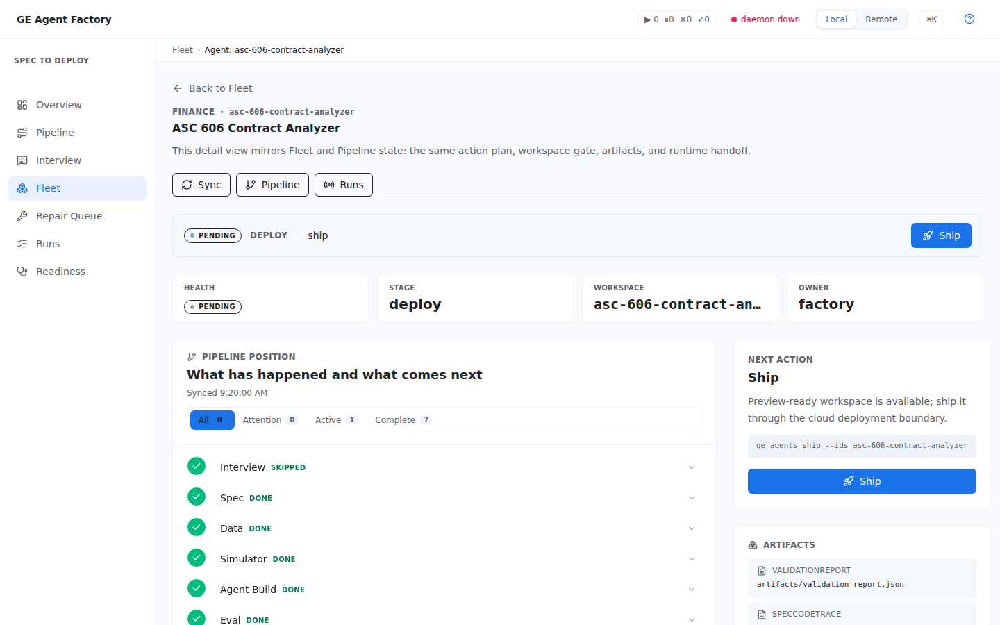
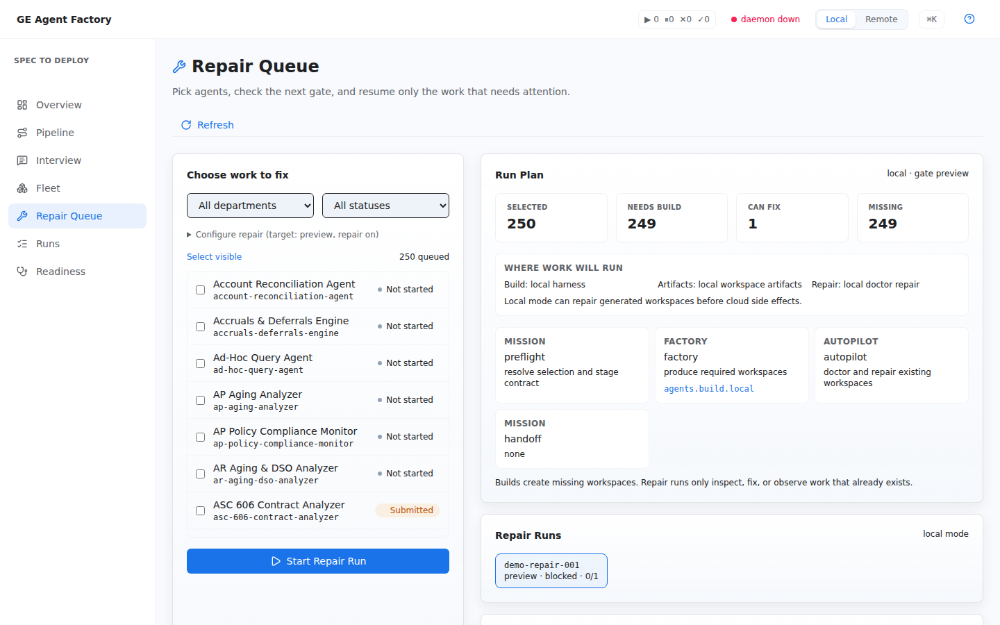
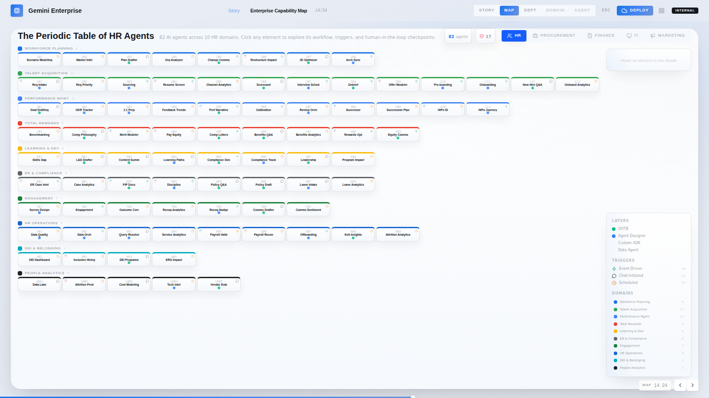
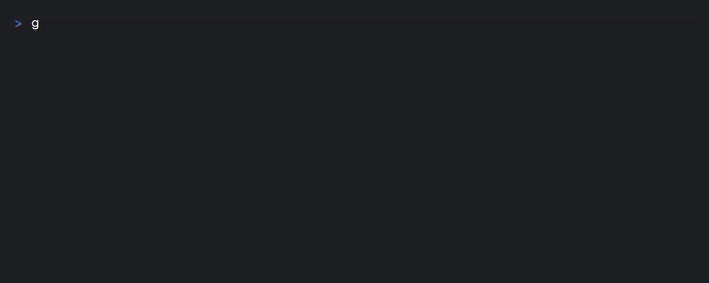
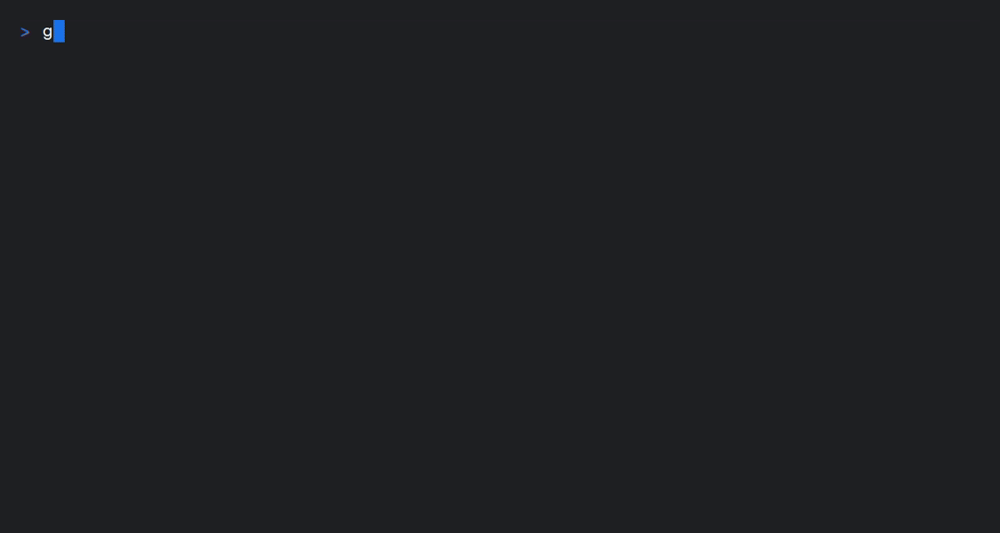
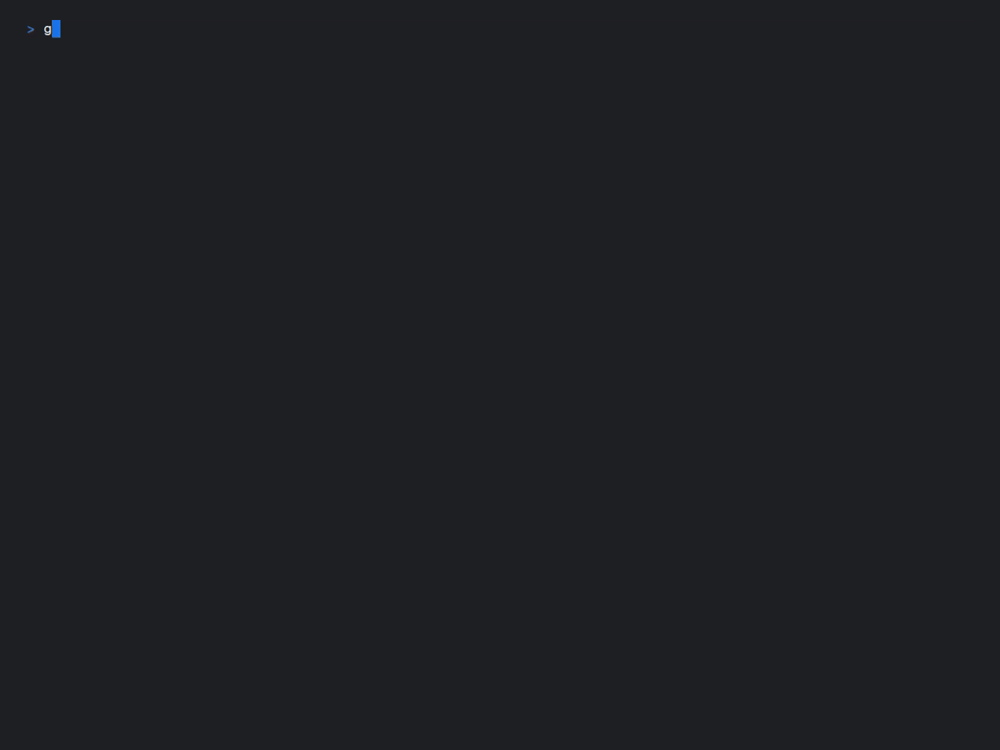

# GE Agent Factory

GE Agent Factory compiles enterprise workflows into governed agent contracts,
source-system simulations, eval suites, tool plans, and proof packs. It does
not replace agents-cli, ADK, or Gemini Enterprise; it produces the upstream
contract and proof artifacts they need.

[](https://shell.cloud.google.com/?cloudshell_git_repo=https://github.com/vamsiramakrishnan/ge-agent-factory&cloudshell_workspace=installer&cloudshell_tutorial=installer/TUTORIAL.md)

<p align="center">
  
</p>

The golden path is three commands, and they run today:

```bash
ge capture               # capture intent into a contract — opens the console Interview
ge prove                 # prove it: build the agent, run its evals → a validated workspace
ge handoff agents-cli    # hand the proven agent to agents-cli → Agent Engine → Gemini Enterprise
```

Capture is console-first today: `ge capture` opens the conversational
Interview in your browser (and `ge capture --from <agent-spec.json>`
registers a contract you already have). A capture flow that lives entirely
in the terminal is [roadmap](#roadmap-the-golden-path), not pretense. At any
point, bare `ge` (or `ge status`) answers three questions: where am I on
capture → prove → handoff, what blocks me, and what is the exact next
command.

Not sure this is the layer you need? Read
[GE Agent Factory vs agents-cli](https://vamsiramakrishnan.github.io/ge-agent-factory/start/vs-agents-cli/).

## See it

<table>
<tr>
<td width="50%">

<br>
<strong>Overview.</strong> Where every agent sits between capture and handoff, and what to do next.
</td>
<td width="50%">
<details open>
<summary><strong>Pipeline.</strong> The build &amp; deploy flow for one spec or a batch — same stages the CLI runs.</summary>

</details>
</td>
</tr>
<tr>
<td width="50%">

<br>
<strong>Agent detail.</strong> Every stage's evidence in one place, down to the exact command to ship it.
</td>
<td width="50%">

<br>
<strong>Repair Queue.</strong> Triage what's blocked across every agent at once instead of re-running everything.
</td>
</tr>
</table>

<p align="center">
  
  <br>
  <em>The full catalog — 363 agents across five departments — laid out as a periodic table. One tile per agent, click to explore.</em>
</p>

Terminal, not screenshots — these are `.gif`s of real runs, not staged:

<table>
<tr>
<td width="33%">

<br>
<code>ge</code> — status board with the next step.
</td>
<td width="33%">

<br>
<code>ge init</code> — discovers config, writes <code>.ge.json</code>.
</td>
<td width="33%">

<br>
<code>ge doctor</code> — every layer of the platform checked, one command.
</td>
</tr>
</table>

## Quickstart

No cloud credentials required until the handoff step; ~10 minutes end to
end:

```bash
curl https://mise.run | sh   # once, if you don't have mise — see SETUP.md
mise run setup               # toolchain + the `ge` CLI on PATH (~5-10 min, one time)
ge init                      # discover config, write .ge.json (~30 s)
ge capture                   # capture a contract in the console Interview — or skip: prove starts from a built-in starter contract
ge prove                     # build + evals → one validated agent workspace (~5 min, all local)
ge handoff agents-cli        # when ready: deploy proven agents to your own Google Cloud project
```

The result on disk after `ge prove` is the whole layer in miniature: the
contract (`usecase-spec.json` with its `behaviorContract`), generated ADK
code and tools, fixture data, smoke tests, an eval suite in `agents-cli`'s
own format, and the artifacts the promotion gate reads. Everything before
handoff is pure local computation — safe to loop, and `ge prove --watch`
re-proves automatically whenever a contract changes.

<details>
<summary>Under the hood: what each verb runs</summary>

| Golden-path verb | What it runs today |
|---|---|
| `ge capture` | opens the console **Interview** at `http://localhost:18260/#/interview` (starting the console if needed) — conversational capture, document grounding, contract editing. `ge capture --from <agent-spec.json>` registers an already-captured contract with the catalog. |
| `ge prove` | fresh machine → health check + one validated canary workspace; workspaces already built → `ge agents build` rebuilds their proof (evals + spec-to-code trace + harness verdicts + promotion gate). `--watch` re-proves on contract change. |
| `ge handoff agents-cli` | hands locally proven workspaces to the cloud — `load_data` → deploy via `agents-cli deploy` → Agent Engine → register tools → publish to Gemini Enterprise. |

The machinery each verb drives is first-class and directly operable too —
see [Operate](#operate).
</details>

**→ Full setup path: [`SETUP.md`](SETUP.md). Ten-minute tutorial:
[contract to handoff](https://vamsiramakrishnan.github.io/ge-agent-factory/start/quickstart/).**

## How it fits

<p align="center">
  
</p>

| Layer | Owned by |
|---|---|
| Intent → contract → simulations → evals → proof | **GE Agent Factory** (this repo) |
| Agent project scaffold, build, deploy | **agents-cli / ADK** (generated and driven by the factory) |
| Runtime | **ADK Agent Engine** |
| End-user surface | **Gemini Enterprise** |

Everything up to *proof* is pure computation on your machine; everything
after touches your Google Cloud project. Building on this machine is the
default — billable cloud work is opt-in — and `ge handoff` bridges the two
sides by handing a locally proven workspace to the cloud for the release
stages only. (The switch that selects the side, and the rest of the
machinery, live under [Operate](#operate).)

<p align="center">
  
</p>

## Documentation

Published docs site (search, sidebar, light and dark themes):
**→ https://vamsiramakrishnan.github.io/ge-agent-factory/**

| | |
|---|---|
| **[Start Here](https://vamsiramakrishnan.github.io/ge-agent-factory/start/what-is-the-factory/)** | What the factory is, the mental model, the ten-minute tutorial, vs agents-cli. |
| **[Core Concepts](https://vamsiramakrishnan.github.io/ge-agent-factory/concepts/)** | The Enterprise Agent Contract, the Authority Graph, source-system twins, evals as proof, the passport & proof pack, handoff targets. |
| **[Guides](https://vamsiramakrishnan.github.io/ge-agent-factory/cookbooks/)** | Capture → compile → simulate → prove → hand off, task by task. |
| **[Console](https://vamsiramakrishnan.github.io/ge-agent-factory/console/)** | The operator UI, view by view. |
| **[Operations](https://vamsiramakrishnan.github.io/ge-agent-factory/operations/)** | Provision, run, observe, troubleshoot. |
| **[Reference](https://vamsiramakrishnan.github.io/ge-agent-factory/reference/)** | CLI (generated from the command tree), contract schema (generated from the zod source), console APIs, config, architecture. |
| **[Contributor Docs](https://vamsiramakrishnan.github.io/ge-agent-factory/contributing/)** | Developer guide, extending the CLI/console, docs rules. |

The site is sourced from [`docs/`](docs/) (start at [`docs/index.md`](docs/index.md)).
Unfamiliar term? The [Glossary](docs/GLOSSARY.md) translates every internal
term into plain language — the operator vocabulary included.

## Roadmap: the golden path

The three verbs are real commands now. What genuinely remains future:

- **CLI-native capture** — a conversational capture flow in the terminal
  itself; today `ge capture` opens the console Interview.
- **Additional handoff targets** — `agents-cli` (→ Agent Engine → Gemini
  Enterprise) is the one supported target today.

## Operate

Everything below this line is the machinery behind the three verbs, in the
operator register — planes, modes, canary, harness, fleet, and friends
(each defined in the [Glossary](docs/GLOSSARY.md)). Golden path above;
levers below.

The golden path, one lever at a time:

```bash
ge prove                     # compile + prove one canary agent workspace (~5 min): health check → build → validate
ge mode local
ge agents build --canary     # compile one contract → validated workspace (build boundary)
mise run console             # watch runs live in the operator console → http://localhost:18260
ge handoff agents-cli        # hand off: cloud runs load_data → deploy → register → publish
```

The mode switch (`ge mode local|remote`, default **local** — billable work
is opt-in) selects which side of the build boundary does the work;
`ge handoff agents-cli` bridges them by handing a locally proven workspace
to the cloud for the release stages only.

## Deploy the platform to your own GCP project

Single-tenant, ~15 min: click **Open in Cloud Shell** above for the guided
installer ([`installer/TUTORIAL.md`](installer/TUTORIAL.md)), or from an
authenticated checkout:

```bash
export GEMINI_ENTERPRISE_APP_ID=projects/<num>/locations/global/collections/default_collection/engines/<app>
CANARY=1 mise run bootstrap   # toolchain → ge init → ge up (all three planes) → prove one agent
```

## Monorepo layout

A Bun workspace monorepo driven by one operator core
(`tools/lib/factory-core.mjs`) behind three surfaces — the `ge` CLI, the web
console, and an MCP server — that share a single command registry and can
never disagree. Full layout, conventions, and how to run one app locally:
[`CONTRIBUTING.md`](CONTRIBUTING.md).

| Path | What it is |
|------|------------|
| [`apps/console`](apps/console) | The operator UI: Overview · Pipeline · Interview · Fleet · Repair Queue · Runs · Readiness, plus Agent detail. |
| [`apps/factory`](apps/factory) | The generator: compiles contracts into workspaces, the simulator runtime, the multi-tenant FastMCP service. |
| [`apps/presentation`](apps/presentation) | The transformation deck and source use-case catalog — including the periodic table above. |
| [`apps/docs`](apps/docs) | The Astro/Starlight docs site (content sourced from `docs/`). |
| [`tools/`](tools) | The `ge` CLI, the MCP server, the shared operator core + local runtime daemon. |
| [`packages/`](packages) | Shared contracts: the agent-spec schema, the run ledger, OKF, design tokens. |

## The `ge` CLI

Bare `ge` prints a status board with the next step; `ge --help` groups the
golden path first. Every command supports `--json` and is also an HTTP route
(console) and an MCP tool — one registry, three surfaces.

```bash
ge                     # status board: mode · planes ✓/○ · next step
ge capture             # golden path: capture a contract (console Interview; --from registers a file)
ge prove               # golden path: prove contracts → validated workspaces (--watch to loop)
ge handoff agents-cli  # golden path: ship proven agents to Agent Engine / Gemini Enterprise
ge init                # discover config → .ge.json
ge devex check         # fast read-only gate: doctor + docs + workspace contracts
ge agents build --canary
ge handoff agents-cli --ids <workspace-id>
ge agents status --watch
ge pipeline run --scenario <id>   # orchestrate the end-to-end pipeline
ge fleet status        # fleet convergence; ge fleet repair --ids <a,b> fixes blockers in bulk
ge runs list           # every recorded run; ge runs events <id> --follow streams one live
ge doctor              # health with runnable fixes (console: Readiness)
```

Full reference (generated from the command tree, drift-gated in CI):
[CLI reference](https://vamsiramakrishnan.github.io/ge-agent-factory/reference/cli/).

## Contributing

```bash
bun install                # workspace deps
mise run devex-check       # fast local gate
mise run ci                # the CI gate: hygiene + lint + typecheck + docs gate + tests
```

See [`CONTRIBUTING.md`](CONTRIBUTING.md), the
[Contributor Docs](https://vamsiramakrishnan.github.io/ge-agent-factory/contributing/),
and [`docs/OPERATIONS.md`](docs/OPERATIONS.md) for the operator runbook.
