# Docs design system

The style guide for anyone (human or agent) adding a page or a diagram to this
site. Reference page, not an essay — if you're about to add a `.mmd` file or a
callout, read the relevant section below first.

> The public website now renders these same `docs/` pages through
> Astro/Starlight (`apps/docs` — see its README). Everything on this page
> about authoring in `docs/` (diagrams, callouts, links) still governs; the
> sync step translates callouts and links for the website automatically. A
> **new top-level** `docs/*.md` page additionally needs a `PAGE_MAP` entry in
> `apps/docs/scripts/sync-content.mjs` to get a place in the site's sidebar.
{: .status }

## Table of contents
{: .no_toc .text-delta }

1. TOC
{:toc}

---

## Theme

The public website is Astro + [Starlight](https://starlight.astro.build)
(`apps/docs`), which renders these `docs/` pages after a build-time sync step
(see `apps/docs/README.md`). Its theme — `apps/docs/src/styles/custom.css` —
derives from the product's own design tokens (`packages/design/src/palette.mjs`,
the canonical source, mirrored into `packages/design/src/tokens.css` by
`bun run docs:tokens`) so the docs site and the console/presentation apps read
as one system:

- **Colors** — the "Modernist Functionalism" palette: primary `#00408b`,
  on-surface `#1b1c1c`, body text `#383e47`, border `#c2c6d4`, surface
  container `#f0eded`. Change a value in `palette.mjs` and re-derive
  (`bun run docs:tokens`); `node tools/check-design-tokens.mjs` guards the
  generated copies and fails the gate on drift.
- **Fonts** — Hanken Grotesk carries headings and chrome, JetBrains Mono
  carries code and technical labels (self-hosted via Fontsource); body copy
  stays on the system reading face for long-form legibility.

Don't hand-roll colors or fonts in a page. If something needs a new color,
add it to `palette.mjs` and re-derive, not inline `style=`.

## Diagrams

### Where they live, how to regenerate

Diagram source is Mermaid, one `.mmd` file per diagram in
`docs/diagrams-src/`. Rendering goes through
[`beautiful-mermaid`](https://www.npmjs.com/package/beautiful-mermaid) via
`tools/gen-docs-diagrams.mjs`, themed by `tools/lib/docs-diagram-theme.mjs`
(`DIAGRAM_THEME` — reads its colors live from `packages/design/src/palette.mjs`,
currently a warm paper background, `#00408b` navy accent, `#565e6c` graphite
lines, Inter font), so every diagram in the site shares one visual system instead of
hand-drawn ASCII art of varying quality. Output SVGs land in
`docs/assets/diagrams/*.svg`, one per source file, same basename.

```bash
node tools/gen-docs-diagrams.mjs          # regenerate all diagrams from source
node tools/gen-docs-diagrams.mjs --check  # fail if any .svg is stale vs its .mmd
```

`bun run docs:diagrams` / `bun run docs:diagrams:check` are the same two
commands via `package.json`. Always regenerate after touching a `.mmd` file —
the checked-in SVG is a build artifact, not hand-edited, and `--check` (run in
CI) fails the build on drift.

### The classDef/class semicolon bug — read this before writing a new diagram

**Never end a `classDef` or `class` line with a semicolon `;`.** The
renderer's `class` statement regex is `^class\s+([\w,-]+)\s+(\w+)$` — it
requires end-of-line immediately after the class name. A trailing `;` doesn't
error; it silently fails to match *and* creates a phantom node literally named
`class` floating in the rendered diagram. This has already happened once.

```
# correct — no semicolons
classDef cloudbuild fill:#e1f3e7,stroke:#16874a,color:#1b1c1c
class validate,preview cloudbuild

# wrong — silently broken, adds a phantom "class" node
classDef cloudbuild fill:#e1f3e7,stroke:#16874a,color:#1b1c1c;
class validate,preview cloudbuild;
```

### Shape vocabulary

Standard Mermaid flowchart node shapes, used consistently across
`docs/diagrams-src/*.mmd`:

| Shape | Syntax | Meaning |
|---|---|---|
| Rectangle | `A["rect"]` | default — a step, component, or artifact |
| Stadium | `A(["stadium"])` | start / end of a flow |
| Diamond | `A{"diamond"}` | decision / branch |
| Cylinder | `A[("cylinder")]` | data store |
| Circle | `A(("circle"))` | rare — a single focal point |
| Hexagon | `A{{"hexagon"}}` | rare — a gate/condition distinct from a decision |

Multi-line labels use a literal `\n` inside the quoted string (see
`write-guard-flow.mmd`'s `"before_tool_callback\nenforce_tool_contract"`), not
an actual newline.

Use `flowchart TD` (top-down) or `flowchart LR` (left-right) for anything that
is a pipeline, decision tree, or component graph — the large majority of
diagrams here. Reach for `sequenceDiagram` only when the point is
*message/call order between named actors over time* (request/response,
polling loops) rather than structure — this repo doesn't currently have one,
but it's the right tool if a future diagram needs to show, e.g., the
gateway/queue/worker request lifecycle turn by turn.

For a flowchart with distinct stages or planes, group with `subgraph` and set
`direction LR` (or `TD`) inside it independently of the outer flowchart
direction — see `factory-line.mmd`'s three subgraphs (`Author and Build`,
`Validate and Refine`, `Release`), each `direction LR` inside an outer
`flowchart TD`. This is also the main lever for fixing an SVG that renders too
tall or too wide: switch the outer direction, or add/adjust a subgraph's own
`direction`.

### Brand color convention

Use `classDef` sparingly, to mark one or two meaningful categories of node —
not every node:

| Meaning | classDef |
|---|---|
| Primary / local emphasis, data | `fill:#e6ebff,stroke:#00408b,color:#1b1c1c` |
| Cloud / release / passing | `fill:#e1f3e7,stroke:#16874a,color:#1b1c1c` |
| Blocked / error | `fill:#fce8e5,stroke:#dc3626,color:#1b1c1c` |

Example (`docs/diagrams-src/write-guard-flow.mmd`):

```
classDef blocked fill:#fce8e5,stroke:#dc3626,color:#1b1c1c
classDef pass fill:#e1f3e7,stroke:#16874a,color:#1b1c1c
class D blocked
class C,E pass
```

### Entity vocabulary (signature pipeline and beyond)

Every diagram that touches the capture→contract→generate→prove→handoff spine
(the "signature pipeline" — see `docs/diagrams-src/signature-pipeline*.mmd`)
uses one fixed shape+color mapping per entity type, so a reader who has seen
one of these diagrams can read any other without a legend:

| Entity | Shape | Syntax | classDef |
|---|---|---|---|
| Human touchpoint (interview, review, approval) | Stadium or circle | `A(["capture"])` / `A(("review"))` | none (default node style — the theme's own white fill/border already reads as "unmarked") |
| Contract (the use-case spec / OKF pair) | Rectangle, primary emphasis | `A["contract"]` | `contract` — `fill:#e6ebff,stroke:#00408b,color:#1b1c1c` |
| Generated artifact (code, tools, fixtures) | Rectangle, default | `A["tools"]` | none (default node style) |
| Source-system twin | Cylinder (data store) | `A[("twin")]` | `system` — `fill:#f0eded,stroke:#565e6c,color:#1b1c1c` |
| Eval / proof gate | Hexagon (gate distinct from a decision) | `A{{"promotion gate"}}` | `proof` — `fill:#e1f3e7,stroke:#16874a,color:#1b1c1c` |
| Handoff target (agents-cli / ADK / Gemini Enterprise) | Stadium, cloud/release emphasis | `A(["agents-cli"])` | `handoff` — `fill:#e1f3e7,stroke:#16874a,color:#1b1c1c` |

This extends, rather than replaces, the general shape vocabulary and brand
color convention above — those still govern diagrams outside the signature
pipeline family (architecture, security, operational flows).

### Arrow semantics

Three edge styles, used consistently so the *kind* of connection is legible
without reading the label:

| Semantics | Syntax | Meaning |
|---|---|---|
| Data / artifact flow | `A --> B` | The default pipeline edge — an artifact is produced and consumed |
| Control / enforcement | `A -.-> B` | Authority, validation, or a gate acting on something (e.g. the Authority Graph constraining Generate; a promotion gate blocking Handoff) — dashed, not part of the main artifact chain |
| Handoff / boundary crossing | `A ==> B` | Crosses the build boundary from local computation into your Google Cloud project (see `factory-line.mmd`) — thick, reserved for the one or two edges per diagram that actually cross that line |

### Status ramp (lifted from the console)

When a diagram needs to show run/agent state rather than static structure
(e.g. an annotated Fleet or Runs illustration), use the same five-value
vocabulary and palette the console itself uses
(`packages/ui/src/status.ts`, `packages/run-ledger/src/status.mjs`) — never
invent a different status palette for docs:

| Status | classDef |
|---|---|
| `pending` | `fill:#f0eded,stroke:#6b7280,color:#1b1c1c` (the status ramp's `queued` gray) |
| `running` | `fill:#e6ebff,stroke:#00408b,color:#1b1c1c` (the ramp's `running` — blue means "live") |
| `blocked` | `fill:#fbeadb,stroke:#d9660a,color:#1b1c1c` (the ramp's `blocked` orange) |
| `done` | `fill:#e1f3e7,stroke:#16874a,color:#1b1c1c` (same green as `pass`/handoff above) |
| `failed` | `fill:#fce8e5,stroke:#dc3626,color:#1b1c1c` (same red as the existing "Blocked / error" row) |

### Embedding a diagram in a page

```html
<p align="center">
  
</p>
```

- Path is relative to the page (`assets/diagrams/...` at the top level of
  `docs/`, `../assets/diagrams/...` from one directory down — e.g.
  `docs/concepts/*.md`).
- Always set `width` on the ``, sized to the diagram's actual aspect
  ratio (700–800 is typical for a wide flowchart). **Never use `style="..."`**
  — GitHub's markdown sanitizer strips inline `style` attributes, and several
  docs pages are read directly on GitHub (not just through the styled website),
  so a `style`-based width silently reverts to the image's native
  (often huge) pixel size there. `width` as a plain HTML attribute survives
  both renderers.
- Always write a real `alt` describing the flow, not the filename.

## Screenshots

Real screenshots of the operator console (`apps/console`), captured by a
deterministic factory — never hand-drawn, never mocked. Every screenshot in
`docs/` must come from this pipeline; if you need a new one, add a view (and
a seed fixture, if the existing seed doesn't cover it) rather than pasting in
a manually-taken image.

### How it works

- **Seed** (`tools/docs-shots/seed.mjs`) builds a small, throwaway `.ge`-style
  state directory: one fully-built local workspace (real generator output —
  the checked-in `apps/factory/tests/fixtures/tools-golden` and
  `data-gen-unit` golden fixtures, reused verbatim, plus a real entry from the
  generated use-case catalog) and a handful of console job/repair records
  covering `running`, `passed`, and `failed`/repair-needed states. Every id
  and timestamp in the seed is a hardcoded literal — no `Date.now()`, no
  `randomUUID()` — and it never touches a real developer's `.ge/` (it reads
  and writes only under the gitignored `.ge-docs-shots/` directory, via
  `GE_STATE_ROOT`/`GE_CONSOLE_JOB_STORE`).
- **Capture** (`tools/docs-shots/capture.mjs`) builds the console
  (`vite build`), serves the production bundle (`apps/console/server.js`)
  against that seeded state, and drives it with headless Chromium
  (Playwright) at a fixed **1440×900** viewport — wide enough for the
  console's widest view (Pipeline's two-pane wizard) without horizontal
  scroll. It freezes the browser clock (`page.clock.setFixedTime`) so any
  wall-clock-derived text (e.g. a "Synced HH:MM:SS" indicator) renders the
  same on every run, disables CSS animations/reduced-motion, and waits for
  each view's own "settled" marker (not just network-idle) before shooting.
- Output lands in `docs/assets/screenshots/<view-name>.png`.
- **The presentation deck** (`apps/presentation`) gets a sibling script,
  `tools/docs-shots/capture-presentation.mjs`, instead of a view added to
  `capture.mjs` — it's a separate Vite app with no seeded server state (its
  catalog data is static, bundled at build time), so it needs its own
  build/serve step. Same Playwright conventions (fixed viewport, disabled
  animations), with one deliberate difference: it does **not** freeze
  `page.clock` — doing so was found to stall the deck's `AnimatePresence`
  slide transition indefinitely, because the transition's own completion
  depends on a timer a frozen clock never advances. The deck has no
  wall-clock-derived text, so nothing is lost by leaving the clock live.

### Regenerating

```bash
bun run docs:shots
```

Regenerate whenever a captured view's layout changes, or the seed data goes
stale enough to look wrong next to the surrounding prose.

### Determinism guarantee

Running `bun run docs:shots` twice in a row produces byte-identical PNGs
(verified via `sha256sum` across all views as part of building this
pipeline). If a screenshot you add differs between two runs, the cause is
almost always one of: a live timestamp/relative-time string, an
uncontrolled animation, or a randomly-generated id somewhere in the seed —
fix the source, don't paper over it with a longer `waitForTimeout`.

### Embedding a screenshot in a page

```html
<p align="center">
  
</p>
```

Same rules as diagrams above: relative path, explicit `width` (no `style=`),
and a real `alt` — describe the state shown (e.g. "1 blocked agent with a
missing-OpenAPI-operation error"), not just the view's name.

## Terminal frames and annotations

### Terminal frames

The website renders code fences through Starlight's built-in Expressive Code
(`apps/docs/astro.config.mjs`, themed `github-dark`/`github-light` to match
the product palette). Use its features deliberately, not just a bare fence:

- **Title a command block** with the working directory or a short label when
  it isn't obvious from context — a fenced block opened with
  `` ```bash title="from a clean checkout" `` . Skip the title when the
  page's prose already says where the command runs.
- **Highlight the line that matters** in a long output block — a fenced
  block opened with `` ```text {3} `` — instead of a prose pointer like
  "note the third line." Prefer this over adding inline comments to
  captured output, which would make it no longer a faithful capture.
- **Diff marks** (`ins={n}` / `del={n}` on the fence's opening line) for
  before/after snippets — a contract field changing, a config gaining a key
  — over a hand-written "before" and "after" pair of blocks.
- **Collapse** long captured output (a full build log, a long file tree)
  with `collapse={8-40}` on the fence's opening line rather than truncating
  it — the guide templates below require the *real* output, and collapsing
  keeps a 200-line log from dominating the page while still being there to
  expand.
- Every command block pairs with its real captured output block immediately
  after, per the "executed, not imagined" rule in the mission brief this
  system serves — a command with no output block, or output that doesn't
  look like a real run (fake-looking ids, round timestamps, no error text on
  a documented failure path), is a defect.

### Annotation style (for screenshots and structured examples)

Two annotation mechanisms, chosen by what's being annotated:

- **Callout overlays on screenshots** — a numbered marker (①②③…) burned into
  the image at the point the capture script places it, paired with a
  numbered list immediately under the image giving each marker's
  explanation. Never annotate by cropping/redrawing the screenshot in an
  external tool — overlays are generated by the capture script (see
  "Screenshots" below) so they regenerate with the image and can't drift
  from a UI that has since changed.
- **Line-level callouts on structured examples** (a contract YAML, a
  passport JSON) — an inline comment on the annotated line itself
  (`# ← what this field controls and why`, or `// ←` for JSON, which doesn't
  support comments natively so these blocks are illustrative-YAML-flavored
  or use a fenced block explicitly labeled as annotated, never presented as
  literal parseable JSON with comments in it). Pair with a short "why this
  field" sentence only when the inline comment can't carry the full reason.

## Callouts

Five types. Author them in `docs/` with the kramdown syntax below; the
website sync (`apps/docs/scripts/lib/enrich.mjs`) converts each to a
Starlight aside, themed from the same palette as the rest of the site:

| Type | Class | Color | Use for |
|---|---|---|---|
| Note | `{: .note }` | blue | Supplementary context, not required to proceed |
| Warning | `{: .warning }` | yellow | Something that will cause a subtle problem if missed |
| Important | `{: .important }` | red | A hard requirement or destructive/irreversible action |
| Tip | `{: .tip }` | green | An optional shortcut or better way to do something |
| Status | `{: .status }` | purple | Point-in-time state of a rollout/migration (e.g. "cutover stage 2 of 4") |

Syntax: a blockquote, then the class line **immediately after with no blank
line in between**:

```markdown
> `private-ranges-only` keeps public egress (Vertex, GCS, Firestore) on the
> default path and only sends RFC-1918 + Google internal through the VPC.
{: .note }
```

A callout may also live *inside* a list item — indent the blockquote and the
class line to the item's continuation depth (see the step-level gotchas in
`docs/cookbooks/prove-an-agent.md`). The website's sync converts indented callouts
to asides too, keeping them attached to their step.

The callout box auto-renders its own label (`NOTE`, `WARNING`, etc., styled in
the site's display font). Don't also hand-write a redundant lead-in like
`**Note:**` inside the blockquote text — remove it; the box already says it.

## Page templates (guides and concepts)

Every **guide** (`docs/cookbooks/`) follows one fixed section order — a page
missing a section is incomplete:

```
**Scope:** <label> — <one clause>.
## When to use this
## Input artifact
## Steps            (numbered list; the sync wraps it in <Steps>)
## Expected output
## Console view
## Generated files
## Common failures
## Repair
## Next step
```

Every **concept page** (`docs/concepts/`) contains, in prose or sections:
a one-sentence definition, why it exists, an example, where it appears in
the CLI, where it appears in the console, the generated artifacts, and
related concepts.

Language discipline: lead with the primary nouns (contract, authority,
source system, simulation, eval, proof, handoff, passport, risk, coverage);
the demoted nouns (daemon, ledger, planes, fleet, pipeline, repair,
harness) are explained on first use and never lead a Start Here or
Core Concepts section.

## Cookbook scope strips

Every cookbook opens with a one-line scope strip directly under the H1:

```markdown
**Scope:** local-only — no cloud project or credentials required.
```

The shape is `**Scope:** <label> — <description>` (an em dash separates the
two). It answers the reader's first question — "will this touch my cloud
project?" — before anything else on the page. Labels in use: `local-only`,
`cloud`, `local or remote`, `local by default`, `repo change`. On GitHub it
renders as plain bold text; the website's sync
(`apps/docs/scripts/lib/enrich.mjs`) upgrades it to a Starlight badge —
green for `local-only`, orange for `cloud`, neutral otherwise. The same sync
wraps a cookbook's `## Steps` ordered list in Starlight's `<Steps>` component,
so keep Steps sections as a single numbered list where possible, and turns a
section index's link-plus-description tables (like the cookbooks' recipe
table) into a card grid — tables whose first content column is prose are
left as tables.

## In-page table of contents

Add a TOC to a page once it has **7 or more `##` headings** — shorter pages
don't need one. Convention (see `docs/reference/cli.md`):

```markdown
## Table of contents
{: .no_toc .text-delta }

1. TOC
{:toc}
```

The website's Starlight theme also renders an automatic "On this page" TOC
from every page's `##`/`###` headings, independent of this block; the sync
strips the kramdown `{:toc}` marker (only the retired Jekyll renderer expanded
it in place).

## Scope discipline for diagrams

Add a diagram only where a flow, architecture, or decision is currently
prose-only *and* a picture would genuinely resolve it faster than reading —
not for every table, command list, or file layout, which read fine as text.
Before adding a new one, check the existing set (19 diagrams as of this
writing, see filenames in `docs/diagrams-src/`) so a new diagram doesn't
duplicate an existing concept from a slightly different angle — extend or
reference the existing one instead where possible.
