# GE Agent Factory — MCP server

`tools/mcp-server.mjs` exposes the factory operations as typed [MCP] tools over
stdio, backed by the same `tools/lib/factory-core.mjs` the `ge` CLI uses. This is
the surface for **models and harnesses**: they call typed tools and get JSON
back, instead of shelling out to the CLI and parsing stdout.

## Registration

`.mcp.json` (repo root) registers it for MCP-aware clients:

```json
{ "mcpServers": { "ge-agent-factory": { "command": "bun", "args": ["tools/mcp-server.mjs"] } } }
```

Run standalone: `bun tools/mcp-server.mjs` (speaks MCP over stdio).

## Tools

The golden path first — the three verbs a model needs to take a contract from
capture to a deployed agent. Each delegates to the same core function as its
CLI twin (`ge capture` / `ge prove` / `ge handoff`):

| Tool | Args | Notes |
|---|---|---|
| `factory_capture` | `from?` | Ensures the console is running and returns the Interview deep link for contract capture; `from` registers an existing `agent-spec.json`. Starts a local dev server if needed. |
| `factory_prove` | `id?`, `target?`, `force?` | **Mutates (local)** — proves the current contracts: fresh machine → health check + first validated workspace; workspaces present → rebuild their proof to the build boundary. |
| `factory_handoff` | `target?`, `ids?`, `startStage?`, `targetStage?`, `noProxy?`, `force?` | **Mutates** — hands proven local builds to a deploy target (`agents-cli` today: uploads the prebuilt workspaces, then runs deploy → register → publish remotely). Every workspace passes the admission gate first (recorded decision; audit mode by default); `force` is the recorded break-glass for a denied decision. Unsupported targets return a structured what/where/why/fix error. |

Release-admission tools — the signed Agent Passport and the gate `ge handoff`
enforces (see [Admission gate & Agent Passport](reference/admission.html)).
All local, no cloud calls:

| Tool | Args | Notes |
|---|---|---|
| `factory_passport_emit` | `id` | **Mutates (local)** — mints the signed Agent Passport (`artifacts/agent-passport.json`) for one proven workspace: subject digests + in-toto/DSSE attestations over the promotion packet (and live proof when present), signed with the local Ed25519 issuing key. Requires a promotion packet — run `factory_prove` first. |
| `factory_passport_verify` | `id` | Read-only — verifies the passport offline: attestation signatures against the trusted key, subject digests recomputed from the bytes on disk. A failure means the evidence no longer describes this workspace. |
| `factory_passport_admit` | `id`, `stage?`, `force?` | Runs the admission gate and returns the AdmissionDecision (stable `GEADM001`–`GEADM008` blockers, each naming its fix). The decision is recorded to the workspace and the `.ge/admission/decisions.jsonl` audit log either way; only a `required` gate refuses. |

Live-behavior tools — the layer over the deployed assist surface. Every one
accepts a `cassette` (recorded stream) so a model can run it with zero cloud
calls; live runs are explicit and cost-guarded:

| Tool | Args | Notes |
|---|---|---|
| `factory_drive` | `turns`, `cassette?`, `record?`, `recordId?`, `recordCassette?`, `targetAgent?`, `assistant?`, `strictResponder?` | Drive the deployed agent (or replay a cassette — zero cloud): sends the turns as one threaded conversation and returns the LiveTranscript (timings, session threading, responder identity, tools, citations). `record` appends the conversation to an evalset as an eval case; `recordCassette` records the live stream for replay. Live turns burn real tokens. |
| `factory_prove_live` | `evalset`, `cassette?`, `maxCases?`, `maxTurns?`, `strictResponder?`, `updateBaseline?`, `targetAgent?`, `assistant?` | Release verification — runs the evalset's conversations through the live surface (or a cassette) and returns the LiveProofResult: per-case metric grid, conformance vs stored baselines (drift blocks), and the live gate verdict. Cost-guard live runs with `maxCases`/`maxTurns`. |
| `factory_bench` | `cassette?`, `sessions?`, `turns?`, `concurrency?`, `targetAgent?`, `confirm?` | Load the assist surface within the hard guards in `.ge.json` `live.bench` and verdict the latency/error budgets (`live.budgets`). A LIVE run costs real money and **requires `confirm=true`**; cassette replay is deterministic and free. |
| `factory_evals_compile` | `spec?`, `id?`, `maxCases?` | Local, deterministic — compiles an agent contract (registered spec or any GenerationSpecEnvelope via `spec`) into the executable behavior suite under `.ge/behavioral`: graph, coverage, selected cases, ADK evalset, agents-cli dataset, bench profile. Feed the evalset to `factory_prove_live`. |
| `factory_data_synth` | `system`, `seed?`, `profile?`, `edgeCaseRate?`, `out?` | Local, deterministic — synthesizes seed data for a simulator system twin and writes the pack's `seed.json` (or `out`): recipe from the pack contract, Snowfakery or offline realization, `profile=realistic` for the statistical realism tier, FK closure verified. Identical inputs ⇒ identical bytes; no cloud calls. |

Operator tools — the same machinery under its operator names:

| Tool | Args | Notes |
|---|---|---|
| `factory_usecases_list` | `department?`, `search?`, `limit?` | Browse the 363-use-case catalog. Read-only, offline. |
| `factory_doctor` | — | Preflight (APIs/IAM/IAP/memory/health) with fixes. Read-only. |
| `factory_status` | `noProxy?` | Stage tally + per-run status for submitted runs. Read-only. |
| `factory_logs` | `runId`, `stage?`, `item?` | A stage's result JSON (errors, exit codes, build log URL). Read-only. |
| `factory_agents_build` | `scope: canary\|all`, `dept?`, `ids?`, `concurrency?`, `force?`, `noProxy?`, `local?`, `vertex?`, `target?`, `limit?` | **Mutates** — builds agents (locally with `local`, or through the cloud factory). |
| `factory_sync` | `force?`, `push?`, `commit?`, `local?`, `remote?`, `create?` | **Mutates** — syncs generated agent code to/from git. |
| `factory_mcp_deploy` | — | **Mutates** — deploys the per-department MCP services (tool plane). |
| `factory_mcp_doctor` | — | Tool-plane health. Read-only. |

Every tool returns the core's structured result as JSON text. Errors come back
as `isError` content rather than crashing the server.

## Config

The server reads the same config as `ge` (`.ge.json` / env / terraform outputs).
Set `GEMINI_ENTERPRISE_APP_ID` and run `ge init` first so the server has a
project, bucket, and service identities to work with.

## Design

One engine, two surfaces: see
[`tools/README.md`](https://github.com/vamsiramakrishnan/ge-agent-factory/blob/main/tools/README.md).
The tool surface (names, descriptions, schemas) is derived from the `mcp`
blocks in `tools/lib/ge-command-registry.mjs` — the same registry the CLI and
console read — and frozen by `tools/mcp-registry-parity.test.mjs`.
Read-only tools (`list_usecases`, `doctor`, `status`, `logs`, `mcp_doctor`)
are safe to call freely; `capture` starts a local dev server; `prove` and
`evals_compile` run local computation; `handoff`, `provision`, `sync`, and
`mcp_deploy` mutate and should be gated by the calling harness. The live
tools (`drive`, `prove_live`, `bench`) are free and deterministic with a
`cassette`; without one they send real traffic at the deployed surface —
`bench` additionally refuses a live run without `confirm=true`.

`factory_mcp_deploy` / `factory_mcp_doctor` operate the **tool plane** below.

---

## MCP tool plane (generated agents)

Distinct from the factory's own MCP server above: this is how the **363 generated
agents** get real tools. Two tiers, switched at runtime by `GE_DATA_BACKEND`
(`fixtures` locally, `mcp` in the cloud). Design:
`docs/design-specs/specs/2026-06-01-mcp-tool-plane-design.md`.

<p align="center">
  
</p>

**Tier 1 — 1P managed MCP** (store access). Every per-agent store has a Google
managed MCP endpoint (`bigquery.googleapis.com/mcp`, `firestore…`, `bigtable…`,
`alloydb…`, `storage…`). `app/tools.py` builds an `MCPToolset` per endpoint the
agent uses, with the right OAuth scope. No custom code; auto-registered when the
product API is enabled.

**Tier 2 — custom per-department MCP** (domain facades). A generic multi-tenant
FastMCP server (`apps/factory/mcp-service/`) is deployed once per
department (`ge-agent-factory-mcp-<dept>`). It resolves `?agent=<id>` and loads that
agent's `mock_data/apis/mcp-tools.json`. It then maps each tool's `binding`
(`{op, store, entity, key, sourceSystem}`) to an op over the agent's per-agent 1P
store, wrapping results in a source-system envelope — this is what makes the data
behave like Workday/Ariba/SAP. Each agent gets one Agent Registry entry pointing
at its department URL, with a ≤10 KB `toolspec.json`.

**Lifecycle:**

```bash
ge data up            # stores + MCP IAM (enable_mcp) + agent-identity principalSet grants
ge mcp deploy         # 5 per-department Cloud Run MCP services (fleet-level, run once)
ge mcp doctor         # services Ready + Agent Registry API/CLI
# per-agent registration happens in the register_tools stage (against the dept URL)
```

**Auth — agent identity (Preview).** Generated agents run under the Agent Runtime
per-agent SPIFFE identity, enabled by `.agent_engine_config.json`
(`{"identity_type":"AGENT_IDENTITY"}`) written into each workspace. IAM is granted
to the **principalSet** (`agent_identity.tf`), not a SA email:
`mcp.toolUser` + per-product data roles + `run.invoker` on the dept services. ADC
(`google.auth.default()`) returns the agent-identity token at runtime; tokens are
CAA/mTLS-bound (in-runtime only). If the Preview is off, the attached runtime SA
carries the same roles — identical code path. Calls send
`Authorization: Bearer …` + `x-goog-user-project: <project>`.

**Constraints:** `toolspec.json` ≤ 10 KB; manual Agent Registry registration is
blocked in `us`/`eu` multi-region (use a region or `global`); legacy-bucket roles
cannot be granted to agent identities (uniform BLA + `objectAdmin` applies instead).

### Tool authorization (agent identity → tools)

Resolving a toolset and *invoking* it are separate grants. The full chain, by role:

| Step | Role | Granted to | Where |
|---|---|---|---|
| Resolve toolset from Agent Registry (`get_mcp_toolset`) | `roles/agentregistry.viewer` | agent-identity principalSet + runtime SA | `agent_identity.tf` / `mcp.tf` |
| **Call the registered MCP server (agent→MCP egress)** | **`roles/iap.egressor`** | agent-identity principalSet | bound **on the mcpServer** at `register_tools` via `gcloud beta iap web add-iam-policy-binding --mcpServer=…` (optional read-only condition: `request.auth.type=='MCP' && mcp.tool.isReadOnly`) |
| IAP / direct → Cloud Run backend | `roles/run.invoker` | agent principalSet + runtime SA (and the IAP service agent when IAP-fronted) | `ge mcp deploy` |
| Custom MCP server → per-agent stores | `bigquery.dataEditor`/`datastore.user`/… | the MCP service's runtime SA | `data_plane.tf` |
| 1P managed MCP (direct) | `roles/mcp.toolUser` + per-product data role | agent-identity principalSet | `agent_identity.tf` |

The agent identity is the SPIFFE principalSet
`principalSet://agents.global.org-<ORG_ID>.system.id.goog/attribute.platformContainer/aiplatform/projects/<PROJECT_NUMBER>`.
Set `GE_AGENT_IDENTITY_ORG_ID=<ORG_ID>` before `ge up` to grant it automatically;
otherwise Agent Identity grants are skipped and the attached runtime SA remains the
fallback. `ge mcp doctor` verifies the resolve + invoke roles; the per-mcpServer
`iap.egressor` grant is logged at `register_tools`. Refs:
`gemini-enterprise-agent-platform/scale/runtime/agent-identity#grant-access-agent`,
`…/govern/policies/assign-identity-iam#agent-to-mcp-server`.

[MCP]: https://modelcontextprotocol.io
