# GE Agent Factory — Operations

This is the runbook for deploying the factory and shipping agents. Every
command in it runs through `bun tools/ge.mjs` (`ge`), which resolves config in
this order: flags > env > `.ge.json` > terraform outputs > gcloud discovery.

Reach for this page for operational questions: how to stand up the platform,
what each cloud component owns, which stage failed, how local and remote mode
split responsibility, and how to recover without inventing a one-off fix.

## Table of contents
{: .no_toc .text-delta }

1. TOC
{:toc}

---

## Components

Three components divide the work: a gateway that scaffolds and enqueues, a
worker that runs the pipeline, and a shared image both build from.

| Component | Cloud Run service | Role |
|---|---|---|
| Gateway | `ge-agent-factory-gateway` | API/runtime entrypoint: scaffolds each agent workspace in-process and enqueues the pipeline. Authenticated by IAM/OIDC, not a UI host. |
| Worker | `ge-agent-factory-worker` | Runs non-release stages; dispatches release stages to Cloud Build. Invoked by Cloud Tasks (OIDC). |
| Builder image | `…/ge-agent-factory/ge-agent-factory-builder` | Shared toolchain (uv, gcloud, agents-cli) + warm uv cache, so per-agent builds skip installs. |

Supporting: Cloud Tasks queue `ge-agent-factory-stages`, Pub/Sub topic
`ge-agent-factory-events`, bucket `<project>-ge-agent-factory`, Firestore
(default DB), service accounts `ge-agent-factory-runner` / `-builder` /
`-runtime`, Artifact Registry repo `ge-agent-factory`.

## Stage graph (per agent)

<p align="center">
  
</p>

Release stages (`validate`, `preview`, `deploy_runtime`, `poll_runtime`,
`publish_enterprise`) run in Cloud Build via `cloudbuild.factory-stage.yaml`.
Every other stage runs on the worker. `validate` runs the pytest smoke test
and, by default, `agents-cli eval` against an achievable, reference-free
`eval_config.json`.

`harness_refine` runs **Antigravity review+refine** with ADK (Agent
Development Kit) skills on the generated workspace — the same pass local
builds run, so cloud and local produce identically-refined code. `validate`
re-gates the result afterward. The stage runs with `--soft`: a Vertex outage
or harness error degrades to the deterministic code instead of failing the
run, so it's never a hard dependency. It's on by default for all 363 agents;
opt out per run with `ge agents build --no-refine` (or `REFINE=0`).
`ge handoff agents-cli` resumes at `load_data`, since the workspace is already
refined locally, and skips this stage.

## Lifecycle

```bash
# 1. Configure
export GEMINI_ENTERPRISE_APP_ID=projects/<num>/locations/global/collections/default_collection/engines/<app>
bun tools/ge.mjs init

# 2. Stand up infra + images + services (Terraform-managed)
bun tools/ge.mjs up            # = infra apply → build → re-apply(images) → init → doctor
#    …or piecemeal:
bun tools/ge.mjs images build builder # shared toolchain image (one-time / on toolchain change)
bun tools/ge.mjs images deploy all    # gateway + worker @ 8 vCPU / 32Gi

# 3. Verify before spending
bun tools/ge.mjs doctor        # every failure prints the exact fix command

# 4. Prove one agent, then the fleet
bun tools/ge.mjs agents build --canary
bun tools/ge.mjs agents status --watch
bun tools/ge.mjs agents logs <runId> --stage validate   # on failure
bun tools/ge.mjs agents build --all
bun tools/ge.mjs agents status --watch

# 5. Persist generated code
bun tools/ge.mjs agents sync --ids account-reconciliation-agent --local
bun tools/ge.mjs agents sync --ids account-reconciliation-agent --local --remote <git-url> --push
```

Run bare `ge` anytime for a status board (mode · planes ✓/○ · next command).
All commands accept `--json` for scripting/CI; `agents build`/`status` accept
`--no-proxy` if you're already inside an authenticated network.

## Data + tool planes

Agents read and write real Google Cloud stores through two layers provisioned
alongside the factory. Run both once per project, before or alongside the
fleet provision:

```bash
# Data plane — shared stores + per-agent IAM (GCS, BigQuery, AlloyDB, Bigtable, Firestore).
bun tools/ge.mjs data up        # terraform apply (stores + IAM) → merge coords into .ge.json
bun tools/ge.mjs data doctor    # bucket / AlloyDB DSN secret / Bigtable / BigQuery reachable

# Tool plane — MCP servers the agents call (see docs/MCP.md for the full model).
bun tools/ge.mjs mcp deploy     # 5 per-department Cloud Run MCP services (fleet-level, once)
bun tools/ge.mjs mcp doctor     # services Ready + Agent Registry API/CLI
```

Per-agent objects (BQ dataset `agent_<id>`, Firestore DB `agent-<id>`, Bigtable
table `agent_<id>`, GCS prefix `agents/<id>/`) are created at the `load_data`
stage. Each agent registers against its department MCP URL (`?agent=<id>`) in the
`register_tools` stage. Runtime tool backend is chosen by `GE_DATA_BACKEND`
(`fixtures` local / `mcp` cloud); agents authenticate with the Agent Runtime
**agent identity** (principalSet IAM; SA fallback). Ordering: `data up` →
`mcp deploy` → `provision`.

## Modes: local vs remote

`ge` has two first-class modes. Set one with `ge mode local|remote`, persisted
in `.ge.json` (default `local` — remote, billable work is opt-in), and
override per command with `--local`/`--remote`. Bare `ge` shows the active
mode and what the client machine does.

There is a hard **build boundary**: everything up to validate/preview is pure
computation (runs anywhere); everything after touches GCP. Local mode does the
former on your machine and stops at the boundary.

| Stage | **local** (your machine) | **remote** (cloud factory) |
|---|---|---|
| plan → generate → package | client (deterministic) | Cloud Run worker |
| harness review/refine (Antigravity) | client (Vertex) | Cloud Run worker (Vertex) |
| validate · preview | client (agents-cli) | Cloud Build |
| ── build boundary ── | local stops here by default | |
| data plane (Terraform), MCP services | cloud-only | Terraform / Cloud Run |
| load_data · deploy_runtime · register · publish | optional via agents-cli (Vertex) | Cloud Build |

**Client requirements** — local: uv, python 3.11, agents-cli, Antigravity SDK,
shared uv cache, Vertex auth, git. remote: gcloud auth + network (the cloud
builder image carries the toolchain).

`mise run deps` (run by `mise run bootstrap-cloud`) creates a repo-local **`.venv`** via uv and
installs the Antigravity SDK into it — no `pip --break-system-packages` into a
PEP-668 system Python (the "airlock"). The harness driver auto-resolves its
interpreter to `.venv/bin/python` (override: `GE_HARNESS_PYTHON`; falls back to
`python3`, e.g. in the worker image). The per-agent uv venvs (for running each
agent's pytest/eval) are separate and unaffected.

```bash
ge mode local                  # switch; bare `ge` confirms it
ge doctor                      # mode-aware: local → toolchain-first; remote → factory-first
ge agents build --canary       # one agent in the active mode
ge agents build --all --warm   # local: --warm pre-fills the shared uv cache
ge agents build --remote --canary   # one-off override without switching mode
ge agents sync --ids account-reconciliation-agent --local
ge agents sync --ids account-reconciliation-agent --local --remote <git-url> --push
```

Local builds stop at the build boundary (`previewed`) and print the next (cloud)
step. Workspaces land in `.ge/factory/workspaces/` and are indexed by
`.ge/factory/workspaces.json`.

**Hand off to the cloud (`ge handoff agents-cli`).** Build locally, deploy remotely
without re-generating: the handoff tars + uploads each prebuilt workspace and
submits a deploy-only run that starts at `load_data` (→ deploy → register →
publish), consuming the prebuilt archive. So the cloud deploys exactly what you
validated — no duplicate generation or Antigravity cost.

```bash
ge agents build --local --canary   # build + validate on this machine
ge handoff agents-cli              # cloud runs load_data → deploy → register → publish (default: all locally-built)
ge handoff agents-cli --ids ws-a,ws-b   # specific local workspaces
ge handoff agents-cli --start-stage deploy_runtime   # skip load_data if stores already loaded
```

Fallback (zero setup): `ge agents build --remote --ids …` re-runs generation in the
cloud and deploys — simpler, but redoes the Antigravity refine and deploys the
cloud's artifact rather than your exact local one.

The generated agent code goes to a **dedicated repo** — set `agentsRepo` in
`.ge.json` (or `GE_AGENTS_REPO`, or `--remote <git-url>`). `agents sync` in local
mode clones that repo into `.agents-repo/`, drops the workspaces in (minus
`.venv`/`node_modules`), commits, and pushes — so the monorepo isn't pushed. With
no repo configured it falls back to `generated-agents/` in this repo.

From the console, Fleet bulk selection and Agent Detail's **Code sync** panel
drive the same `ge agents sync` path. The selected agent ids are passed through
to the CLI, so a one-agent sync never silently exports the entire local factory
workspace set.

## Local state

Everything the factory writes locally lives under one root, `.ge/`, so
resetting or inspecting state is always the same operation regardless of
which command produced it:

| Path | Purpose |
|---|---|
| `.ge/runtime/` | daemon task records, events, interaction responses, resume plans |
| `.ge/pipelines/` | pipeline graph workspaces, mock data, Snowfakery output, simulator overlays |
| `.ge/interviews/` | generated interview specs before/after registry review |
| `.ge/factory/workspaces/` | local generated agent workspaces |
| `.ge/factory/runs/` | local factory run metadata and logs |
| `.ge/skills/` | synced harness skill manifest |
| `.ge/cache/` | shared uv/Snowfakery/tool caches |
| `.ge/console/` | console job records |

Use `ge state paths` to inspect this layout. Use `ge state reset --yes` when you
want to clear generated local state and start clean; `mise run setup` recreates deps,
skills, caches, and the daemon.

Under the hood local mode delegates to `ge-harness factory plan` + `factory run
--vertex` (Antigravity SDK harness). Both surfaces — CLI and the MCP tools
(`factory_agents_build`/`factory_sync` with `local: true`) — share `factory-core`.

## Deploy contract (who builds, who deploys)

One rule: **Cloud Build builds images; Terraform owns Cloud Run config.**

- **Build images** — `ge images build` (or the optional `cloudbuild.yaml` push trigger)
  builds + pushes immutable tags to Artifact Registry. It does **not** deploy.
- **Bind + deploy** — `ge infra apply --gateway-image <tag> --worker-image <tag>`
  (run by `ge up`) points the Cloud Run services at those tags. Terraform is the only
  owner of env vars, ingress, service account, scaling, CPU/memory, and IAM.
- **Where env vars live** — Terraform (`cloud_run.tf`), never `gcloud run deploy
  --set-env-vars`. A push no longer clobbers Terraform-managed env.
- **Emergency deploy** — `ge images deploy` rebuilds + binds in one step; for a pure
  rollback use Cloud Run revision traffic (`gcloud run services update-traffic`).

## Auth model

Gateway/worker are `--no-allow-unauthenticated`. `ge` auto-runs
`gcloud run services proxy` for the duration of a gateway call, so you don't mint
tokens by hand. Cloud Tasks → worker uses OIDC as `ge-agent-factory-runner`
(needs `run.invoker` on the worker — `doctor` checks this). This domain blocks SA
impersonation, so programmatic IAP access uses the proxy, not minted tokens.

## Access posture (ingress + auth)

Two tiers, both **external ingress, never `allUsers`**:

<p align="center">
  
</p>

- **gateway + worker** — `INGRESS_TRAFFIC_ALL` but **authenticated-only** via IAM/OIDC,
  **no IAP**. Cloud Tasks invokes the worker with an OIDC token as the runner SA;
  the `ge` CLI reaches the gateway via the auto-managed `run.invoker` proxy. (The
  worker must stay IAP-free or Cloud Tasks breaks.) `allUsers` is granted only behind
  the explicit `allow_public_gateway=true` escape hatch (off by default).
- **console + presentation (the human UIs)** — **direct Cloud Run IAP**
  (`enable_iap=true`): external, but only IAP-authenticated principals in
  `iap_members` (default `["domain:google.com"]` — all Googlers) may reach them.
  Set `console_image` / `presentation_image` to create the services
  (`installer/terraform/ui_services.tf`); IAP enables `iap_enabled` on the service,
  grants the IAP service agent `run.invoker`, and grants each member
  `roles/iap.httpsResourceAccessor`. Presentation is UI-only; runtime tasks go
  through the console/API gateway/CLI/MCP surfaces. No load balancer, OAuth
  client, cert, or DNS.

  ```hcl
  # values.tfvars
  enable_iap         = true
  iap_members        = ["domain:google.com"]            # or ["group:my-team@google.com"]
  console_image      = "us-central1-docker.pkg.dev/<proj>/ge-agent-factory/console:<sha>"
  presentation_image = "us-central1-docker.pkg.dev/<proj>/ge-agent-factory/presentation:<sha>"
  ```

**Legacy LB+IAP** (`iap_lb.tf`) is opt-in via `enable_iap_lb=true` + `domain` if you
need a custom hostname; most setups don't. For programmatic runs, keep platform IAP
off the gateway/worker (IAM/OIDC, not IAP) — `doctor` warns if it's on and prints `--no-iap`.

## Operating the console

The console's views are documented in [Console](./console/); operationally:

- Run locally with `mise run console` (dev, port 18260) or `bun --cwd
  apps/console run start` (production server).
- In production, mutating actions (build/ship/sync) delegate to the runtime
  gateway instead of presentation code. Set `GE_CONSOLE_READONLY=1` only for a
  deliberately locked-down observe-only console.
- Live logs come from the NDJSON event bus (`tools/lib/events.mjs`): remote
  workers tee stage events to GCS, local runs write
  `.ge/factory/factory-events.jsonl`, and daemon tasks write streams under
  `.ge/runtime`; the API server fans them out as SSE.
- `ge console deploy` builds the console image (Cloud Build) and binds it to
  Cloud Run via `terraform apply` (Terraform owns the Cloud Run config,
  `installer/terraform/ui_services.tf`); `--no-apply` builds and pushes only.
  `ge console doctor` checks the deployed service (readiness, IAP,
  optional `GE_CONSOLE_READONLY` lock, and `ge images build console` builds the
  image alone. Whether a given project has actually cut over its production
  console to this path is still an operator decision, not a gap in the
  tooling.

## More

- [Troubleshooting](./operations/troubleshooting.html) — failure modes we've hit, with fixes.
- [Provision the platform](./operations/provision-the-platform.html) — standing the planes up.
- [Deploy the Agent Gateway](./operations/agent-gateway.html) — the governed tool front door.
- [Run and observe](./operations/run-and-observe.html) — runs, resume, and the durable record.
- Archived: [live rename cutover runbook](./runbooks/rename-cutover.md).
