# ADR 0001 — Remote execution: a durable control plane (queue + jobs + ledger + events)

- Status: Accepted — all 5 phases landed (ledger, live stream, direct transport, pipeline state machine, ge apply reconciler). Remaining: live-env flips (see end).
- Date: 2026-06-15
- Owners: Vamsi Ramakrishnan
- Supersedes: the laptop-orchestrated remote path in `tools/lib/factory-core.mjs`

## Context

`ge agents build` (remote) and `ge agents ship` work, but the orchestrator lives on
the operator's machine. Tracing the current path:

- **Laptop is in the critical path.** Remote build spawns `gcloud run services proxy`
  *per CLI invocation* (`withGateway`, `factory-core.mjs:452`) and POSTs each agent over
  that tunnel from a local `pool()` (`provision`, `factory-core.mjs:913`; `ship`, `:1566`).
  If the machine sleeps or the CLI exits, the run is orphaned.
- **Run state is local + split.** `.ge-state.json` (runId→workspaceId) lives on one
  machine; `workspaces.json` is a second store; `app.sqlite` a third. They drift — the
  orphaned-workspace readiness failure fixed in `removeProject` (`projects.js:207`) was a
  direct symptom.
- **Hand-rolled fan-out.** Concurrency is `pool(pending, conc)` against a single gateway
  endpoint — no platform-managed retry/backoff/dedup; a failed agent is a local map entry,
  not a redrivable unit of work.
- **Resumption is "re-run and skip."** Idempotency is `stageReached()` checkpoint-skipping
  (`factory.js:476`), not an event-sourced state machine. "Regenerate" had to mean *delete a
  directory* (`provisionLocal --force`) because there is no run model to reset.
- **Prereqs are a ritual, not a state.** `ge up` → `ge mcp deploy` → build, ordered by
  hand. Preflight gating (added alongside this ADR: gateway + per-department tool plane,
  `commandDoctor` `toolPlane`) blocks the worst silent failures, but nothing reconciles
  toward a declared desired state.

Net: it behaves like a contraption because **the operator's machine owns execution, state,
retries, and observability**. The local harness for fast local builds is good and stays;
this ADR is about **remote**.

## Decision

Move the execution spine to the platform. The gateway stops being a dumb proxy and fronts a
**durable control plane**; the CLI and console become thin clients that submit *intent* and
stream *state*.

  

### Execution spine
- **Cloud Tasks** as the work queue — one task per `(agent, stage)`. The platform owns
  retries, backoff, rate-limiting, and dedup, replacing the local `pool()`.
- **Cloud Run Jobs** as workers — each stage runs as a job execution (native parallelism,
  per-execution logs, automatic retry). Today we abuse a Cloud Run *service* + tunnel to do
  batch work; Jobs are the right primitive.
- **No tunnel.** Console/CLI call the gateway directly over HTTPS with **ID-token auth
  (IAP / Run invoker)**; worker→MCP and worker→data use the existing workload identity. The
  `gcloud run services proxy` lifecycle is deleted.

### State: Firestore + AlloyDB (not Cloud SQL)
A deliberate two-store split by access pattern. **AlloyDB is already provisioned** in the
data plane (`ge-agent-alloydb-dsn`), so we reuse it rather than adding a store.

- **AlloyDB (Postgres) — the durable relational source of truth.** Agents, workspaces,
  runs, and stage history live here as the one authoritative ledger. Powers the queryable
  views the console already needs (fleet health, bottlenecks, joins across agent ⇄ run ⇄
  stage). Collapses `.ge-state.json` + `workspaces.json` + sqlite into one store with one
  writer — the orphan-drift class of bug becomes structurally impossible.
- **Firestore — live run state + event stream.** Run documents with a `stages`/`events`
  subcollection, written by workers as stages transition. The console **subscribes**
  (real-time listeners / SSE bridge) for live remote progress — no re-proxying, no GCS
  log-tailing. High-write, push-oriented, ephemeral-friendly: exactly Firestore's lane.

Rule of thumb: **AlloyDB is the system of record you query; Firestore is the live tape you
watch.** A worker writes an event to Firestore on every transition and commits the durable
row to AlloyDB at stage completion; a reconciler keeps them consistent.

### Run model
- Each agent's pipeline (`created → validated → … → published`) is an **event-sourced state
  machine** keyed by `(runId, agentId, stage)`. Transitions are idempotent by construction;
  retries are safe.
- **Regenerate** = emit a `reset → created` transition, not filesystem surgery.
- A **run-events topic (Pub/Sub)** fans transitions to the console (SSE) and to Cloud
  Logging. (The local analog — daemon-health surfacing — already shipped.)

### Desired state
- `ge apply <manifest>` declares platform planes + the agent fleet; a **reconciler** drives
  actual→desired in dependency order (gateway → tool plane → data → agents). Preflight
  becomes a **drift diff** rendered in the UI. "Deploy from local" stops being an ordered
  ritual and becomes "apply; the controller sequences it."

## Consequences

Positive:
- The operator's machine can disconnect mid-run; the platform finishes the work.
- One source of truth (AlloyDB) + one live stream (Firestore) ends state drift and polling.
- Failures are redrivable queue items, not local bookkeeping.
- Resumption/regenerate/retry are state transitions, not bespoke code paths.
- Observability is a stream, not a tail.

Negative / costs:
- New infra surface (Cloud Tasks queues, Run Jobs, Firestore, Pub/Sub) to provision via
  Terraform and to authorize (invoker/IAP, workload identity).
- Two stores means a consistency contract (Firestore event ⇄ AlloyDB row) to own and test.
- Migration touches CLI, daemon/API, and console together; must be phased.

## Migration (incremental; each phase removes one contraption smell)

  

1. **Run ledger first** — AlloyDB schema for runs/agents/stages; `provision`/`ship` write
   it, console/CLI read it. Kills state drift. Lowest risk, highest leverage.
   **✅ Landed (phase 1):** `tools/lib/run-ledger.mjs` — an event-sourced ledger
   (runs → work items → stage events) with idempotent transitions and projections that
   match the console contracts (`FactoryRunSummary`, fleet state). Portable behind a tiny
   adapter: **SQLite** (`bun:sqlite`/`better-sqlite3`) locally + in tests, **Postgres/
   AlloyDB** (`pgAdapter`) for the cloud. `provisionLocal`/`provision`/`ship` now
   **dual-write** the ledger (best-effort, never fatal; falls back to the legacy files if
   no driver). `ge ledger backfill|runs|fleet` imports the old stores and reads the unified
   one. Unit-tested via in-memory SQLite. **Read cutover (opt-in, `GE_LEDGER_READS=1`):**
   `fleetStatus` sources per-agent state from the ledger and `listFactoryRuns` is
   ledger-authoritative (file runs deduped by `startedAt`; in-flight sessions still shown);
   off by default so a fresh install is unchanged. **Next:** default the flag on once
   validated against a live console, then retire the file stores.
2. **Live run state** — Firestore run/event documents; console subscribes (replaces
   polling + GCS tailing).
   **✅ Landed (phase 2):** the ledger now carries a monotonic per-run event `seq` and a
   tail API (`events(runId, {afterSeq})`). The local generator streams **live** into the
   ledger as stages complete: `createFactoryEventSink` gained an `onEvent` hook,
   `provisionLocal` shares one run id between the live stream and the final ingest
   (idempotent), and `factoryEventToLedgerOp` maps the generator's events to ledger ops.
   The console subscribes via `GET /api/ge/ledger/runs/:id/events` (SSE; `transport.streamLedger`
   polls the ledger and advances `afterSeq`) and `streamLedgerRun()` in the client. The
   cloud counterpart is `run-ledger-firestore.mjs` (`createFirestoreEventMirror`) — same
   event mapping, written to `factoryRuns/{runId}/events` for Firestore `onSnapshot`
   listeners. **✅ Console wired:** Activity's build detail subscribes via `streamLedgerRun`
   (live tail, falls back to the snapshot). `GE_LEDGER_READS` now defaults **on** (per-agent
   merge keeps it safe pre-backfill). **✅ Cloud mirror wired:** the worker's
   `recordStageEvent` writes `factoryRuns/{runId}/events/{key}` (idempotent) for the cloud
   console's Firestore listener.
3. **Enqueue instead of proxy** — Cloud Tasks → gateway dispatches Cloud Run Job executions
   per stage; CLI just enqueues + streams. Delete the proxy + local pool.
   **✅ Landed (phase 3):** Recon found the cloud spine **already exists** — a Cloud Tasks
   queue (`factory_stages`, `tasks.tf`) plus gateway + worker Cloud Run services, where the
   worker runs one stage per invocation and re-enqueues the next. The remaining contraption
   was the *toolchain* tunneling to the gateway via `gcloud run services proxy`. Added a
   `gatewayTransport` config (`proxy`|`direct`): **direct** skips the proxy child process and
   calls `cfg.gatewayUrl` over HTTPS with a minted ID token (`gcloud auth print-identity-token
   --audiences=…`); `postJson`/`getJson` thread the auth header through `provision`/`ship`/
   `status`. Default stays `proxy` until validated against a live gateway — flip with
   `GE_GATEWAY_TRANSPORT=direct`. (No new Cloud Run **Job** needed; the worker service +
   per-stage re-enqueue already provide durable fan-out.) **Next:** default `direct` on, and
   surface a live-gateway smoke in `ge doctor`.
4. **State-machine the pipeline** — recast build/ship/regenerate as ledger transitions;
   idempotent retries via Cloud Tasks.
   **✅ Landed (phase 4):** `tools/lib/pipeline-state-machine.mjs` (pure) — canonical
   stages + build boundary, `stageOwner`, `nextStage`, `isTerminal`, `planWorkItem`
   (`none`|`retry`|`build_local`|`ship`|`advance_remote`), and an `applyTransition`
   reducer (forward-only; `reset` rewinds). build/ship/regenerate are now transitions over
   it: the ledger gained `recordReset` (regenerate = a `reset` event that rewinds to
   `created`; `provisionLocal --force` records it into the live run), and `core.ledgerPlan`
   / `ge ledger plan` give one authoritative next-action per work item — replacing ad-hoc
   `stageReached` skipping. Idempotent retries already come from Cloud Tasks (worker
   re-enqueue) + idempotent ledger transitions.
5. **`ge apply` reconciler** — declarative platform + fleet; drift surfaced in the UI.
   **✅ Landed (phase 5):** `tools/lib/reconcile.mjs` (pure) — `normalizeManifest`
   (platform planes opt-in; fleet defaults previewed/local/all) + `planReconcile` → ordered
   steps (gateway → data → tool plane → agents) from the desired manifest vs actual (planes
   from `statusBoard`, fleet from the phase-4 ledger plan). `core.applyPlan`/`applyApply`,
   CLI `ge apply` (plan by default; `--yes` executes in order via the existing ops),
   `GET /api/ge/apply/plan` + `ge.applyPlan()`, and a Reconcile drift card in Overview.
   `ge.manifest.example.json` is the template. "Deploy from local" is now `ge apply`.

## Remaining flips (gated on a live environment)

These are validated only against a real gateway/project, not in CI:
- Default `GE_GATEWAY_TRANSPORT=direct` and `GE_LEDGER_READS` (already on) after a
  live-gateway smoke; add that smoke to `ge doctor`.
- Wire the cloud worker to call `createFirestoreEventMirror` (the write path exists in
  `recordStageEvent`) and point the console's remote run view at the Firestore listener.
- Retire `.ge-state.json` / `workspaces.json` / `factory-run-*.json` once all reads are off
  them.

## Alternatives considered

- **Keep laptop orchestration, harden it.** Rejected: the proxy + local state is the root
  cause, not a polish problem.
- **Cloud Workflows for orchestration.** Viable for the stage DAG and can layer on in
  phase 4; the queue+jobs+ledger spine is the prerequisite either way.
- **Cloud SQL for the ledger.** Rejected per decision: standardize on **AlloyDB** (already
  provisioned, Postgres-compatible, better at the analytical fleet queries) + **Firestore**
  for live state.
- **Single store (only AlloyDB, or only Firestore).** Rejected: AlloyDB alone makes live
  push awkward; Firestore alone makes relational fleet queries awkward. The split matches
  access patterns.

## Open questions

- Task granularity: one task per `(agent, stage)` vs per agent with in-job stage loop.
- Firestore↔AlloyDB write ordering and the reconciliation/repair job.
- Whether the local harness also reports into the same ledger (unify local + remote runs).
