# Agent Passport & Proof Pack

**Definition:** the *proof pack* is the set of artifacts showing an agent
honored its contract before release; the *agent passport* is the set of
artifacts that identify the agent once it is deployed — who it is, what it
may call, and where it came from. Together they are what you can show an
auditor.

  

## Why they exist

The handoff line is also an accountability line. Once an agent leaves the
factory for Agent Engine and Gemini Enterprise, two questions must remain
answerable without archaeology: *what evidence justified shipping this?*
(proof pack) and *what exactly is running, under which identity, with access
to what?* (passport). Both answers are files, not recollections.

## The proof pack, file by file

Everything below is produced inside the workspace before the build boundary
and travels with it:

| Artifact | What it proves |
|---|---|
| `mock_systems/usecase-spec.json` | the contract itself — what was promised |
| validation report (via `workspace.json`) | the project builds, lints, and passes smoke tests |
| spec-to-code trace | every contract intent is present in the generated code |
| `artifacts/generator-feedback.json` | an independent verify-stage review scored the code against the contract |
| the refine verdict file in `artifacts/` | what was auto-fixed, with a `spec_to_code_fidelity` verdict |
| eval results (`tests/eval/…`) | the running agent behaved as the golden evals demand |
| promotion packet (incl. the Promotion Gate section) | the gate's pass/fail record — the summary an approver reads |

Operator spelling

The verify stage is the *harness*; its refine verdict file is
`artifacts/harness-refine.json`.

The [promotion gate](./evals-as-proof.html) is what makes this a *pack*
rather than a pile: it refuses the deploy unless the pieces are present and
passing.

## The passport, file by file

| Artifact | What it identifies |
|---|---|
| `agents-cli-manifest.yaml` | the project's deploy identity for the layer below: name, agent directory, region, `deployment_target: agent_runtime` |
| Agent Registry entry (`register_tools` stage; `adk` / `mcp` / `a2a`) | the agent and the toolsets it may resolve |
| per-agent Agent Runtime identity | the IAM principal the agent runs as — grants go to the principalSet, not a shared account |
| `workspace.json` | the workspace manifest: what is in this agent, stage by stage |
| run ledger entries | the full build/deploy/publish history, event by event |

> **Roadmap.** There is no single consolidated `agent-passport.json` file
> today — the passport is the set of artifacts above. Consolidating them
> into one signed, portable document (and a `ge` command that emits it) is
> roadmap work; until it ships, treat this page's tables as the passport's
> table of contents.
{: .note }

## Example — reading a shipped agent's story

For a deployed agent, the trail reads end to end:

1. `usecase-spec.json` — what the business asked for.
2. Promotion packet — the proof that gate-day checks passed.
3. `agents-cli-manifest.yaml` — what was handed to `agents-cli`.
4. Agent Registry entry — the tool authority it holds at runtime.
5. `ge runs events <runId>` — the recorded history of every stage that got
   it there.

No step in that chain requires asking the engineer who shipped it.

## Where they appear

- **CLI:** `ge agents status` (milestones per agent), `ge runs show <id>` /
  `ge runs events <id>` (the durable history), `ge agents logs <runId>`
  (per-stage output). The gate runs inside the build; `--force` overrides
  are visible in the record.
- **Console:** the Agent detail view (the stage rail, artifacts, live
  logs); the **Runs** view for history; the
  [all-agents view](../console/fleet-and-repair.html) for the same rolled
  up across every agent.
- **Generated artifacts:** all of the files in the two tables above.

## Related concepts

- [Evals as Proof](./evals-as-proof.html) — how the proof pack's contents
  are produced.
- [Authority Graph](./authority-graph.html) — the enforcement chain the
  passport's identity artifacts plug into.
- [Handoff Targets](./handoff-targets.html) — where the passport is
  presented.
