# Agents and ADK

A generated agent is **not a mock and not a prompt blob**. It is a real
[Agent Development Kit (ADK)](https://google.github.io/adk-docs/) Python project:
an `Agent`/`App`, real `FunctionTool`s, ADK callbacks, a `pyproject.toml`,
fixtures, smoke tests, and an evalset. You can `cd` into a generated workspace and
run it. The `generated-agents/` directory holds hundreds of these, each built from
its spec.

## What a generated agent IS

Look at `generated-agents/<name>/app/agent.py`. The shape is always the same:

```python
from google.adk.agents import Agent
from google.adk.apps import App
from .tools import source_adapters

root_agent = Agent(
    name="...",
    model="gemini-3.5-flash",
    instruction=_INSTRUCTION,            # built from the behaviorContract
    before_agent_callback=initialize_workflow_state,
    before_tool_callback=enforce_tool_contract,    # write-guard
    after_tool_callback=capture_tool_evidence,     # evidence
    tools=source_adapters,
)
app = App(root_agent=root_agent, name="app")
```

The `instruction` is **derived from the spec**, not improvised: it restates the
primary objective, the in/out-of-scope lists, the tool playbook (by canonical
name), the evidence the agent must cite, escalation/refusal triggers, and hard
guardrails. Tools are real Python functions wrapped as `FunctionTool`s, named by a
strict convention `<verb>_<source_system_id>_<business_object>` (e.g.
`query_blackline_reconciliations`, `action_sap_s_4hana_fi_close`) so the agent
cannot invent aliases and so every tool traces to a system + entity in the spec.

## Governance is wired in, not bolted on

The factory's central safety idea: **governance lives in ADK callbacks**, so it
runs on every turn regardless of what the model says. Two callbacks do the work:

- **Write-guard** (`before_tool_callback` → `enforce_tool_contract`). Before any
  write-like ("action") tool runs, it checks: are the required inputs present? is
  an idempotency key supplied when expected? and — for high-risk actions — has the
  agent gathered evidence from **at least N distinct source systems**? If not, it
  *returns an error/escalation instead of letting the call through*. The model
  never gets to skip the gate.
- **Evidence capture** (`after_tool_callback` → `capture_tool_evidence`). After
  each tool returns, it records the source system, the evidence kind, and any
  audit-trail line into session state — without changing the tool result. This is
  what later turns (and the write-guard's multi-system check) read from.

<p align="center">
  
</p>

Action tools themselves are deterministic: they mint **stable, reproducible ids**
(sha1 of the inputs) and emit an `audit_trail`, so audit records are consistent
across runs and the agent can echo them verbatim.

## Single-agent vs multi-agent topology

The factory does **not** always emit a single `LlmAgent`. The topology is
**derived from the spec's `behaviorContract.workflow`** (see
[Specs and OKF](./specs-and-okf.html)). When the workflow has enough tool-bearing
stages and enough distinct tools, the build derives a **multi-agent** structure
(Sequential / Parallel ADK composition) instead of one flat prompt; otherwise it
stays a single agent. The decision lives in the workflow-derivation module, and
the Antigravity harness then **validates the generated topology against the spec
and self-corrects** during the `harness_refine` stage. The agent's structure is a
consequence of the contract, not a fixed template.

## The dual tool backend

The same generated code runs two ways, switched at runtime by the
**`GE_DATA_BACKEND`** environment variable in `app/tools.py`:

<p align="center">
  
</p>

The two backends present the **same tool names and the same result envelopes**, so
the agent's instructions, tests, and evals are identical across them. Locally you
get fast, hermetic fixtures; in the cloud the very same calls go through the MCP
tool plane to per-agent stores that behave like the real source systems (see
[Simulators and BYO](./simulators-and-byo.html)). If an MCP toolset is not yet
registered, resolution falls back to fixtures rather than crashing startup.

The reference implementation of the generator (and the `factory` CLI that drives
generation, refine, registration, and status) lives in
[`apps/factory/scripts/factory.mjs`](https://github.com/vamsiramakrishnan/ge-agent-factory).

See the [Reference](../reference/) for the generated workspace layout and the
ADK/`agents-cli` command surface, and the [Cookbooks](../cookbooks/) for running
and evaluating a generated agent.
