# The Authority Graph

**Definition:** the authority graph is the chain of *who may do what, enforced
by whom* that connects an agent's contract to its runtime — from declared
scope, through generated guardrails, through least-privilege cloud identity,
to the policy-enforced Agent Gateway.

  

## Why it exists

An agent's authority cannot live in a prompt, because a prompt is a
suggestion. In the factory, authority is declared once — in the
[Enterprise Agent Contract](./enterprise-agent-contract.html) — and then
*compiled into enforcement* at every layer the agent passes through. No
single layer is trusted to hold the line alone; each hop checks what the
previous one asserted.

## The graph, layer by layer

| Layer | Authority artifact | Enforced by | Fails how |
|---|---|---|---|
| **1 · Contract** | `inScope[]` / `outOfScope[]`, `toolIntents[]`, `evidenceRequirements[]`, `escalationRules[]`, `refusalRules[]` | Review — a controller can read and sign off on it | A bad contract is visible *before* anything is built |
| **2 · Generated code** | Tools exist only for declared intents, named `<verb>_<system>_<object>`; write-guard and evidence-capture callbacks | ADK callbacks on every turn, regardless of what the model says | A write without required inputs, idempotency key, or enough evidence returns an error/escalation instead of executing |
| **3 · Platform identity** | Dedicated service accounts per service; OIDC on every service-to-service call; per-agent runtime identity | Google Cloud IAM in your own project | A service without the bounded role simply cannot call |
| **4 · Governed front door** | Agent Registry entries + Agent Gateway authz policy | The managed Agent Gateway (mTLS, policy-enforced egress) | Outbound calls to unregistered tools/hosts are blocked (once enforcement is on) |

Read down the table and you have the whole story: the business writes layer
1, the factory compiles layers 1→2, Terraform and the installer stand up
layer 3, and layer 4 governs all your deployed agents as a whole.

## Layer 2 in one picture: governance is wired in, not bolted on

Two generated ADK callbacks run on every turn:

- **Write-guard** (`before_tool_callback`): before any write-like tool runs,
  it checks required inputs, idempotency keys, and — for high-risk actions —
  that evidence was gathered from at least N distinct source systems. If
  not, the call never executes; the model cannot skip the gate.
- **Evidence capture** (`after_tool_callback`): after each tool returns, it
  records the source system, evidence kind, and audit-trail line into
  session state — the record the write-guard's multi-system check (and any
  later citation) reads.

  

The generated code anatomy — including these callbacks in situ — is in
[Generated artifacts](../reference/agent-generation.html).

## Layer 3: identity, not secrets

When work crosses the build boundary into your Google Cloud project, every
arrow is an authenticated identity with a bounded role — the factory never
runs on the default compute service account:

- A **runner** identity executes builds and stages; a smaller **runtime**
  identity serves the browser-facing surfaces. Each carries only its own
  role set (`installer/terraform/service_accounts.tf`).
- Service-to-service calls carry **OIDC identity tokens** — stage tasks are
  minted for the runner identity and the worker accepts nothing else.
- Deployed agents run under a **per-agent Agent Runtime identity**
  (Preview): IAM is granted to the principalSet, not a shared service
  account, and tokens are mTLS-bound and usable only in-runtime.

## Layer 4: the governed front door

Deployed agents call their tools through the platform's MCP tool services,
and those can be put behind the **managed Agent Gateway** — one
mTLS-fronted, policy-enforced endpoint governing tool egress for every
deployed agent at once.
*Resolving* a toolset (from the Agent Registry) and *invoking* it are
separate grants:

  

The gateway's authz layer ships in **DRY_RUN (audit-only)** first: it logs
the allow/deny decision it *would* make, so you review real traffic before
flipping to ENFORCED. Enforcement, registry population, and rollback are an
operator procedure, not a concept — see
[Deploy the Agent Gateway](../operations/agent-gateway.html).

  

## Where it appears

- **CLI:** authority is inspectable, not invisible — `ge doctor` verifies
  the identity wiring; every mutating `ge` command carries a declared risk
  level (`read-only` → `mutates-cloud`) surfaced in `--json` output and the
  console.
- **Console:** the contract's scope and rules render in **Spec Review**; the
  **Readiness** view rolls identity and platform-layer checks into a
  verdict.
- **Generated artifacts:** `app/agent.py` (callback wiring), `app/tools.py`
  (tool bindings), `mcp-tools.json` (tool-service bindings), the Agent
  Registry entry after handoff.

## Related concepts

- [Enterprise Agent Contract](./enterprise-agent-contract.html) — where
  authority is declared.
- [Source-system Twins](./source-system-twins.html) — the envelope format
  that makes evidence counting work.
- [Agent Passport & Proof Pack](./agent-passport-and-proof-pack.html) — the
  identity and proof artifacts a shipped agent carries.
- [Handoff Targets](./handoff-targets.html) — the runtime this authority
  follows the agent into.
