# Security and the Agent Gateway

When the factory crosses the [build boundary](./the-factory-line.html) into your
Google Cloud project, the governing idea is **least privilege everywhere**: every
service runs as its own bounded identity, every service-to-service call is
authenticated, and the agent-to-tool plane can be put behind a **managed,
policy-enforced front door**. This is single-tenant — it all runs in *your*
project.

## Per-service, least-privilege identities

The factory does **not** run on the default compute service account (which carries
near-Editor power: `bigquery.admin`, `artifactregistry.admin`, …). Terraform
defines dedicated service accounts
([`installer/terraform/service_accounts.tf`](https://github.com/vamsiramakrishnan/ge-agent-factory)),
each scoped to a role:

| Identity | Runs | Carries (bounded) |
|---|---|---|
| **runner** (`ge-agent-factory-runner@`) | the worker Cloud Run service + per-stage Cloud Build | datastore.user, cloudtasks.enqueuer, run.developer/invoker, cloudbuild.builds.editor, artifactregistry.writer, aiplatform.user, bigquery.{dataEditor,jobUser}, secretmanager.secretAccessor, … |
| **runtime** (`ge-agent-factory-runtime@`) | the browser-facing console + gateway services | a smaller set: datastore.user, cloudtasks.enqueuer, run.invoker, discoveryengine.editor, aiplatform.user, logging.logWriter |
| **builder** | container image builds | the build executor role only |

`installer/fix-service-accounts.sh` is the idempotent remediation that grants those
SAs their roles **and reassigns each Cloud Run service off the default compute
SA** — runtime→{console, gateway}, runner→worker. Storage access is **bucket-scoped**
(`objectAdmin` on the factory + data buckets), not project-wide.

## OIDC service-to-service

There are no shared secrets between planes; calls carry **OIDC identity tokens**:

- **Cloud Tasks → worker.** Each stage task is created with
  `--oidc-service-account-email <runner>` and an audience equal to the worker URL,
  and the worker is deployed `--no-allow-unauthenticated`. So only a task minted
  for the runner identity can drive a stage.
- **runtime mints AS runner.** The browser-facing runtime SA is granted
  `serviceAccountTokenCreator` on the runner SA so it can enqueue tasks that target
  the runner identity — without itself holding the runner's broader roles.
- **Ingress.** The worker's ingress is configurable (default open so Cloud Tasks can
  reach it; tightening to internal must not break task delivery). The gateway allows
  external, **authenticated-only** ingress; the legacy load-balancer path can
  restrict ingress to the LB. Finishing the ingress + runner-SA hardening is tracked
  work, not yet fully closed.

## The MCP plane on Cloud Run

The generated agents' cloud tools are served by the **MCP tool plane** (see
[Simulators and BYO](./simulators-and-byo.html) and the
[MCP design notes](https://github.com/vamsiramakrishnan/ge-agent-factory)): a
generic multi-tenant FastMCP service deployed **once per department** on Cloud Run,
plus Google-managed 1P MCP endpoints for direct store access. The identity model
here is the subtle part — *resolving* a toolset and *invoking* it are separate
grants:

  

Generated agents run under the **Agent Runtime per-agent identity** (Preview):
IAM is granted to the **principalSet**, not a SA email, and ADC returns an
agent-identity token at runtime (tokens are mTLS/CAA-bound, in-runtime only). If
the Preview is off, the attached runtime SA carries the same roles — **identical
code path**.

## The managed Agent Gateway

On top of that plane sits the **managed Agent Gateway**: a single managed
**mTLS-fronted, policy-enforced endpoint** that governs an agent's access to the
MCP servers. It is provisioned by the official
`terraform-google-agent-gateway` module (`installer/terraform/agent_gateway.tf`,
v0.5.0) plus `installer/provision-agent-gateway.sh`, and documented in
[`installer/AGENT-GATEWAY.md`](https://github.com/vamsiramakrishnan/ge-agent-factory).

Two hard-won facts shape its configuration:

- **It is regional, not `global`.** The first attempt failed with `Error 501:
  unimplemented` — the cause was the `location`, not preview enrollment. Mapping:
  Gemini Enterprise `global`/`us` → gateway `us-central1`; `eu` → `europe-west1`.
- **Access path is `AGENT_TO_ANYWHERE` (egress), not `CLIENT_TO_AGENT`.** The
  factory's case is governing an agent's *egress* to MCP servers registered in the
  Agent Registry. Egress **blocks all outbound to unregistered hosts**, so the MCP
  servers/tools must be registered first (`var.agent_gateway_registries`).

The **authz layer** every gateway requires is applied separately (from
`installer/agent-gateway-authz/`) and is currently **live in `DRY_RUN`
(audit-only)**: an authz-extension + a CUSTOM authz-policy targeting the gateway,
with `roles/iap.egressor` granted to the agent identity. DRY_RUN logs the decision
it *would* make without blocking, so you can review before enforcing. Flipping
`iamEnforcementMode: "DRY_RUN" → "ENFORCED"` (after populating registries and
reviewing the logs) is a deliberate, reversible later step — rollback is re-importing
the DRY_RUN config. An optional read-only condition can restrict egress to
read-only MCP tools (`request.auth.type=='MCP' && mcp.tool.isReadOnly`).

## The mental model

  

Every arrow is an authenticated identity with a bounded role; the gateway is the
one place an agent's tool access can be governed by policy across the whole fleet.

See the [Reference](../reference/) for the terraform variables and the IAM role
matrix, and the [Cookbooks](../cookbooks/) for provisioning and enforcing the
gateway.
