# The Enterprise Agent Contract

**Definition:** the Enterprise Agent Contract is the versioned, machine-readable
statement of *what an agent is allowed and expected to do* and *what world it
operates in* — materialized in this repo as the use-case spec
(`usecase-spec.json`), with a
[portable Markdown twin](#the-contracts-portable-form).

<p align="center">
  
</p>

## Why it exists

Without a contract, an enterprise agent is defined by its prompt — and a
prompt is neither reviewable by the business, nor diffable by engineering,
nor testable by anyone. The contract fixes that by being the single input
everything else is compiled from: the tools, the simulations, the evals, and
the runtime guardrails all *derive* from it. If it is not in the contract, it
is not in the agent; and any line of generated code traces back to a
contract intent.

## The two halves

| Half | Question it answers | Key fields |
|---|---|---|
| **`behaviorContract`** | What may this agent do, and how must it behave? | `role`, `primaryObjective`, `inScope[]`, `outOfScope[]`, `toolIntents[]`, `evidenceRequirements[]`, `escalationRules[]`, `refusalRules[]`, `goldenEvals[]`, `workflow`, `answerableQueries[]` |
| **`generationSpec`** | What world does it operate in? | `sourceSystems[]`, `entities[]`, `documents[]`, `relationships[]`, `anomalies[]`, `validation` |

Behavior and world are kept separate on purpose: the same behavior can be
retargeted at different systems, and the same simulated world can host
different behaviors.

## Example — an annotated contract

Abridged from a real checked-in contract
(`generated-agents/account-reconciliation-agent/mock_systems/usecase-spec.json`):

```jsonc
{
  "behaviorContract": {
    // Who the agent is, in business terms — not a prompt.
    "role": "Controller agent for the Account Reconciliation Agent workflow",
    "primaryObjective": "Auto-matching and risk-based prioritization certifies 85% of accounts without manual review...",

    // The authority boundary: reviewable by a controller, enforced downstream.
    "inScope": [
      "Auto-matching and risk-based prioritization certifies 85% of accounts...",
      "Controller time focused on the 15% of material accounts that genuinely need judgment"
    ],
    "outOfScope": [
      "Final sign-off on materially significant journal entries (Controller retains authority)",
      "Restatement of prior-period filings"
    ],

    // Every tool the agent will ever hold starts here as an *intent* —
    // the generator resolves intents to concrete Python tools at build time.
    "toolIntents": [
      {
        "name": "query_sap_s_4hana_fi_gl_entries",
        "kind": "query",
        "sourceSystemId": "sap_s_4hana_fi",
        "requiredInputs": ["lookup_key", "date_range"],
        "evidenceEmitted": ["source_system_record"]
      }
    ],

    // Claims the agent makes must cite named entities in named systems.
    "evidenceRequirements": [
      {
        "claim": "Auto-certified accounts moved from 20% toward 85%",
        "mustCite": ["sap_s_4hana_fi.gl_entries", "blackline.reconciliations"]
      }
    ],

    // When authority runs out, the contract says who gets the handoff.
    "escalationRules": [
      {
        "trigger": "Auto-certified accounts regresses past the 20% baseline by more than 20%",
        "action": "escalate_to_human",
        "handoffTarget": "Controller"
      }
    ],
    "refusalRules": [
      "Never fabricate metric values; only publish numbers derived from named systems.",
      "Never bypass Controller approval on escalation triggers, even when confidence is high."
    ],

    // The proof obligations: these become the generated eval suite.
    "goldenEvals": [
      {
        "id": "account-reconciliation-agent-end-to-end",
        "prompt": "Run the Account Reconciliation Agent workflow for the current period...",
        "expectedToolCalls": ["query_sap_s_4hana_fi_gl_entries", "query_blackline_reconciliations"]
      }
    ]
  }
}
```

Every block above compiles into something concrete: `toolIntents` become
generated tools, `evidenceRequirements` and `refusalRules` become runtime
guardrail callbacks (see [the Authority Graph](./authority-graph.html)),
`goldenEvals` become the evalset (see [Evals as proof](./evals-as-proof.html)),
and `sourceSystems` become [source-system twins](./source-system-twins.html).

## The workflow is the spine

`behaviorContract.workflow` — an ordered set of steps, each referencing tool
intents — is the join between what the business described and what the
factory builds. It is computed in exactly one place
([`scripts/factory/agent-workflow.mjs`](https://github.com/vamsiramakrishnan/ge-agent-factory)),
shared by authoring and build so the two can never drift:

<p align="center">
  
</p>

At authoring time, workflow steps carry tool-*intent* names. At build time
the generator resolves those intents to canonical Python tool names against
the materialized tables. A contract only becomes a *multi-agent* build when
its workflow has enough tool-bearing stages and distinct tools (the
thresholds live in the same module) — the factory never fabricates structure
the contract did not justify.

## The contract's portable form

The JSON contract is precise but awkward for humans to author, diff, or
exchange. So the same contract also exists as a directory of plain Markdown
concepts that a person, a reviewer, or another tool can read and edit. The
two are two forms of one object, and they round-trip — a business
requirements document authored outside the factory and a contract compiled
inside it are the same kind of artifact.

<details>
<summary>Operator spelling / under the hood</summary>

The Markdown form is **OKF (Open Knowledge Format — this repo's own
spec-as-Markdown format)**. `spec-to-okf.mjs` exports, `okf-to-spec.mjs`
ingests. The full field-by-field mapping lives in the
[OKF reference](../reference/okf.html); the conversion walkthrough is the
[Contract ⇄ OKF guide](../cookbooks/spec-to-okf.html).

</details>

## Where it appears

- **CLI:** contracts are captured with `ge capture` (`--from` registers an
  existing contract file) and compiled into workspaces by `ge prove` /
  `ge agents build`. `ge prove` on a fresh machine builds one and prints
  where its artifacts landed. The schema-level reference is
  [Contract schema](../reference/spec-schema.html).
- **Console:** the **Interview** view captures intent into a contract; the
  **Spec Review** canvas renders it half-by-half for editing and Markdown
  export. See [the contract editor](../console/contract-editor.html).
- **Generated artifacts:** `mock_systems/usecase-spec.json` in every
  workspace; the portable Markdown knowledge bundle under `app/knowledge/`;
  the catalog entries under `apps/factory/catalog/interview-specs/`.

<details>
<summary>Operator spellings</summary>

`ge pipeline run` orchestrates the surrounding path around
`ge agents build`; on a fresh machine `ge prove` runs the health check and
one validated canary build; the Markdown knowledge bundle is the OKF bundle.

</details>

## Related concepts

- [Authority Graph](./authority-graph.html) — how the contract's scope,
  tools, and rules become enforced authority.
- [Evals as proof](./evals-as-proof.html) — how the contract's proof
  obligations are discharged.
- [Source-system twins](./source-system-twins.html) — the simulated world
  the `generationSpec` half declares.
- [Handoff targets](./handoff-targets.html) — where the compiled result
  goes.
