# Evals as Proof

**Definition:** in the factory, proof is the set of machine-checkable
comparisons between an agent's contract and its actual behavior — generated
evals, a spec-to-code trace, and independent review verdicts — collected
before release and enforced by a gate that refuses to ship without them.

<p align="center">
  
</p>

## Why it exists

"The demo went well" is not a release criterion an enterprise can sign. The
contract already states what correct behavior *is* — its `goldenEvals`, its
answerable queries, its evidence and refusal rules. Evals-as-proof closes
the loop: every proof obligation in the contract is compiled into an
executable check, and the results are artifacts you can attach to a review,
not anecdotes.

## The proof chain

Four independent checks, each answering a different way an agent can fail:

| Check | Question | Artifact |
|---|---|---|
| **Smoke tests** | Does the generated project run at all? | `tests/test_smoke.py` results in the validation report |
| **Spec-to-code trace** | Does the generated code contain what the contract asked for — every tool, every system, every rule? | the trace artifact listed in `workspace.json` |
| **Verify-stage review / refine** | Does an independent LLM reviewer judge the code faithful to the contract — and can it fix what isn't? | `artifacts/generator-feedback.json` (review) and the refine verdict file in `artifacts/` (with a `spec_to_code_fidelity` verdict) |
| **Evals** | Does the running agent behave as the contract's golden evals demand — right tools, right order, grounded answers? | `tests/eval/evalsets/ge_behavior_contract.evalset.json` + scored results |

<details>
<summary>Operator spelling</summary>

The verify stage is the *harness* — the LLM review-and-refine step between
generation and validation. Its refine verdict file is
`artifacts/harness-refine.json`, and its milestones appear as
`harness_reviewed` / `harness_refined`.

</details>

The eval criteria are not generic: each generated `eval_config.json` scores
tool-call trajectory, tool-use quality, final-response quality,
hallucination, and safety against pack-specific rubrics — with thresholds
the run must clear.

## Example — what a generated eval asserts

From a real contract's golden eval: *"Run the Account Reconciliation Agent
workflow for the current period. Cite the relevant source-system evidence
and surface any escalations required"* — with `expectedToolCalls` naming the
exact generated tools (`query_sap_s_4hana_fi_gl_entries`,
`query_blackline_reconciliations`, …) that must appear in the trajectory.
The eval passes only if the agent uses its declared authority the way the
contract said it would, against the
[source-system twins](./source-system-twins.html).

Run it yourself inside any workspace — the evalset is in `agents-cli`'s own
format:

```bash
cd .ge/factory/workspaces/<id>
agents-cli eval run --all
```

## The promotion gate: proof is enforced, not advisory

Before any deploy, the **promotion gate** (`factory promotion-gate`,
`apps/factory/src/promotion-packet.js`) inspects the workspace: validation
report, spec-to-code trace, and verify-stage verdicts must all clear their
bar.
If they don't, you get a list of specific blockers instead of a deploy. An
override exists (`--force` / `GE_ALLOW_UNPROMOTED=1`) precisely so that
using it is a visible, deliberate act.

The gate's output — the **promotion packet** — is the core of the
[proof pack](./agent-passport-and-proof-pack.html) that travels with the
agent at handoff. It can also travel *verifiably*: `ge passport emit` signs
the packet into the workspace's Agent Passport, and the
[admission gate](../reference/admission.html) at `ge handoff` re-checks that
evidence — signatures, digest bindings, freshness — as a recorded allow/deny
decision, so the proof is checkable at the release boundary instead of
trusted (see [Admit an agent](../cookbooks/admit-an-agent.html)).

## Repair, not resignation

A failed proof is a work item, not a dead end. The refine half of the
verify stage auto-fixes what it can; what remains becomes blockers that the
repair loop (the console's Repair Queue and its CLI equivalent) drives back
through the line until the workspace converges. See
[Repair a failed proof](../cookbooks/repair-failed-proof.html).

<details>
<summary>Operator spelling</summary>

The bulk repair command is `ge fleet repair`.

</details>

## Where it appears

- **CLI:** `ge prove` prints the eval config path of the first agent it
  builds; `ge agents status` shows the `harness_reviewed` / `harness_refined`
  / `validated` milestones; `agents-cli eval run --all` executes the evalset
  in any workspace.
- **Console:** run stages and verify-stage review scores in the **Runs**
  view and Run Drawer; blockers in the **Repair Queue**; the **Readiness**
  verdict rolls up environment-level checks.
- **Generated artifacts:** `evals/golden.json`, `tests/eval/eval_config.json`,
  `tests/eval/evalsets/ge_behavior_contract.evalset.json`,
  `artifacts/generator-feedback.json`, the refine verdict file in
  `artifacts/` (named in the operator spelling under the proof-chain table
  above), the validation report and promotion packet in the workspace.

## Related concepts

- [Enterprise Agent Contract](./enterprise-agent-contract.html) — where the
  proof obligations are declared.
- [Agent Passport & Proof Pack](./agent-passport-and-proof-pack.html) —
  where the proof travels after release.
- [Source-system Twins](./source-system-twins.html) — the world the proof
  runs in.
