# Core Concepts

These pages explain the mental model of the contract layer — the **why** and
the **how it fits together**, not the exact commands. For commands, flags,
and file layouts, follow the links into [Reference](../reference/) and the
[Guides](../cookbooks/).

One idea ties the section together: **the contract is the center of
gravity.** Enterprise intent is captured into an Enterprise Agent Contract;
simulations, tools, evals, and proof are compiled from it; and the proven
result is handed off to agents-cli, ADK, and Gemini Enterprise. Each concept
page covers one link in that chain.

  

Six concepts, one map. Each page below opens with the same diagram, zoomed to
its own stage — the rest dimmed — so you always know where you are in the
chain.

## The concepts

| Concept | One sentence | Page |
|---|---|---|
| Enterprise Agent Contract | The versioned, machine-readable statement of what an agent may do and what world it operates in | [The Enterprise Agent Contract](./enterprise-agent-contract.html) |
| Authority Graph | How the contract's scope, tools, evidence, and escalation rules become *enforced* authority — at generation time and at runtime | [The Authority Graph](./authority-graph.html) |
| Source-system Twins | Simulated enterprise backends with realistic data, so agents are exercised before real integrations exist | [Source-system Twins](./source-system-twins.html) |
| Evals as Proof | Generated evals, the spec-to-code trace, and harness verdicts — evidence, not vibes, gated before release | [Evals as Proof](./evals-as-proof.html) |
| Agent Passport & Proof Pack | The artifacts that identify a shipped agent and prove it honored its contract | [Agent Passport & Proof Pack](./agent-passport-and-proof-pack.html) |
| Handoff Targets | agents-cli, ADK Agent Engine, and Gemini Enterprise — the layer below, and exactly what crosses the line | [Handoff Targets](./handoff-targets.html) |

## Read these in order

1. **[The Enterprise Agent Contract](./enterprise-agent-contract.html)** —
   the artifact everything derives from.
2. **[The Authority Graph](./authority-graph.html)** — what the agent is
   *allowed* to do, and who enforces it where.
3. **[Source-system Twins](./source-system-twins.html)** — the world it is
   tested in.
4. **[Evals as Proof](./evals-as-proof.html)** — how "it works" becomes
   evidence.
5. **[Agent Passport & Proof Pack](./agent-passport-and-proof-pack.html)** —
   what you can show an auditor.
6. **[Handoff Targets](./handoff-targets.html)** — where the result goes and
   what stays out of the factory's scope.

> It is an agent **factory**, not a prompt-only demo generator: the output is
> a versioned workspace of running code, gated by tests and evals, deployed
> under least-privilege identities in your own single-tenant Google Cloud
> project.
{: .note }

## Concept to source map

| Concept | Source anchor | Why it matters |
|---|---|---|
| Contract schema | `packages/agent-spec/src/schema.ts` | The zod source of truth the docs tables are generated from |
| Operator core | `tools/lib/factory-core.mjs` | Shared engine behind CLI, console, and MCP |
| Generated agent | `apps/factory/src/agent-workspace-pipeline.js` | Turns contracts into ADK workspaces |
| Source-system twins | `apps/factory/simulator-systems/` | Makes source systems testable before real integration |
| Tool plane | `apps/factory/mcp-service/` | Runtime facade generated agents call tools through |
| Cloud platform | `installer/terraform/` | Owns infra, IAM, data stores, MCP, and runtime services |

Unfamiliar term? See the [Glossary](../GLOSSARY.html) — plain-language
translations of the internal jargon (harness, OKF, canary, planes, pipeline
runs, …).
