# Source-system Twins

**Definition:** a source-system twin is a stateful, simulated stand-in for an
enterprise backend — Workday, SAP Ariba, ServiceNow, BlackLine, and dozens
more — realistic enough that a generated agent behaves as if it were wired
into the real system, without touching it.

  

## Why they exist

An enterprise agent is only as believable as the systems it talks to — and
the real systems are exactly what you cannot point an unproven agent at.
Twins break the deadlock: the contract declares which systems the agent's
world contains, and the factory materializes those systems as simulations
with seeded data, state machines, and approval gates. Evals run against the
twin *before* anyone requests a single production credential.

## One generic engine, a corpus of systems

Twins are **data-driven, not hand-coded per system**. A single generic
engine (`apps/factory/mcp-service/simulator_runtime/`, notably `generic.py`)
executes any system described by a **simulator pack** — a small set of
declarative files under `simulator-systems/<id>/`: the schema, the seed
rows, the exposed tools, the workflow state machines, and the row
projections. (The full pack contract is in
[Simulator systems](../reference/simulator-systems.html).)

The corpus — 50+ systems, from Workday and SAP S/4HANA to GitHub, Jira, and
Datadog — is listed in `simulator-systems/registry.json`. Because the engine
is generic, adding a system means adding *data*, not code. Every system gets
the same realistic behavior: filtering, pagination, OData-style query
controls, state transitions, approval gates, idempotency, async jobs, and
webhooks — keyed per agent/system/scenario so two agents never collide.

## Example — synthesize a twin you don't have

Bring your own system: describe a backend in natural language, upload
sample payloads, or hand over an OpenAPI spec. The factory compiles it into
a live twin and mounts it immediately — no redeploy, no new code:

  

The synthesis flow (`mcp-service/synthesis.py`) goes **sketch** (compact
intermediate: collections, keys, state machines) → **contract** (explicit
tool bindings, workflows, projections — no naming-convention guessing) →
**seed** (referentially consistent rows, plus scenario-coverage rows so
demos actually hit approval gates and invalid transitions). Synthesized
packs are namespaced (`byo_<name>`) and resolved **overlay → built-in**, so
they never collide with the corpus; a proven twin can be promoted into the
corpus as a normal pack. Walkthrough:
[Generate simulations](../cookbooks/generate-simulations.html).

## Twins are shaped for governance, not just data

In the cloud, the per-department MCP (Model Context Protocol) service
resolves each tool's binding to an operation over the agent's per-agent
store, and wraps every result in a **source-system envelope**: source
system id, evidence kind, audit trail.

  

That envelope is exactly what the agent's evidence-capture callback records
and what its write-guard counts (see
[the Authority Graph](./authority-graph.html)). Twins don't just return
data; they return data *shaped to make governance and citation work*.
Offline, plain fixture files present the same tool names and envelopes, so
the agent, its tests, and its evals are identical across both backends (the
switch is documented in
[Generated artifacts](../reference/agent-generation.html)).

## Where they appear

- **CLI:** twins are generated and seeded during `ge prove` /
  `ge agents build`; the end-to-end build & deploy flow includes simulator
  seed/validate steps; pack tooling (scaffold, validate, seed) is under
  `apps/factory/scripts/`.

  

  
Operator spelling

  The end-to-end flow with the simulator seed/validate steps is
  `ge pipeline run`.

  

- **Console:** the systems catalog and BYO synthesis UI (`POST
  /api/systems/synthesize`); simulator checks surface in **Readiness**.
- **Generated artifacts:** `fixtures/` (offline data), `mcp-tools.json`
  (tool bindings), the per-agent stores loaded at `load_data` during
  handoff.

## Related concepts

- [Enterprise Agent Contract](./enterprise-agent-contract.html) — where the
  agent's world (`sourceSystems`, `entities`) is declared.
- [Evals as Proof](./evals-as-proof.html) — what runs against the twins.
- [Authority Graph](./authority-graph.html) — why the envelope format
  matters.
