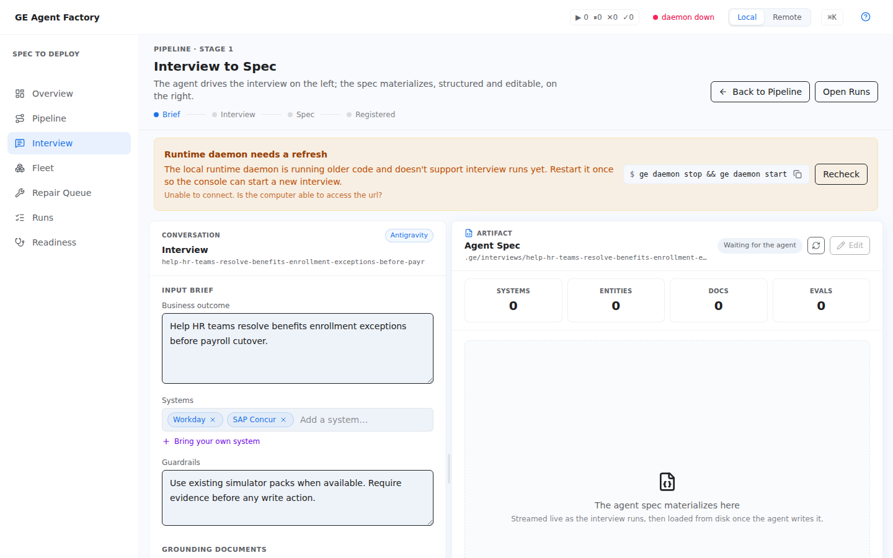

# Contract editor

Two connected surfaces capture intent and edit the resulting
[Enterprise Agent Contract](../concepts/enterprise-agent-contract.html): the
**Interview** view (conversational capture) and the **Spec Review** canvas
(structured editing and export).

## Interview — capture

An artifact-driven interview: a chat transcript pane on one side, a live
contract canvas on the other, and a document dropzone for grounding. You
describe the use case (or upload a BRD — a Business Requirements Document —
and let the interview read it); the interview agent asks what it still needs
and streams the contract into the canvas as it firms up — role, scope, tool
intents, workflow, evidence and escalation rules.

Use it when no contract exists yet. The result feeds straight into the
**Pipeline** view for compilation. Step-by-step:
[Capture from an interview](../cookbooks/capture-from-interview.html) and
[Capture from documents](../cookbooks/capture-from-documents.html).

  

## Spec Review — edit and export

The Spec Review canvas renders the contract half-by-half — the behavior half
(role, scope, rules, tool intents, workflow, golden evals) and the world
half (source systems, entities) — with field-level editing. It is also where
the contract's portable Markdown form is produced: the **Export OKF** action
and the OKF (Open Knowledge Format) Knowledge Bundle preview
(`GET /api/interviews/<id>/okf` behind the scenes).

> The OKF export is fully wired at the API level; the canvas's export button
> coverage is still being finished. `curl` against
> `/api/interviews/<id>/okf` always works.
{: .note }

## What it writes

- The contract: a catalog entry under `apps/factory/catalog/interview-specs/`
  (and `usecase-spec.json` in any workspace later compiled from it).
- Uploaded grounding documents, attached to the interview
  (`POST /api/interviews/<usecaseId>/documents`).
- The OKF bundle, on export.

## See also

- [The Enterprise Agent Contract](../concepts/enterprise-agent-contract.html) — what the fields mean.
- [Contract ⇄ OKF](../cookbooks/spec-to-okf.html) — the CLI path for the same conversion.
- [Pipeline & runs](./pipeline-and-runs.html) — compiling the captured contract.
