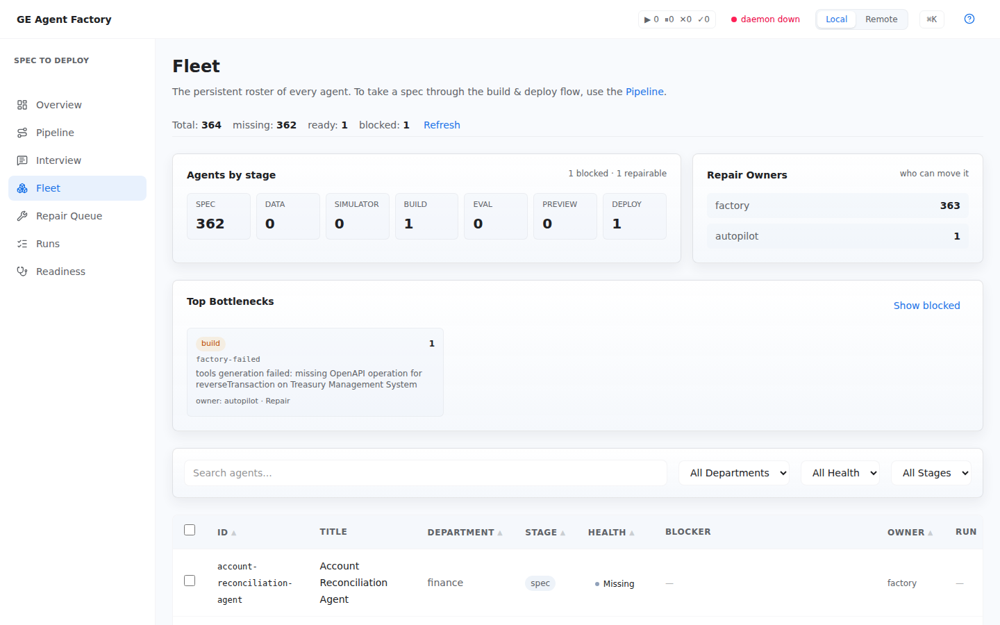

# Fleet & repair

Three surfaces for the many-agent day: **Fleet** (the roster), **Repair
Queue** (convergence), and **Agent detail** (one agent, deeply).

## Fleet — the roster

Every generated agent, filterable by department, status, and stage — filters
live in the URL hash, so a filtered view is shareable and reload-safe.
Select agents to run **bulk** build / ship / sync / repair / regenerate
actions. CLI equivalent: `ge fleet status`, plus `ge agents build --all` /
`ge agents ship` (all locally-built workspaces, or `--ids <a,b>`) for the
bulk actions.

  

## Repair Queue — converge to a target

A targeted queue for driving agents to a goal stage (`preview`, `promote`,
`deploy:plan`, `publish:plan`) with optional auto-repair: pick a
department/status scope and a target, run it, and the queue tracks the
resulting repair runs as they observe blockers, fix what they can, and
retry. This is the console face of
[repairing a failed proof](../cookbooks/repair-failed-proof.html); the CLI
equivalent is `ge fleet repair --ids <a,b>`.

  

## Agent detail — one agent end to end

The deep view for a single agent: its stage lifecycle, workspace doctor and
repair reports, artifacts (the
[proof pack](../concepts/agent-passport-and-proof-pack.html) contents), and
per-stage actions (build, ship, sync, regenerate, repair). A **triage band**
highlights what needs attention so you can act without scanning the whole
pipeline.

  

## See also

- [Repair a failed proof](../cookbooks/repair-failed-proof.html) — the guide.
- [Hand off to ADK / Gemini Enterprise](../cookbooks/handoff-adk-gemini-enterprise.html) — shipping from the Fleet view's bulk actions.
- [Readiness](./readiness.html) — the verdict to check before bulk operations.
