# OKF & GE Drive views

Yes — the recent OKF and `ge drive` work is represented in the console model.
It is not a detached dashboard: it is the detail layer between contract review,
runs, and workspace proof.

  

## OKF view

The OKF view belongs next to **Spec Review** because OKF is the portable
knowledge form of the same contract, not a separate source of truth. Use it to
answer four questions before generating or regenerating an agent:

| Question | Console affordance |
|---|---|
| What contract is this OKF bundle tied to? | Spec identity, version, department, use case, and contract diff context |
| What knowledge is grounded? | Source files, extracted concepts, and coverage by capability or workflow step |
| What is ready to export? | OKF bundle status, file list, and generated knowledge artifacts |
| What still needs review? | Missing source references, thin concepts, or contract fields that do not map cleanly |

The important invariant is contract-first ownership: edits happen in the
contract review surface; OKF export reflects that reviewed state.

## GE Drive view

The GE Drive view is the browser version of the operator loop you run from the
terminal with commands such as `ge prove` and `ge agents build`. It should make
these things visible without asking an operator to tail logs manually:

- the selected workspace and target stage;
- the command that will run, before it runs;
- live stage progress from the durable run ledger;
- blocked reasons and retry/repair actions;
- links to generated files, eval output, ADK preview, and proof-pack artifacts.

This is why the view spans **Pipeline**, **Runs**, and **Agent detail** instead
of appearing as one isolated sidebar item. Pipeline chooses the next command;
Runs follows it; Agent detail shows the files and proof that command produced.

## View contract

| Area | Must show | Must not do |
|---|---|---|
| OKF | Contract identity, bundle status, concepts, source files, export action | Let OKF silently diverge from the reviewed contract |
| GE Drive | Command preview, stage target, live follow, blockers, artifact links | Hide the underlying `ge` command or invent console-only behavior |
| Proof | Eval verdicts, validation artifacts, proof-pack location | Treat a green UI state as proof without artifacts |

## Relationship to the rest of the console

- **Interview** captures intent and supporting documents.
- **Spec Review** edits and approves the Enterprise Agent Contract.
- **OKF** packages the reviewed contract's knowledge context.
- **GE Drive** runs the factory against that contract and OKF bundle.
- **Runs** records the run ledger and live follow stream.
- **Agent detail** exposes generated files, preview, evals, and proof.
- **Readiness** checks whether the environment can safely run the next mutating step.

Together, these views make the console an operator cockpit over the same engine
as the CLI, not a parallel implementation.
