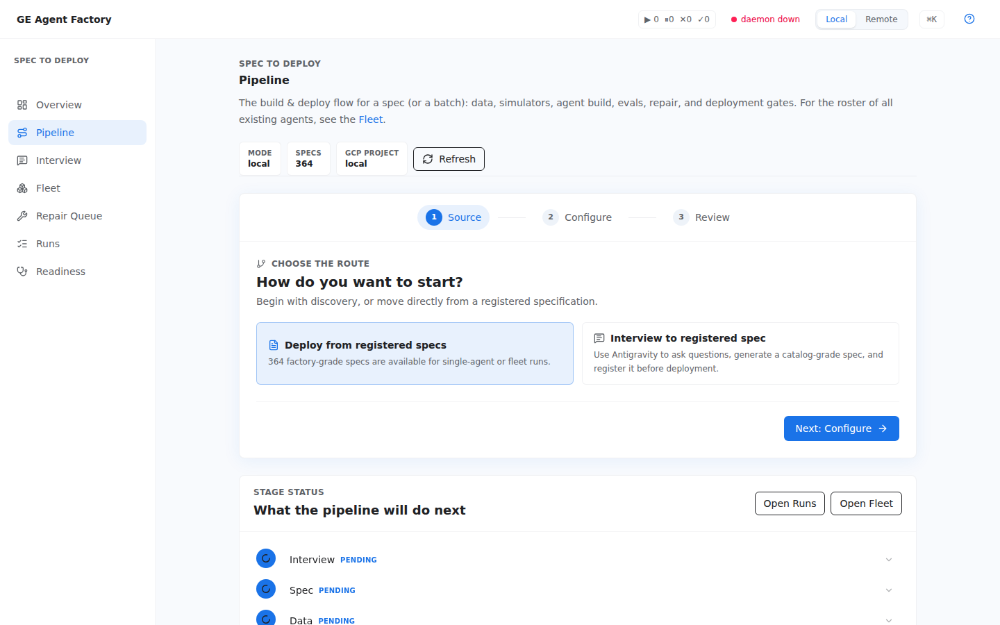

# Pipeline & runs

Compilation and observation are two views: **Pipeline** starts work,
**Runs** watches it.

## Pipeline — from contract to agent

A three-step wizard — **Source → Configure → Review**:

1. **Source** picks an existing contract or starts a new one (handing you to
   the [contract editor](./contract-editor.html) if needed).
2. **Configure** sets the scenario and the **source systems** via the
   SystemsField, which autocompletes over the simulated-system corpus. Its
   **Bring Your Own System** flow synthesizes a brand-new
   [source-system twin](../concepts/source-system-twins.html) from a
   natural-language description and binds it to the contract, live.
3. **Review** shows what will run and launches it.

Use it to drive a single agent (or a bulk scope) from contract to generated,
validated workspace. The CLI equivalents are `ge pipeline plan|run` and
`ge agents build`.

  

## Runs — everything, chronologically

One timeline over all three run sources — pipeline runs, builds, and jobs —
normalized into a single list with a unified status filter. Each row is
tagged by origin, expands to detail, and **Follow** opens the live Run
Drawer on it. CLI equivalents: `ge runs list`, `ge runs show <id>`,
`ge runs events <id> --follow`.

## The Run Drawer

The live-follow surface: an ordered **stage timeline**, a rolling **log
tail**, the **blocked reason** when a run pauses, and a reconnecting
indicator if the stream drops. **Pin** keeps it open after completion.
Because remote runs stream their logs through the same durable record, a
cloud compilation follows exactly like a local one.

  

## See also

- [Compile a contract](../cookbooks/compile-a-contract.html) — the same path from the CLI.
- [Run and observe](../operations/run-and-observe.html) — resuming blocked runs, inspecting the durable record.
- [Fleet & repair](./fleet-and-repair.html) — when it's many agents, not one.
