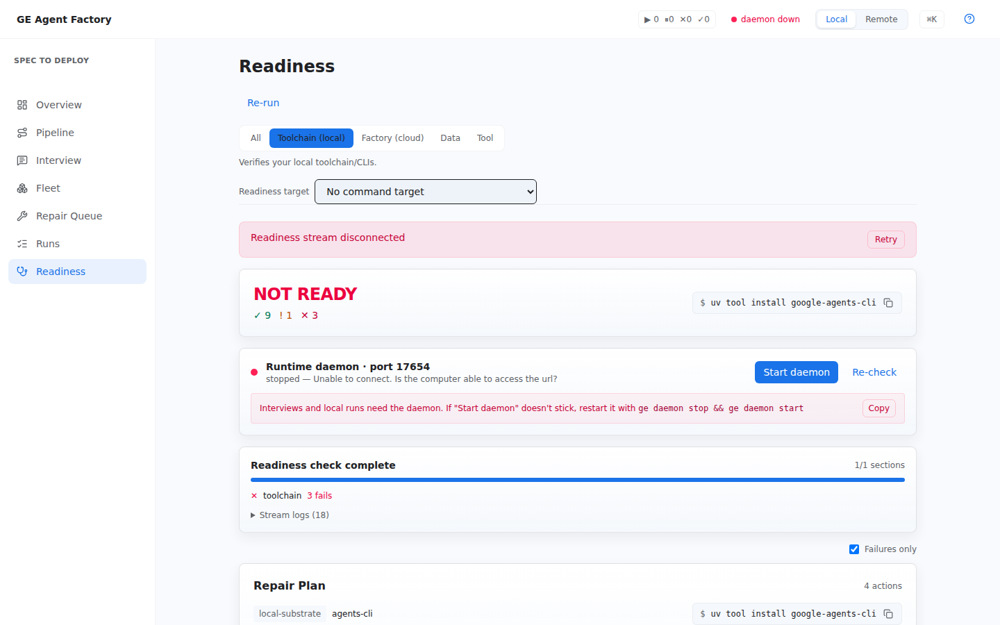

# Readiness

**Readiness** answers one question before you run anything mutating: *is
this environment ready for what you're about to do?* — and when the
answer is no, it hands you the exact command that fixes it.

## How it works

The view streams the health-check family (`doctor`) for a chosen scope —
`all`, `local`, `cloud`, `data`, or `mcp` — and optionally for a specific
target command (e.g. "am I ready to run `agents.build`?"). Every section's
checks roll up into a single verdict — **READY / NEEDS ATTENTION / NOT
READY** — and each failing check renders with a copy-able fix you can run
directly, or follow as a run.

Use it:

- before standing up the platform (scope `cloud`),
- before a first local compile (scope `local`),
- whenever something is blocked and you want the concrete unblock command
  rather than a stack trace.

  

CLI equivalents: `ge doctor`, `ge doctor --local|--cloud|--data|--mcp`, and
`ge doctor --command <id>` for command-scoped preflight.

## Readiness vs. proof

Two different verdicts, easy to conflate:

- **Readiness** (this view) judges the *environment*: toolchain, platform
  services, data and tool planes.
- **Proof** judges the *agent*: evals, trace, harness verdicts, the
  promotion gate. That story is in
  [Evals as proof](../concepts/evals-as-proof.html), and its console home is
  the Agent detail view's artifacts and the
  [Repair Queue](./fleet-and-repair.html).

## See also

- [Set up locally](../start/getting-started.html) — the first Readiness pass on a fresh machine.
- [Provision the platform](../operations/provision-the-platform.html) — driving cloud readiness to green.
