# Compile a contract into an agent

**Scope:** local-only — stops at the `previewed` build boundary; no cloud
credentials touched.

Compilation is the factory's central move: one
[contract](../concepts/enterprise-agent-contract.html) in, one generated,
validated workspace out. The workspace is a complete, standard
[ADK](https://google.github.io/adk-docs/) / `agents-cli` project — real code
derived from the contract, not a scaffold you fill in.

<p align="center">
  
</p>

## When to use this

- You have captured a contract — via the
  [interview](capture-from-interview.html),
  [documents](capture-from-documents.html),
  [an OpenAPI spec](capture-from-openapi.html), or the catalog — and want the
  compiled agent it describes.
- You changed a contract and need to recompile its agent.
- You want to see exactly what the compiler emits before involving any cloud
  project.

## Input artifact

The **Enterprise Agent Contract** — materialized as the use-case spec
(`usecase-spec.json`, see the [spec schema](../reference/spec-schema.html)).
Compilation reads the contract's `behaviorContract.workflow`, source systems,
entities, and `goldenEvals`; everything in the output traces back to a field
in the contract.

Prerequisites for the toolchain itself: `mise run setup` completed and
`mise run doctor-local` green. Local compilation needs `google-antigravity`
importable in `.venv` (verified by `mise run deps` / `mise run doctor-local`).

## Steps

1. **Switch to local mode** (compile on this machine, up to the build
   boundary — the cutoff after which stages would touch your Google Cloud
   project).

   ```bash
   ge mode local
   ```

2. **Compile a single contract end-to-end (canary).**

   ```bash
   ge agents build --canary
   ```

   `ge agents build` is the compile command; its flags control scope and the
   compiler's behavior:

   - `--canary` compiles **one** agent; `--all` compiles the whole catalog.
   - `--local` forces this machine via the harness — the local, LLM-driven
     review/refine step that checks generated code against the contract
     (see the [Glossary](../GLOSSARY.html)); `--remote` submits to the cloud
     factory. Without an override it follows the active `ge mode`.
   - `--dept <name>` filters by department; `--ids <a,b,c>` compiles specific
     agent/workspace ids.
   - `--limit <n>` caps local selection; `--concurrency <n>` sets remote
     submit concurrency (default 2).
   - `--model <id>`, `--location <loc>`, `--vertex` / `--no-vertex`,
     `--max-output-tokens <n>` tune the harness review/refine + generated
     agent.
   - `--target <stage>` sets the harness target (local; default `previewed`).
   - `--warm` pre-warms the shared uv cache before running (local).
   - `--force` recompiles even if already completed (local: wipes the
     selected workspaces first).
   - `--no-refine` skips the cloud refine stage on remote runs (`REFINE=0`);
     `--watch` (remote) tracks submitted runs until they are terminal.

   Equivalent `mise` shortcuts:

   ```bash
   CANARY=1 mise run provision-local   # ge agents build --local --canary
   CANARY=1 mise run provision         # ge agents build --canary  (active mode)
   ```

   > Always canary first. `--canary` proves the whole compile path on one
   > contract in minutes; only reach for `--all` once the canary workspace
   > verifies clean.
   {: .note }

3. **Find the workspace.** Local builds report `Workspaces in <dir>`. The
   canonical location is:

   ```bash
   ls .ge/factory/workspaces/<workspace-id>/
   ```

   (Override the state root with `GE_STATE_ROOT`. The manifest is
   `.ge/factory/workspaces.json`.) Inspect the full local state layout with:

   ```bash
   ge state paths
   ```

4. **Confirm the run finished.**

   ```bash
   ge agents status            # shows the run and its stages
   ge agents status --watch    # loops every 15s until runs are terminal
   ge runs events <runId> --follow   # stream one run's events live
   ```

## Expected output

- `ge agents build --local --canary` ends with
  `✓ local build → previewed (build boundary). Workspaces in .ge/factory/workspaces`.
- `ge agents status` shows the run terminal with no failed stages.
- The workspace directory exists and contains `app/agent.py` and
  `tests/eval/` (open them — the topology in `app/agent.py` mirrors
  `behaviorContract.workflow`).

## Console view

- **Pipeline** and **Runs** show the compile stages and live events for the
  run — see [Pipeline and runs](../console/pipeline-and-runs.html).
- **Agent detail** shows the per-agent stage pipeline, live logs, and
  downloadable artifacts.

## Generated files

Inside the generated workspace (one contract → one workspace):

- `app/agent.py` — the compiled agent (real ADK; Sequential/Parallel topology
  derived from `behaviorContract.workflow`, not a mock).
- `app/tools.py` — real `FunctionTool`s with the dual fixtures/MCP backend.
- Fixtures / simulation data for the agent's source systems (see
  [source-system twins](../concepts/source-system-twins.html)).
- `app/knowledge/` — the OKF knowledge bundle grounding the agent (see
  [Spec ⇄ OKF](spec-to-okf.html)).
- `tests/eval/` — `evalsets/ge_behavior_contract.evalset.json`,
  `eval_config.json`, `optimization_config.json`, compiled from the
  contract's `goldenEvals`.
- `agents-cli-manifest.yaml`, `pyproject.toml` — what makes the workspace a
  standard `agents-cli` project (see the full layout in
  [Agent generation](../reference/agent-generation.html)).

## Common failures

- **Build pauses at data readiness** — the Snowfakery runtime isn't warm. Run
  `mise run data-runtime`.
- **Local build fails immediately** — `google.antigravity` not importable.
  Re-run `mise run deps`.
- **No eval set in the workspace** — the contract has no
  `behaviorContract.goldenEvals`; add golden evals and recompile.
- **Remote run stalls after submit** — skip the cloud refine stage with
  `--no-refine` if you suspect it, and inspect with
  `ge agents logs <runId>`.

## Repair

- Read the failing stage first: `ge agents logs <runId> --stage validate`.
- Recompile one contract from scratch: `ge agents build --local --ids <id> --force`.
- If several workspaces are blocked, use the repair loop instead of manual
  retries — see [Repair a failed proof](repair-failed-proof.html).

## Next step

Prove the compiled agent against its contract — evals, harness verdicts, and
the promotion gate: [Prove an agent](prove-an-agent.html).
