# Getting started locally

**Scope:** local-only — no cloud project or credentials required.

## Goal

Understand the difference between **local** and **remote** mode, and see how
the fast DevEx gate and one-command smoke proof fit into the loop — all
without touching a cloud project.

Unfamiliar term? See the [Glossary](../GLOSSARY.html) — plain-language
translations of the jargon (harness, OKF, canary, planes, pipeline runs, …).

## Prerequisites + install

**→ For the full step-by-step (clone, prerequisites, `mise run setup`,
`mise run doctor-local`, first command, optional cloud setup), see
[`SETUP.md`](../../SETUP.md) at the repo root.** The short version:

```bash
mise run setup          # install deps, sync catalog/skills, install the `ge` command, start the daemon
mise run doctor-local    # check local tools: Bun, uv, Python, agents-cli, cache, harness wiring
mise run console         # open the operator UI → http://localhost:18260
```

## Steps

1. **Run the fast DevEx gate.**

   ```bash
   mise run devex-check
   ```

   This is `ge devex check`: local doctor, GitHub Pages link check, and generated
   workspace manifest contract validation in one fast command.

2. **Prove one local workspace end to end.**

   ```bash
   mise run devex-smoke
   ```

   This runs local readiness, sets local mode, builds one
   **[canary](../GLOSSARY.html#canary)** workspace
   (a single throwaway agent used to prove the pipeline works, as opposed to
   building the whole catalog) to the `validated` stage, and prints the
   workspace path, `workspace.json`, eval config, and next commands. It is the
   fastest proof that the repo is usable on this machine.

3. **Understand which mode you're in.**

   <p align="center">
     
   </p>

   ```bash
   ge mode
   ```

   - `ge mode` with no argument **reports** the active mode (defaults to
     `remote` when unset).
   - `ge mode local` — this machine runs *generate → validate* up to the
     **build boundary** (the `previewed` stage — the last stage that runs with
     no cloud credentials; everything after it touches your Google Cloud
     project); deploy/register/publish are cloud-only steps.
   - `ge mode remote` — this machine submits + observes; the cloud factory
     builds, deploys, and publishes.

   `mise.toml` also exposes `mise run mode-local` and `mise run mode-remote` as
   thin wrappers.

   > The mode defaults to `remote` when unset. If you're exploring on a fresh
   > clone with no cloud project, run `ge mode local` first so nothing tries to
   > reach Google Cloud.
   {: .note }

4. **(Optional) Build one agent locally to the preview boundary.**

   ```bash
   mise run mode-local && CANARY=1 mise run provision-local
   ```

   `CANARY=1 mise run provision-local` is `ge agents build --local --canary` — it
   builds a single agent on this machine up to the `previewed` build boundary.

## Verify

```bash
mise run doctor-local      # local toolchain section is all green
mise run devex-check       # local doctor + docs links + workspace manifest contracts
mise run devex-smoke       # validates one canary workspace and prints workspace.json
ge mode                # prints: mode: local (or remote)
ge state paths         # shows where state lands (.ge/...)
```

The console should load at http://localhost:18260 and show the Readiness view.

## Troubleshoot

See [`SETUP.md`](../../SETUP.md#troubleshoot) for install-time issues (missing
Bun, `~/.local/bin` not on PATH, `google.antigravity` not importable). Specific
to this cookbook's loop:

- **Mock/simulator data pauses** — `mise run data-runtime` warms the Snowfakery
  runtime; it needs network/cache the first time.
- **Status board / next step** — run `mise run next` or bare `ge` for a status-based
  recommendation.
