# Hand off to agents-cli

**Scope:** local-only — inspect and exercise the workspace with stock
`agents-cli`; actually deploying it is a cloud action covered in the
[next guide](handoff-adk-gemini-enterprise.html).

The handoff line is deliberate: the factory compiles and proves, and what
crosses the line is a *standard* `agents-cli` / ADK project with no factory
runtime library inside (see
[Handoff targets](../concepts/handoff-targets.html)). This guide opens a
proven workspace as exactly that — an ordinary project any ADK engineer can
run, eval, and deploy with tools they already know.

<p align="center">
  
</p>

## When to use this

- You want to verify there is no lock-in: the agent must work with stock
  `agents-cli`, outside any factory tooling.
- An ADK team is taking ownership of the generated code and needs to know
  what they're receiving.
- You want to run or debug the agent's evals directly in the workspace.

## Input artifact

A compiled, [proven](prove-an-agent.html) workspace. Find its path:

- `ge prove` builds/verifies a canary and prints the workspace id,
  path, manifest, and eval config;
- `ge state paths` shows the state layout — workspaces live under
  `.ge/factory/workspaces/<id>/`;
- the checked-in reference example is
  `generated-agents/account-reconciliation-agent/`.

`agents-cli` must be installed (`mise run deps`; pin
`google-agents-cli>=0.2,<0.3`).

## Steps

1. **Change into the workspace.**

   ```bash
   cd .ge/factory/workspaces/<workspace-id>
   ```

2. **Inspect the manifest — the file that makes it an `agents-cli` project.**

   ```bash
   cat agents-cli-manifest.yaml
   ```

   From the reference example:

   ```yaml
   name: account_reconciliation_agent
   agent_directory: app
   region: us-central1
   create_params:
     deployment_target: agent_runtime
     is_a2a: false
   ```

   `agent_directory: app` points at the ADK app (`app/agent.py`,
   `app/tools.py`); `deployment_target: agent_runtime` declares the deploy
   destination (ADK Agent Engine's runtime). `pyproject.toml` carries the
   matching `[tool.agents-cli]` section and plain dependencies
   (`google-adk`, `pydantic`, `pytest`) — nothing factory-specific.

3. **Run the evals with stock `agents-cli`.**

   ```bash
   agents-cli eval run --all
   ```

   This executes `tests/eval/evalsets/ge_behavior_contract.evalset.json`
   against the workspace's offline fixtures — the same proof the factory
   ran, now reproduced by the receiving team with their own tooling. (See
   [Prove an agent](prove-an-agent.html) for config and timeout variants.)

4. **Optionally, push the code to its long-term home.**

   ```bash
   ge agents sync --ids <workspace-id> --local
   ge agents sync --ids <workspace-id> --local --remote <git-url> --push
   ```

   With no repo configured this falls back to `generated-agents/` in this
   repo.

5. **Understand the deploy story.** The factory's release stages drive
   `agents-cli deploy` for you (`deploy_runtime` runs it inside the
   workspace — see the [next guide](handoff-adk-gemini-enterprise.html)).
   Because the project is standard, a manual `agents-cli` deploy from this
   directory is also possible — the manifest already declares the target —
   but then the factory's promotion gate and passport artifacts are on you
   to enforce.

   > Prefer `ge handoff agents-cli` over a by-hand deploy: it runs the same
   > `agents-cli` deploy underneath, plus the promotion gate, tool
   > registration, and Gemini Enterprise publishing.
   {: .note }

## Expected output

- `agents-cli eval run --all` passes in the workspace with no factory
  tooling involved.
- The manifest and `pyproject.toml` read as a plain ADK project — the
  receiving team needs the [ADK docs](https://google.github.io/adk-docs/),
  not this repo, to work on it. (See
  [vs agents-cli](../start/vs-agents-cli.html) for where each layer's
  responsibility ends.)

## Console view

- **Agent detail** — the per-agent view's Code sync panel drives the same
  `ge agents sync` path; **Fleet** bulk selection syncs several at once. See
  [Fleet and repair](../console/fleet-and-repair.html).

## Generated files

What crosses the handoff line (full layout in
[Agent generation](../reference/agent-generation.html)):

- `agents-cli-manifest.yaml` — project name, `agent_directory`, region,
  `deployment_target: agent_runtime`.
- `app/agent.py`, `app/tools.py`, `app/knowledge/` — the ADK app, tools, and
  OKF grounding bundle.
- `pyproject.toml`, `uv.lock` — standard Python packaging with the
  `[tool.agents-cli]` section.
- `tests/eval/` — `eval_config.json`, `optimization_config.json`,
  `evalsets/ge_behavior_contract.evalset.json`; plus `tests/test_smoke.py`
  and `evals/golden.json`.
- `fixtures/`, `mock_data/`, `mock_systems/` — the offline simulation data
  the tools read when `GE_DATA_BACKEND=fixtures` (the default).

## Common failures

- **`agents-cli: command not found`** — run `mise run deps`.
- **`eval run --all` flag rejected** — `agents-cli` outside the
  `>=0.2,<0.3` pin; reinstall the pinned version.
- **`Legacy configuration detected in pyproject.toml`** — the workspace
  predates the manifest; recompile it
  ([Compile a contract](compile-a-contract.html)) to get
  `agents-cli-manifest.yaml`.
- **Tools return no data outside the factory** — the default backend is
  `fixtures`; the `mcp` backend only resolves in a provisioned cloud
  project.
- **The checked-in example lacks `app/knowledge/`** — that snapshot is
  single-agent and predates conditional bundle emission; new builds emit it
  whenever the contract qualifies.

## Repair

If the workspace fails under stock `agents-cli`, treat it as a failed proof,
not a handoff problem: return to
[Repair a failed proof](repair-failed-proof.html), converge the workspace,
and re-run this guide. Don't hand-patch generated code in place — the next
compile would overwrite it; fix the contract instead.

## Next step

Ship the proven project through the release stages —
[Hand off to ADK Agent Engine / Gemini Enterprise](handoff-adk-gemini-enterprise.html)
— and see what identity travels with it in
[Agent passport & proof pack](../concepts/agent-passport-and-proof-pack.html).
