# Guides

Task-oriented guides through the layer this product adds above
agents-cli, ADK, and Gemini Enterprise: **capture** the contract, **compile**
it into an agent, **simulate** the source systems it touches, **prove** the
agent against the contract, and **hand off** the result to the runtime your
organization already operates. Every guide uses only real commands from the
repo (`mise.toml`, `tools/ge.mjs`, `apps/factory/scripts/*`) and real console
API routes.

Throughout, "the contract" means the enterprise agent contract — concretely,
the use-case spec (`usecase-spec.json`, or `agent-spec.json` when it comes out
of the interview). Its portable Markdown form is the OKF bundle. See
[The enterprise agent contract](../concepts/enterprise-agent-contract.html)
and the [Glossary](../GLOSSARY.html).

| # | Guide | What you get |
|---|-------|--------------|
| 1 | [Capture a contract in the interview](capture-from-interview.html) | A saved contract with a workflow and answerable queries, captured through the console interview |
| 2 | [Capture a contract from documents](capture-from-documents.html) | An interview grounded in your BRD and policy documents, so the contract cites real requirements |
| 3 | [Capture a source system from OpenAPI](capture-from-openapi.html) | A simulated source-system twin synthesized from an OpenAPI document |
| 4 | [Compile a contract](compile-a-contract.html) | A runnable agent compiled from the contract (`ge agents build --canary`) |
| 5 | [Contract ⇄ OKF](spec-to-okf.html) | The contract's portable Markdown form — an OKF bundle — and the round-trip back |
| 6 | [Generate simulations](generate-simulations.html) | Simulated source systems with deterministic seed data, mounted or promoted |
| 7 | [Prove an agent](prove-an-agent.html) | The behavior-contract eval set run as proof that the agent honors its contract |
| 8 | [Repair a failed proof](repair-failed-proof.html) | A diagnosed failure and a repaired, re-proven agent |
| 9 | [Admit an agent](admit-an-agent.html) | A signed Agent Passport over the proof pack, and the recorded admission decision that gates the handoff |
| 10 | [Hand off to agents-cli](handoff-agents-cli.html) | The compiled agent handed to the agents-cli workflow |
| 11 | [Hand off to ADK / Gemini Enterprise](handoff-adk-gemini-enterprise.html) | The compiled agent handed to ADK or Gemini Enterprise |
| 12 | [Drive a shipped agent](drive-a-shipped-agent.html) | A live conversation with the deployed agent, instrumented per turn, recordable as eval cases and cassettes |
| 13 | [Compile behavioral evals](compile-behavioral-evals.html) | An executable behavior suite derived from the contract — evalset, coverage, grading dataset, and load profile |
| 14 | [Prove the shipped agent live](prove-live.html) | Evalset cases run through the deployed assist surface — metric grid, conformance baselines, and the live gate verdict |
| 15 | [Bench against live budgets](bench-live-budgets.html) | Latency and error budgets verdicted against the live surface, with cassette replay for CI |

> Where a path or flag differs from common assumptions, the guide calls it out
> explicitly.
{: .note }

## Recommended paths

  

| Situation | Path |
|---|---|
| Fresh clone, no cloud | [Getting started](../start/getting-started.html) → [Capture a contract in the interview](capture-from-interview.html) → [Compile a contract](compile-a-contract.html) → [Prove an agent](prove-an-agent.html) |
| Business use case, no contract yet | [Capture a contract from documents](capture-from-documents.html) → [Capture a contract in the interview](capture-from-interview.html) → [Contract ⇄ OKF](spec-to-okf.html) → [Compile a contract](compile-a-contract.html) |
| New source system | [Capture a source system from OpenAPI](capture-from-openapi.html) → [Generate simulations](generate-simulations.html) → [Prove an agent](prove-an-agent.html) |
| First cloud release | [Provision the platform](../operations/provision-the-platform.html) → [Deploy the Agent Gateway](../operations/agent-gateway.html) → [Run and observe](../operations/run-and-observe.html) |
