# Prove an agent

**Scope:** local-only — the proof runs against the generated workspace's
offline fixtures; no cloud credentials touched.

Proof is what separates "the demo went well" from a release you can sign:
machine-checkable comparisons between the
[contract](../concepts/enterprise-agent-contract.html) and the agent's actual
behavior (see [Evals as proof](../concepts/evals-as-proof.html)). This guide
runs the whole chain on one workspace — the generated evals, the harness
review/refine verdicts, the spec-to-code trace — and then evaluates the
promotion gate that decides whether the agent may ship.

<p align="center">
  
</p>

## When to use this

- You recently [compiled a contract](compile-a-contract.html) and want evidence
  it behaves as the contract demands before any handoff.
- A reviewer asked "how do you know this agent is correct?" and you need
  artifacts, not anecdotes.
- A shipped agent's contract changed and you must re-prove the recompiled
  workspace.

## Input artifact

A compiled agent workspace under `.ge/factory/workspaces/<id>/` (or the
synced `generated-agents/<agent>/` directory). The contract must carry
`behaviorContract.goldenEvals` — otherwise no eval set is produced.
`agents-cli` must be installed (via `mise run deps` / `mise run setup`).

The evals are compiled from the contract, not hand-written: for each agent
the factory writes (see `renderAgentsCliEvalSet` in
`apps/factory/scripts/factory.mjs`)
`tests/eval/evalsets/ge_behavior_contract.evalset.json` (ADK — Agent
Development Kit — format, `eval_set_id: "ge_behavior_contract"`, one
`eval_case` per golden eval),
`tests/eval/eval_config.json`, and `tests/eval/optimization_config.json`.
Each eval case is a single-turn `conversation` whose `user_content` is the
eval prompt, plus `intermediate_data.tool_uses[]` — the expected trajectory.
The trajectory comes from the OKF (Open Knowledge Format) Eval-Scenario
**mechanisms** (`deriveTestMechanisms(contract)`, the same helper that
emits the OKF `tests/<id>.md` concepts), preferring those mechanisms over raw
`expectedToolCalls`; each tool name is canonicalized and kept only if it's an
actual generated tool (`list_systems`, `query_<table>`, contract action
tools). The evalset is the runnable projection of the contract's test
concepts.

## Steps

1. **Change into the generated agent workspace.**

   ```bash
   cd .ge/factory/workspaces/<workspace-id>     # or the synced generated-agents/<agent>/ dir
   ```

2. **Run the eval set.** The factory invokes:

   ```bash
   agents-cli eval run --all
   ```

   When the config exists it adds the config flag (this is what the factory's
   lifecycle runner does):

   ```bash
   agents-cli eval run --all --config tests/eval/eval_config.json
   ```

   A timeout can be passed through (`--timeout <seconds>`). Optimization
   uses:

   ```bash
   agents-cli eval optimize --config tests/eval/optimization_config.json
   ```

   > `--all` and the JSON config paths are what the factory invokes today
   > (verified in `factory.mjs`). `agents-cli` flags can change between
   > releases — confirm with `agents-cli eval run --help` before relying on
   > them. The pin is `google-agents-cli>=0.2,<0.3` (see `mise run deps`),
   > which keeps `eval run --all`.
   {: .warning }

3. **Read the harness verdicts.** The harness is the local, LLM-driven
   reviewer that judges the generated code against the contract and can
   rewrite what isn't faithful (see the [Glossary](../GLOSSARY.html)). It
   leaves two verdict artifacts in the workspace:

   ```bash
   cat artifacts/generator-feedback.json   # review verdict, incl. okToPromote
   cat artifacts/harness-refine.json       # refine verdict, incl. spec_to_code_fidelity
   ```

   These run automatically during `ge agents build`; `ge agents status`
   shows the `harness_reviewed` / `harness_refined` / `validated` milestones.

4. **Check the spec-to-code trace** — the structural proof that every tool,
   system, and rule the contract declares actually appears in the generated
   code. It is produced during validation and consumed by the gate in the
   next step; the trace artifact is listed in the workspace's
   `workspace.json`.

5. **Evaluate the promotion gate.** The gate refuses to ship a workspace
   whose validation report, spec-to-code trace, or harness verdicts haven't
   cleared their bar:

   ```bash
   node apps/factory/scripts/factory.mjs promotion-gate --dir .ge/factory/workspaces/<workspace-id>
   ```

   (Run from the repo root; this command is also called
   `factory promotion-gate`.) On failure it prints the specific blockers and
   exits non-zero. An override exists (`--force` on the gate/deploy, or
   `GE_ALLOW_UNPROMOTED=1`) precisely so that using it is a visible,
   deliberate act.

## Expected output

- `agents-cli eval run --all` reports the eval cases passing — right tools,
  right order, grounded answers.
- `artifacts/generator-feedback.json` has an `okToPromote` verdict that is
  not `false`; `artifacts/harness-refine.json` carries a passing
  `spec_to_code_fidelity` verdict.
- `promotion-gate` returns `ok: true` with a `specToCodeScore` /
  `specToCodeFidelity` and an empty `blockers` list. That gate output is the
  promotion packet at the core of the
  [proof pack](../concepts/agent-passport-and-proof-pack.html).

## Console view

- **Runs** — run stages and harness scores appear in the Runs view and Run
  Drawer; see [Pipeline and runs](../console/pipeline-and-runs.html).
- **Readiness** — the environment-level rollup of verdicts; see
  [Readiness](../console/readiness.html).
- **Repair Queue** — where blockers land when a proof fails; see
  [Fleet and repair](../console/fleet-and-repair.html).

## Generated files

Proof artifacts, all inside the workspace:

- `tests/eval/evalsets/ge_behavior_contract.evalset.json`,
  `tests/eval/eval_config.json`, `tests/eval/optimization_config.json` — the
  runnable evals (criteria include `tool_trajectory_avg_score`, rubric- and
  safety-based scores).
- `evals/golden.json` — the human-readable golden eval specs used for
  harness review.
- `artifacts/generator-feedback.json` — harness review verdict.
- `artifacts/harness-refine.json` — harness refine verdict with
  `spec_to_code_fidelity`.
- The validation report and spec-to-code trace consumed by the gate
  (`apps/factory/src/promotion-packet.js`).

## Common failures

- **No `evalset.json`** — the contract has no
  `behaviorContract.goldenEvals`; the factory returns `null` and writes
  nothing. Add golden evals (the [interview](capture-from-interview.html)
  emits them) and recompile.
- **`agents-cli: command not found`** — run `mise run deps` (installs
  `google-agents-cli`).
- **`eval run --all` flag rejected** — your `agents-cli` is outside the
  `>=0.2,<0.3` pin (newer versions removed `--all`). Reinstall the pinned
  version or check `agents-cli eval run --help`.
- **Tool-use mismatch** — only canonical generated tools are kept in the
  trajectory; if a golden eval referenced a tool the agent doesn't expose,
  it's dropped from the case.
- **Promotion gate blocked** — the blockers name exactly which proof is
  missing or failing (e.g. "validation report is not passing",
  "harness review verdict: ok_to_promote is false").

## Repair

A failed proof is a work item, not a dead end. The harness refine step
fixes what it can automatically; what's left becomes blockers for the repair
loop — see [Repair a failed proof](repair-failed-proof.html). For a single
workspace, `ge agents logs <runId> --stage validate` shows why validation
failed, and `ge agents build --local --ids <id> --force` recompiles from
scratch.

## Next step

With the gate green, hand the proven workspace off:
[Hand off to agents-cli](handoff-agents-cli.html) to work with the project
directly, or
[Hand off to ADK Agent Engine / Gemini Enterprise](handoff-adk-gemini-enterprise.html)
to ship it.
