# Repair a failed proof

**Scope:** local-only — repairs converge workspaces to the `preview` build
boundary on this machine; no cloud credentials touched.

A failed proof — a validation report that isn't passing, a harness verdict
that refused promotion, an eval that missed its trajectory — is a work item,
not a dead end. This guide runs the repair loop: observe the blockers, let
the repair runner fix and retry each blocked workspace, and re-prove.

<p align="center">
  
</p>

## When to use this

- [Prove an agent](prove-an-agent.html) ended with promotion-gate blockers
  or failing evals.
- `ge agents status` shows failed runs, or several workspaces are stuck
  short of the build boundary.
- A compile or repair run was interrupted and you need to pick it up where
  it stopped.

## Input artifact

A blocked workspace (or several) and its run history:

- run ids from `ge agents status` or `ge runs list`;
- blocker descriptions from `ge fleet status` — *fleet* here is the set of
  all agent workspaces the factory tracks;
- the failing stage's logs (step 2 below).

The repair runner executes through the local daemon (the background process
that runs and records tasks); `ge daemon status` should report it healthy.

## Steps

1. **Survey convergence and blockers.**

   ```bash
   ge fleet status
   ```

   This prints fleet health (`blocked` / `repairable` counts, tallies by
   stage and by owner) and the top bottlenecks — each with a blocker id, a
   suggested action command, and the affected agent ids. `--limit <n>` caps
   the bottleneck list (default 8).

2. **Read the failing stage before repairing.**

   ```bash
   ge agents logs <runId> --stage validate
   ```

   `--stage` defaults to `validate`; `--item <id>` narrows to one work item
   within the run. This pretty-prints the stage result, error, and the
   failing command's stderr.

3. **Start a repair run.**

   ```bash
   ge fleet repair --ids <a,b>
   ```

   The repair runner observes each item's blockers, repairs, and retries
   until the item converges or attempts run out:

   - `--ids <a,b>` — comma-separated agent/workspace ids (default: the
     current repair queue).
   - `--target-stage <stage>` — the gate to converge to (default `preview`).
   - `--attempts <n>` — repair attempts per item (default 3).
   - `--no-repair` — observe blockers without running repair.
   - `--run-preview` — run preview after repair when supported.
   - `--follow` — stay attached and stream the run's live events.

4. **Watch the repair run.**

   ```bash
   ge fleet repairs              # list recent repair runs
   ge fleet repairs <id>         # one repair run's summary
   ge runs events <id> --follow  # stream its live events
   ```

   `ge runs list` shows the same run in the unified timeline (daemon tasks
   plus durable ledger runs — the ledger is the persistent record of builds,
   newest first).

5. **Resume anything that was interrupted rather than blocked.**

   For a daemon task that stopped mid-flight:

   ```bash
   ge runs resume <id>
   ```

   (POSTs the task's deterministic resume plan.) For builds recorded in the
   ledger — retry failed stages, finish local work:

   ```bash
   ge agents resume          # prints the resume plan
   ge agents resume --run    # executes it in order
   ```

   `--ids <a,b>` filters; `--target <stage>` overrides the target (default
   `previewed` in local mode, `published` in remote mode).

6. **Re-prove.** Once the repair run reports the workspaces converged,
   re-run the proof chain — see [Prove an agent](prove-an-agent.html).

## Expected output

- `ge fleet repair` returns a repair-run summary; `ge fleet repairs` shows
  its counts as `passed/repaired/blocked/total` — a converged fleet ends
  with `blocked` at 0.
- `ge fleet status` shows the previously-blocked agents at or past the
  target stage, with no remaining bottleneck naming them.
- A resumed run advances past the blocked stage in `ge runs list`.

## Console view

- **Repair Queue** — the blockers and repair runs, with the same
  observe/repair/retry loop; **Fleet** shows convergence per agent. See
  [Fleet and repair](../console/fleet-and-repair.html).
- **Runs** — the repair run's live event stream and history. See
  [Pipeline and runs](../console/pipeline-and-runs.html).

## Generated files

- A durable repair-run record (a daemon task with its event stream under
  `.ge/runtime/` — inspect with `ge runs events <id>` or replay with
  `ge runs replay <id>`).
- Refreshed proof artifacts in each repaired workspace —
  `artifacts/generator-feedback.json`, `artifacts/harness-refine.json`, the
  validation report — which is what the promotion gate re-reads.

## Common failures

- **`ge daemon is stopped; run: ge daemon start`** — `ge fleet repair` and
  `ge fleet repairs` need the daemon; start it and retry.
- **Repair leaves items blocked** — attempts ran out. Read the remaining
  blockers (`ge fleet repairs <id>`, or `--no-repair` to observe), fix the
  root cause manually, and re-run with more `--attempts`.
- **`ge runs resume` does nothing** — confirm the task id and that it's
  actually resumable (`ge runs show <id>`).
- **`ge agents resume` says the ledger is empty** — run a build first, or
  import legacy state with `ge ledger backfill`.
- **Run stuck at data readiness** — warm the data runtime:
  `mise run data-runtime`.

## Repair

If the loop itself can't converge a workspace, drop to first principles:
`ge agents logs <runId> --stage <stage>` for the exact failing command,
fix the contract or simulation it points at (see
[Generate simulations](generate-simulations.html)), then recompile that one
workspace with `ge agents build --local --ids <id> --force` and re-enter
this guide at step 1.

## Next step

Re-run the proof chain on the repaired workspaces —
[Prove an agent](prove-an-agent.html) — then proceed to
[handoff](handoff-agents-cli.html).
