# Developer Guide

Use this guide to find the right layer for a change and run the smallest check
that proves it works.

Unfamiliar term? See the [Glossary](./GLOSSARY.html) — plain-language
definitions of harness, OKF, canary, planes, pipelines, and other jargon.

## Purpose first

GE Agent Factory exists to close the gap between "we can imagine an enterprise
agent" and "we can hand off, audit, test, and operate one." The system is built
around one principle: **the spec is the contract**. Business intent, source
systems, data entities, tool bindings, workflows, eval mechanisms, generated code,
and cloud release stages all trace back to that contract.

That's why the repo holds a generator, local fixtures, simulator packs, an
operator CLI, a console, an MCP (Model Context Protocol) server, Terraform,
run [ledgers](./GLOSSARY.html#ledger) (durable run records), evals, and
generated-agent workspaces — pieces that let a developer reproduce an agent
locally and an operator release the same artifact into a governed project.

## What to run first

```bash
mise run setup
mise run doctor-local
ge prove
mise run console
```

This installs the toolchain, proves one included contract to a validated
workspace, and opens the console at `http://localhost:18260`. To work on your
own use case, run `ge capture` before `ge prove`. The default proof needs no
cloud credentials.

<details>
<summary>Lower-level developer checks</summary>

```bash
mise run devex-check                         # local tools + docs links + workspace contracts
mise run mode-local                         # make local execution explicit
CANARY=1 mise run build-agents-local        # build one catalog agent to the boundary
```

</details>

For cloud release work:

```bash
export GEMINI_ENTERPRISE_APP_ID=projects/<num>/locations/global/collections/default_collection/engines/<app>
mise run bootstrap-cloud
ge handoff agents-cli
```

## Repo map

The layering is enforced, not conventional: apps import the operator core,
the core imports the shared packages, and nothing imports upward
(`node tools/check-no-app-imports.mjs`, part of the commit gate):

<p align="center">
  
</p>

| Path | Purpose | Start here when... |
|---|---|---|
| `tools/ge.mjs` | Human CLI over the factory core | Adding or debugging operator commands |
| `tools/lib/factory-core.mjs` | Shared engine used by CLI, console, and MCP | Changing build, handoff, sync, doctor, or platform behavior |
| `tools/lib/ledger/run-ledger.mjs` | Local/remote run state and event history | Debugging status, fleet, logs, or resumability |
| `tools/mcp-server.mjs` | MCP surface over factory operations | Letting models or [harnesses](./GLOSSARY.html#harness) (LLM review/driver loops) drive the factory |
| `apps/console/` | React operator UI | Changing Pipeline, Fleet, Activity, Doctor, or agent detail flows |
| `apps/factory/` | Generator, workbench, simulator tooling, factory worker | Changing generated workspaces, data, evals, or simulator integration |
| `apps/factory/simulator-systems/` | Source-system simulator packs | Adding Workday/SAP/etc. behavior without a live system |
| `apps/factory/mcp-service/` | Runtime MCP facade for generated agents | Changing how cloud agents call source-system tools |
| `installer/terraform/` | Cloud project platform | Changing infra, IAM, data stores, Cloud Run, Agent Gateway, or MCP |
| `packages/` | Shared workspace libraries, including the extracted engines: `@ge/synthkit` (deterministic synthetic data — [Synthetic data](./reference/synthetic-data.html)) and `@ge/evalkit` (behavioral eval compiler + metrics — [Evaluation generation](./reference/evaluation-generation.html)). Not all packages are wired in yet; see the [modularization audit](./modularization-audit.html) for per-package integration status | Changing cross-app contracts, an engine, or reusable UI/runtime code |
| `docs/` | Canonical docs published by the Astro/Starlight app in `apps/docs` | Changing public explanation, guides, reference, or operations docs |

## Mental model

The factory has one stage graph and two execution modes.

| Mode | Runs where | Use it for |
|---|---|---|
| Local | Your machine | Fast iteration, fixture-backed generation, tests, evals, preview checks |
| Remote | Your Google Cloud project | Data load, Agent Runtime deploy, MCP registration, Gemini Enterprise publish |

The build boundary is `previewed`. Stages before it are pure computation and can
run locally. Stages after it touch cloud resources and run through the remote
factory or `ge handoff agents-cli`.

The three platform [planes](./GLOSSARY.html#planes) — the infrastructure
layers `ge up` stands up — are:

<p align="center">
  
</p>

| Plane | Owns |
|---|---|
| Factory plane | Gateway, worker, Cloud Tasks queue, Cloud Build, run orchestration |
| Data plane | GCS, BigQuery, Bigtable, Firestore, AlloyDB, per-agent data/IAM |
| Tool plane | Per-department MCP services, Agent Registry entries, Agent Gateway |

## Workspace manifest

Every local build writes `.ge/factory/workspaces/<workspace-id>/workspace.json`.
Treat it as the workspace contract for developers and tools:

| Field | Why it exists |
|---|---|
| `source` | The originating use case, department, spec, pipeline, and fixture manifest |
| `agent` | Runtime, entrypoint, agent path, and tool path |
| `commands` | Copyable install, run, test, eval, doctor, repair, sync, and handoff commands |
| `generatedFiles` | Required and optional generated files with existence status |
| `readiness` / `quality` | Current local health: mock data, agent, tests, trace, preview, data package |
| `registration` | Whether deploy, registry, runtime, publish, and Gemini Enterprise handoff are ready |
| `artifacts.items` | Validation, trace, preview, deploy, publish, data, and tool-plan artifact inventory |

`ge devex check` validates the local doctor, documentation links, and generated
workspace contracts. `ge prove` prints the primary workspace path and
manifest path, then gives the next commands to run.

## Development loops

### CLI/core change

1. Edit `tools/ge.mjs` for rendering/command wiring or `tools/lib/*` for behavior.
2. Run the focused test when one exists, then `bun test tools`.
3. Run `ge --json` or the exact command you touched.
4. Update [CLI reference](./reference/cli.html) if flags, commands, or behavior changed.

### Console change

1. Edit `apps/console/src/*`.
2. Run `mise run console`.
3. Exercise the affected view in the browser.
4. Update [Console & APIs](./reference/console-and-apis.html) or
   [Console Tour](./console/) if routes, views, or payloads changed.

### Generator or generated-agent change

1. Edit `apps/factory/src/*` or the relevant generator scripts.
2. Build one canary locally with `mise run mode-local && CANARY=1 mise run build-agents-local`.
3. Inspect the generated workspace under `.ge/factory/workspaces/`.
4. Run evals when the change affects behavior contracts.
5. Update [Agent generation](./reference/agent-generation.html),
   [Spec schema](./reference/spec-schema.html), or [OKF](./reference/okf.html).

### Simulator change

1. Add or edit a pack under `apps/factory/simulator-systems/`.
2. Validate the pack with the simulator tooling.
3. Build a canary that uses the system.
4. Update [Simulator systems](./reference/simulator-systems.html) and the
   [Bring your own simulator](./cookbooks/generate-simulations.html) cookbook
   when the pack contract changes.

### Cloud platform change

1. Edit `installer/terraform/` or cloud-facing factory code.
2. Run `ge doctor` before and after the change.
3. Prefer `ge infra plan` before any apply.
4. Update [Architecture](./reference/architecture.html), [Operations](./OPERATIONS.html),
   or [MCP](./MCP.html) if IAM, ingress, service names, data stores, or stage
   ownership changed.

## Quality gates

Use the smallest gate that proves the change, then run the broader gate before
merging shared behavior.

| Change type | Focused check | Broader check |
|---|---|---|
| Docs only | `bun run docs:gate` and `bun run docs:site:build` | `bun run ci` |
| CLI/core | `bun test tools` and the touched `ge` command | `mise run devex-check`, then `bun run ci` |
| Console | `bun run build:console` | `bun run ci` |
| Presentation | `bun run build:presentation` | `bun run ci` |
| Generator | Relevant `apps/factory` tests | `bun run ci` plus a one-agent build |
| Python simulator runtime | `bun run test:py` | `bun run ci` plus simulator conformance test |
| Terraform/platform | `ge infra plan`, `ge doctor` | Canary bootstrap in a test project |

`bun run ci` runs source hygiene → typecheck → Oxlint → the catalog build →
`bun run docs:gate` → `bun run test:gated`. The final command shards `bun test`
by app and package, merges the results, and cross-checks failures against
`tools/known-test-failures.json`; see AGENTS.md's "Before you commit" section.
`mise run ci` mirrors `cloudbuild.ci.yaml` and currently omits the standalone
Oxlint step, so prefer `bun run ci` for the complete local gate.

## Documentation rules

The docs should stay purpose-first and executable.

- Start each page by saying why the thing exists.
- Present front-door tasks in Capture → Prove → Handoff order.
- Keep commands copyable from the repo root unless the page says otherwise.
- Name whether commands are read-only, local-mutating, or cloud-mutating.
- Link concepts to reference and reference to cookbooks.
- When behavior changes, update docs in the same change as code.
- Prefer source paths over vague component names.

## Where to go next

| Question | Read |
|---|---|
| Why is the factory shaped this way? | [Concepts](./concepts/) |
| What command or field do I need? | [Reference](./reference/) |
| How do I complete a task? | [Cookbooks](./cookbooks/) |
| How do I deploy or recover it? | [Operations](./OPERATIONS.html) |
| How does MCP fit in? | [MCP](./MCP.html) |
