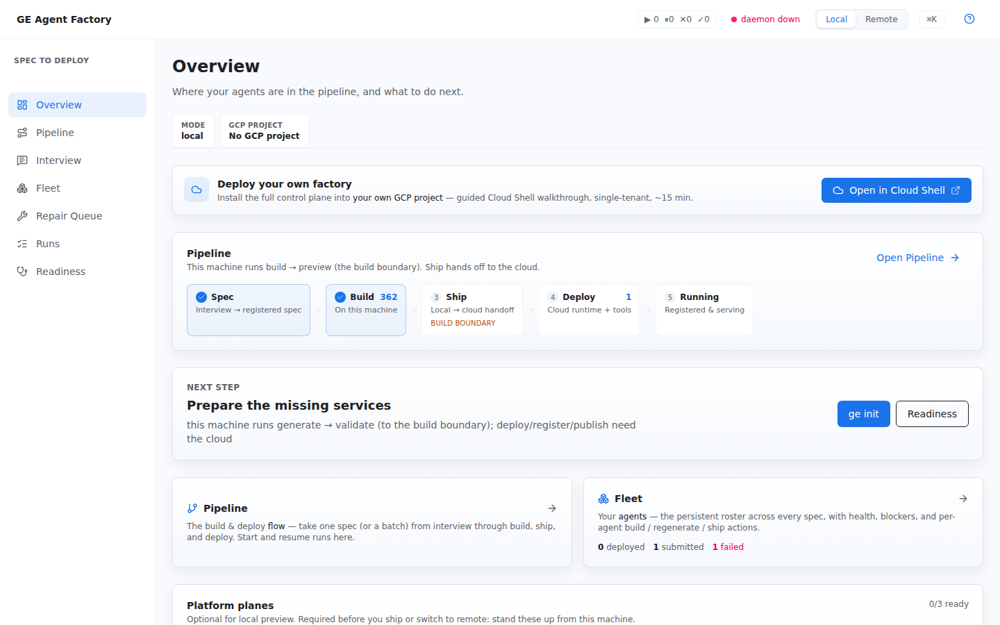

# What is GE Agent Factory?

**An agent is a contract with the external world.** It reads your systems,
acts on your data, and speaks to your users — so the factory builds it
from one: not hand-assembled, not trusted on faith, but compiled from a
canonical spec and admitted to production on verifiable evidence. What you
walk away with is a contract you can read, a simulation you can test
against, and proof you can show a reviewer — before the agent touches
anything real.

Hand-writing an agent from a business requirements document works for one
demo — one person can hold the whole intent in their head while wiring up
prompts and tool calls. It stops working at the second agent, because
nothing written down connects the business's request to the code that's
supposed to satisfy it. Skipping the document and writing straight from
judgment calls is worse: there's no requirement left to check the agent
against, so nothing catches it drifting from what was asked until a user
does.

The spec is an Enterprise Agent **Contract**, captured in **OKF** — the
Open Knowledge Format from Google Cloud: plain Markdown with structured
frontmatter, portable and vendor-agnostic, readable by a business owner
and compilable by the factory. A user interview, a BRD, or a PRD yields
it, and that one spec drives the whole path — every stage after capture is
checked against the same contract, not just generated from it once and left
to drift:

1. **Capture** — start from a user interview or an existing BRD; the
   factory compiles it into a contract.
2. **Generate** — the contract generates the agent's ADK code and tools; a
   spec-to-code trace checks the result against the contract's tool intents.
3. **Evaluate** — the contract and the generated code produce the eval
   suite, in agents-cli's own eval format, scored against the contract's
   success criteria.
4. **Simulate** — the contract's declared source systems become simulated
   third-party SaaS backends, seeded with synthetic data, so every tool
   call is exercised against them before any production integration exists.
5. **Admit** — the evidence from every checked stage is sealed into a
   signed Agent Passport, and an admission gate — a required prerequisite,
   not a suggestion — verifies it before the agent ships through agents-cli
   to ADK Agent Engine.
6. **Run** — the deployed agent is published to Gemini Enterprise, where
   your business users talk to it.

The passport carries standard in-toto attestations, so admission
controllers you may already run — sigstore policy-controller, Kyverno,
Binary Authorization — can verify the same evidence downstream. See
[Agent Passport & Proof Pack](./concepts/agent-passport-and-proof-pack.html).

Everything below the handoff line — scaffolding the ADK project, deploying to
Agent Engine, publishing into Gemini Enterprise — is done *by* those tools.
The factory owns everything above it: turning intent into that readable
contract, exercising it against simulated systems, and sealing the evidence
that it holds.

<p align="center">
  
</p>

That flow runs on a deliberately small stack. Three operator surfaces —
CLI, console, MCP — share one command registry; the registry drives one
generator engine; the engine leaves everything it makes on disk as
inspectable artifacts. Only the handoff at the bottom touches your Google
Cloud project:

<p align="center">
  
</p>

## Works with your coding agent

<p align="center">
  &nbsp;
  &nbsp;
  &nbsp;
  &nbsp;
  
</p>

Every factory job ships as an agent skill — including the install itself —
so a coding agent can set up a bare machine, verify each step, and operate
the factory end to end:

```bash
curl -fsSL https://raw.githubusercontent.com/vamsiramakrishnan/ge-agent-factory/main/packages/create-ge-agent-factory/bin/create-ge-agent-factory.mjs \
  | bun - -- --skills agents        # GitHub-backed clone + guided, verified install
```

| Agent | Install |
| --- | --- |
| **Claude Code** | `/plugin marketplace add vamsiramakrishnan/ge-agent-factory` then `/plugin install factory-bootstrap@ge-agent-factory` |
| **Gemini CLI** | `gemini extensions install https://github.com/vamsiramakrishnan/ge-agent-factory` |
| **Antigravity · Codex · agents-cli-style sessions** | `curl -fsSL https://raw.githubusercontent.com/vamsiramakrishnan/ge-agent-factory/main/packages/create-ge-agent-factory/bin/create-ge-agent-factory.mjs \| bun - -- --skills agents` |
| **Any MCP client** | `bun tools/mcp-server.mjs` from a checkout |

Generated workspaces hand off to [Google agents-cli](https://google.github.io/agents-cli/) / ADK / Gemini Enterprise either way; skills automate the setup and operations above that handoff, not the handoff itself.

## From contract to proof in the console

The console exposes the same path: capture a contract, keep its knowledge
bundle beside it, watch agents build and prove, and inspect the evidence
before handoff.

<details>
<summary>The console views along that path, in the machinery's own names</summary>

<p align="center">
  
</p>

| Surface | What you check | Why it matters |
|---|---|---|
| **Interview + Spec Review** | Role, scope, tools, refusal rules, success criteria | The business request becomes an auditable Enterprise Agent Contract |
| **OKF export** | Knowledge bundle, concepts, source files, export readiness | The reviewed contract has grounded context that can travel with the generated agent |
| **Pipeline + Runs** | `ge prove`, `ge agents build`, stage logs, blockers | Operators can drive the same factory engine from the browser or terminal |
| **Agent detail + proof** | Files, ADK preview, eval results, proof pack | Reviewers see the generated output and evidence before promotion |

</details>

## The problem it solves

Enterprise agent programs rarely fail at the model. They fail at the seams:
the business intent lives in a slide deck, the data access rules live in an
IAM console, the tool definitions live in a notebook, and the evidence that
any of it works lives nowhere. Each seam is a place where an agent silently
drifts from what the business asked for.

The factory closes those seams with one artifact chain:

| Without the factory | With the factory |
|---|---|
| Intent is a slide or a prompt | Intent is captured into a versioned **contract** — role, scope, tools, evidence rules, escalation and refusal rules |
| Agents are demoed against production or nothing | Agents are exercised against **source-system twins** — simulated backends seeded with realistic synthetic data |
| Correctness is asserted in a demo | Correctness is **proven**: generated eval suites, a spec-to-code trace, and a promotion gate that blocks unproven agents |
| Tool access is hand-wired | Tools are generated from the contract and governed at runtime |
| Deployment is a bespoke script | **Handoff** is a defined step: the output is a real agents-cli / ADK project, shipped to Agent Engine and published to Gemini Enterprise in your own Google Cloud project |

## What the factory is not

- **Not an agent framework.** The generated agent is standard Google ADK
  Python; the factory writes it, it doesn't run it.
- **Not a deploy tool.** Deployment is `agents-cli`'s job; the factory
  prepares the project and drives the handoff.
- **Not a chat product.** The output is code, data, evals, and proof — the
  conversational surface belongs to Gemini Enterprise.

Comparing this against what you already run? [GE Agent Factory vs agents-cli](./start/vs-agents-cli.html)
breaks down the layers.

## See it work

All local, no cloud credentials — about ten minutes end to end:

```bash
curl https://mise.run | sh   # once, if you don't have mise
mise run setup               # toolchain + the ge CLI (~5-10 min, one time)
ge init                      # discover config, write .ge.json (~30 s)
ge prove                     # compile one contract into a validated agent workspace (~5 min)
```

<details>
<summary>Under the hood</summary>

On a fresh machine, `ge prove` runs the local doctor, then builds one
canary workspace to the `validated` stage. Once workspaces exist,
`ge prove` rebuilds their proof via `ge agents build`; `ge prove --watch`
re-proves on contract change.

</details>

The result on disk is the whole layer in miniature: a contract
(`usecase-spec.json` with its `behaviorContract`), generated ADK code and
tools, fixture data, smoke tests, an eval suite, and the validation artifacts
the promotion gate reads:

<p align="center">
  
</p>

Continue with the
[ten-minute tutorial](https://vamsiramakrishnan.github.io/ge-agent-factory/start/quickstart/)
or the fuller [local setup guide](./start/getting-started.html).

<p align="center">
  
</p>

The console (`mise run console` → `http://localhost:18260`) shows the same
state live — the screenshot above is a real capture of it, not a mock.
See [Console](./console/).

## Do this at scale

The same contract, generated code, checked evals, and simulated systems
exist today for 363 horizontal agents across HR, Finance, IT, Marketing,
and Procurement, plus 150 industry-vertical agents across retail, banking,
insurance, telco, and manufacturing. Browse the canonical spec and
generated source for any of them, laid out as a periodic table — one tile
per agent, click through to its Enterprise Agent Contract and code:

- [Horizontal catalog](https://vamsiramakrishnan.github.io/ge-agent-factory/catalog/) — 363 shared-services agents across five departments
- [Vertical catalog](https://vamsiramakrishnan.github.io/ge-agent-factory/catalog-verticals/) — 150 industry agents across five verticals
- [Catalog explorer](https://vamsiramakrishnan.github.io/ge-agent-factory/catalog/explorer/) — both halves together, filterable by industry, function, and value stream

None of it is hand-maintained: the catalog is generated from the same
drift-gated registry the factory itself builds from
(`apps/factory/src/agent-spec-registry.generated.json`), so it can never
drift from the specs it's showing.

## Where to go

| You want to | Start at |
|---|---|
| Understand the layer and its artifacts | [Core mental model](./start/mental-model.html), then [Core Concepts](./concepts/) |
| Compare against agents-cli / ADK / Gemini Enterprise | [GE Agent Factory vs agents-cli](./start/vs-agents-cli.html) |
| Do a task end to end | [Guides](./cookbooks/) |
| Drive it from a browser instead of a terminal | [Console](./console/) |
| Stand up, operate, and troubleshoot the platform | [Operations](./OPERATIONS.html) |
| Look up a command, schema, or API | [Reference](./reference/) |
| Work on the factory itself | [Contributor docs](./developers.html) |

Unfamiliar term? The [Glossary](./GLOSSARY.html) translates every internal
noun into plain language — the operator vocabulary included.
