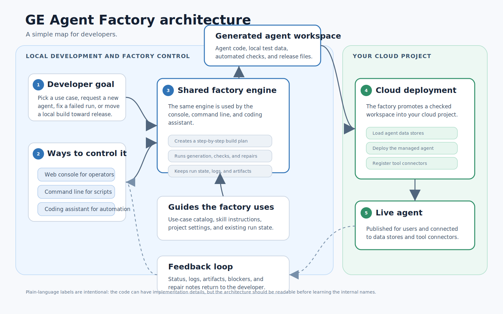

# GE Agent Factory

[](https://shell.cloud.google.com/?cloudshell_git_repo=https://github.com/vamsiramakrishnan/ge-agent-factory&cloudshell_workspace=installer&cloudshell_tutorial=installer/TUTORIAL.md)

**GE Agent Factory turns an enterprise use case into a generated, tested, deployable
Gemini Enterprise agent.** You start from a business use case (or an interview that
produces one), and the factory generates a real ADK agent — code, tools, fixtures,
tests, and evals — grounded by simulated source systems. The same workspace runs
locally against fixtures and, when you are ready, is promoted to your own Google Cloud
project: per-agent data stores, an MCP tool plane, Agent Runtime, Agent Registry, and a
Gemini Enterprise publish. It is an agent **factory**, not a prompt-only demo generator.



## How it works

- **Interview → spec (OKF).** A business use case becomes a portable spec in
  [Open Knowledge Format](https://github.com/vamsiramakrishnan/ge-agent-factory) (systems,
  entities, tools, and a behavior-contract workflow).
- **Generate → validate.** The spec drives deterministic generation of a multi-agent ADK
  workspace (`app/agent.py` + `app/tools.py`, fixtures, smoke tests, evalsets); the
  Antigravity SDK reviews and refines it, then it is re-gated by pytest + `agents-cli eval`.
- **Deploy.** The checked workspace is promoted through the cloud stage graph — per-agent
  data load, Agent Runtime deploy, MCP/Agent Registry tool registration, and Gemini
  Enterprise publish — all in **your own** GCP project (single-tenant).

## Quickstart

Local development — no cloud credentials required:

```bash
make setup          # install deps, sync catalog/skills, install the `ge` command, start the daemon
make doctor-local   # check local tools: Bun, uv, Python, agents-cli, cache, harness wiring
make console        # open the operator UI (Pipeline · Fleet · Activity · Doctor) → http://localhost:18260
```

Build one agent locally, up to the preview/build boundary:

```bash
make mode-local
make provision-local CANARY=1
```

Deploy to your own GCP project (the guided path):

- Click **Open in Cloud Shell** above to clone the repo and run the installer
  ([`installer/TUTORIAL.md`](https://github.com/vamsiramakrishnan/ge-agent-factory/blob/main/installer/TUTORIAL.md)).
- Or, from a checkout with `gcloud` authed:

  ```bash
  export GEMINI_ENTERPRISE_APP_ID=projects/<num>/locations/global/collections/default_collection/engines/<app>
  make bootstrap CANARY=1   # stand up the planes and prove one agent end to end
  ```

Run `make help` for every target, or `make next` for a status-based recommendation.

## Where to go next

- **[Concepts](./concepts/)** — the factory model: modes, the stage graph, OKF specs,
  the data plane, and the MCP tool plane.
- **[Reference](./reference/)** — the `ge` CLI, `make` targets, configuration, and the apps.
- **[Cookbooks](./cookbooks/)** — task-oriented guides: build a canary, run a mission,
  bring your own simulator, ship to the cloud.
