# Architecture

The factory turns a business use case into a generated, tested, deployable agent.
It is organized into three **planes** and runs in one of two **modes**. Release
builds use a **durable control plane** (ADR 0001) so that work survives a laptop
closing and is observable from one place — the **run ledger**.

See also: the rendered diagram at
[`docs/architecture.svg`](https://github.com/vamsiramakrishnan/ge-agent-factory),
and [ADR 0001 — remote control plane](https://github.com/vamsiramakrishnan/ge-agent-factory)
(`docs/adr/0001-remote-control-plane.md`).

---

## The three planes

<p align="center">
  
</p>

| Plane | What it is | Provisioned by |
|---|---|---|
| **Factory plane** | Orchestration + build: the `ge` CLI, the Cloud Run **gateway**, the **worker**, and the **Cloud Tasks** stage queue | `installer/terraform/` (`cloud_run.tf`, `tasks.tf`, `service_accounts.tf`) |
| **Data plane** | Shared + per-agent data stores: GCS bucket, **AlloyDB** (Postgres) cluster, **Firestore**, BigQuery, Bigtable, and the AlloyDB DSN secret | `installer/terraform/data_plane.tf`, `firestore.tf` |
| **Tool (MCP) plane** | Per-department custom MCP services + the **Agent Registry**, fronted by the managed **Agent Gateway** | `installer/terraform/agent_gateway.tf`; `ge mcp deploy` |

`ge up` stands up all three (`infra` → `data` → `mcp`) and runs the unified
doctor. `ge data up` and `ge mcp deploy` provision the data and tool planes
independently.

---

## Local vs remote mode

Mode is stored in `.ge.json` (`ge mode local | remote`) and dictates **where the
work runs**. The split point is the **build boundary** — the `previewed` stage.

### Local mode (`provisionLocal`)

Driven by `core.provisionLocal` in
[`tools/lib/factory-core.mjs`](https://github.com/vamsiramakrishnan/ge-agent-factory).
Stages **up to the build boundary** run on the operator's machine via the
Antigravity harness (`apps/factory/`):

```
created → validated → harness_reviewed → harness_refined → data_packaged → previewed
```

- Output: generated workspaces under `.ge/factory/workspaces/` + a
  `factory-events.jsonl` live stream.
- Ledger writes to a local SQLite store.
- Deploy / register / publish are cloud steps — hand the checked workspace off
  with `ge agents ship` (or switch to remote mode).

### Remote mode (`provision`)

Driven by `core.provision`. The CLI **submits** the build intent to the gateway
and observes; the cloud worker runs all stages through to publish (or stops at the
requested `targetStage`). State is written to the durable ledger (Firestore +
AlloyDB).

---

## The durable control plane (ADR 0001)

A remote build is a chain of HTTP tasks, one per `(runId, item, stage)`:

<p align="center">
  
</p>

- **Gateway** (`ge-agent-factory-gateway`, `cloud_run.tf`) authenticates the
  caller and enqueues stage tasks; the gateway service account holds
  `roles/cloudtasks.enqueuer`.
- **Cloud Tasks queue** (`tasks.tf`) dispatches one HTTP task per stage with
  retries + exponential backoff. Each task carries an OIDC token signed as the
  **runner** service account, with the worker URL as audience.
- **Worker** (`ge-agent-factory-worker`,
  [`apps/factory/src/factory-worker.js`](https://github.com/vamsiramakrishnan/ge-agent-factory))
  restores the workspace, runs the stage, records the stage event to Firestore +
  AlloyDB, streams bounded log frames, and enqueues the next stage. It runs as the
  runner SA (Firestore, AlloyDB, GCS, Secret Manager access).

This replaces the original model where the operator's laptop ran the whole fleet:
the control plane is now Cloud Tasks + a Cloud Run worker + a Firestore/AlloyDB
ledger, durable across restarts.

---

## The run ledger

The ledger is the **single source of truth** for runs — local and remote — read
by `ge ledger *`, `ge fleet`, and the console.

- **API** ([`tools/lib/run-ledger.mjs`](https://github.com/vamsiramakrishnan/ge-agent-factory)):
  `startRun`, `recordTransition`, `completeRun`, `getRun`, `listRuns`,
  `events(runId, {afterSeq})`, `fleetByUseCase`, `recordReset`, `backfill`.
- **Three tables**: `ledger_runs` (one row per run), `ledger_work_items` (latest
  state per use case / workspace), `ledger_events` (monotonic `seq`-indexed event
  log for live tail + reconnect dedup).
- **Backends**:
  - Local / test → **SQLite** (`bun:sqlite`, fallback `better-sqlite3`).
  - Cloud control plane → **AlloyDB / Postgres** via a `pg` adapter; the DSN comes
    from the `ge-agent-alloydb-dsn` Secret Manager secret.
  - **Firestore** mirrors the event stream for the live console
    ([`tools/lib/run-ledger-firestore.mjs`](https://github.com/vamsiramakrishnan/ge-agent-factory),
    `normalizeFirestoreLedgerEvent`).
- If no driver is available, callers fall back to the legacy on-disk
  `.ge-state.json` / `factory-run-*.json` / `factory-events.jsonl`.

`ge ledger backfill` imports legacy on-disk state into the ledger.

---

## Request / auth flow

| Hop | Auth | Required role |
|---|---|---|
| CLI → gateway | gcloud identity token (`gcloud auth print-identity-token`, audience = gateway URL) | `roles/run.invoker` on the gateway for the active identity |
| gateway → Cloud Tasks | gateway service account | `roles/cloudtasks.enqueuer` |
| Cloud Tasks → worker | OIDC token signed as the **runner** SA (audience = worker URL) | inherited from the runner SA |
| worker → data plane | workload identity (runner SA) | `roles/alloydb.client`, `roles/datastore.user`, GCS + `secretmanager.secretAccessor` |

The CLI talks to the gateway in one of two transports: a `gcloud run services
proxy` tunnel (the default, no public ingress needed) or a direct HTTPS call with
a bearer ID token. The managed **Agent Gateway** governs the MCP plane — only its
Service Extensions identity is granted `roles/run.invoker` on the MCP services.

> **Not fully traced in code at writing time:** the exact CLI→gateway request
> payload shape and the optional legacy IAP load-balancer path are referenced in
> ADR 0001 and the Terraform module but were not line-by-line verified here.
> Treat those specifics as advisory and confirm against `factory-core.mjs` /
> `installer/terraform/` before relying on them.
