# Console & APIs

The console is the operator UI over the same engine the `ge` CLI drives —
Pipeline, Fleet, Activity, Readiness/Doctor, a live Run Drawer, and the
BYO (bring-your-own) systems flow. Run it with `mise run console` →
`http://localhost:18260`. It proxies the local GE runtime daemon (default
port `17654`).

- Views: `apps/console/src/views/`
- Server: `apps/console/src/server/`
- Client: `apps/console/src/services/geClient.ts`

## Table of contents
{: .no_toc .text-delta }

1. TOC
{:toc}

---

## Views

| File | Shows |
|---|---|
| `Overview.tsx` | Status dashboard: plane cards, reconcile drift, active runtime tasks, quick-start pipelines |
| `Journey.tsx` | The Pipeline wizard (source → configure → review) to launch a build through to a staged target |
| `Fleet.tsx` | All agents with department/stage filters and batch actions (build, ship, sync, repair) |
| `Activity.tsx` | Unified timeline of runs (pipeline / build / job) with status filters and live tail |
| `Doctor.tsx` | Readiness/health dashboard, scoped to local / cloud / data / mcp, with pass/warn/fail |
| `Autopilot.tsx` | The Repair Queue: batch readiness / convergence runs polled from the daemon |
| `Interview.tsx` | The BYO interview UI: form (outcome / systems / constraints) + live spec canvas and grounding docs |
| `SpecReview.tsx` | Standalone spec inspect/edit (`#/spec-review/:usecaseId`) |
| `AgentDetail.tsx` | One agent: pipeline plan, doctor report, repair actions |

**Run Drawer + "Now" pulse** — `apps/console/src/components/RunDrawer.tsx`, driven
by the `useRunStream` hook (`apps/console/src/hooks/useRunStream.ts`). It follows
any run live, including remote runs, by subscribing to the ledger event SSE stream;
the active stage is the "Now" pulse.

**BYO `SystemsField`** — the systems picker in the interview/pipeline flow, backed by
`GET /api/systems` and `POST /api/systems/synthesize`.

---

## Server API

Routes are dispatched in `apps/console/src/server/ge-api-router.mjs` (with handlers
in `ge-api.mjs`, `interview-docs.mjs`, `systems.mjs`). `(SSE)` marks a streaming
endpoint.

Most mutating `/api/ge/*` routes are not bespoke handlers — they come from the
shared command registry (`packages/capability-registry/src/registry.mjs`), which gives each
one preflight gating, risk labeling, and job streaming for free:

  

See [Add a ge command](../contributing/add-a-ge-command.html) for the full walkthrough.

### Registry-backed mutating routes

This table is **generated from the registry** (`bun run docs:console-api`;
drift fails CI), so it always matches what the routes actually do. Each
returns `202 { jobId, command }`; stream progress via
`GET /api/ge/jobs/:id/logs` (SSE).

<!-- BEGIN GENERATED: ge-console-commands — do not edit; run `bun run docs:console-api` -->
| Route | CLI | Purpose | Risk | Preflight requires |
|---|---|---|---|---|
| `POST /api/ge/prove` | `ge prove` | Prove contracts end to end: fresh machine → health check + first agent build; agents built already → rebuild their proof | `starts-local-workloads` | `node`, `uv` on PATH · local toolchain |
| `POST /api/ge/handoff` | `ge handoff` | Hand proven agents to a deploy target (agents-cli → Agent Engine → Gemini Enterprise) | `mutates-cloud` | `gcloud` on PATH · `.ge.json`: project, gatewayUrl, dataBucket · cloud auth · tool plane deployed · BigQuery API (hard) · ship handoff wiring |
| `POST /api/ge/passport/emit` | `ge passport emit` | Mint the consolidated signed Agent Passport for a proven workspace: subject digests plus DSSE attestations over the proof pack | `starts-local-workloads` | `bun` on PATH |
| `POST /api/ge/passport/verify` | `ge passport verify` | Verify a passport's integrity: attestation signatures, and digest binding to the workspace bytes on disk | `read-only` | `bun` on PATH |
| `POST /api/ge/passport/admit` | `ge passport admit` | Evaluate the admission gate over the passport (policy: .ge.json promotion.gates.admission) and record the allow/deny decision | `starts-local-workloads` | `bun` on PATH |
| `POST /api/ge/drive` | `ge drive` | Talk to the deployed agent over its live assist surface with per-turn timing/responder instrumentation; record conversations as eval cases or cassettes | `starts-workloads` | `bun` on PATH |
| `POST /api/ge/prove/live` | `ge prove --live` | Release verification: run evalset cases through the deployed agent's assist surface — metric grid, conformance baselines, live gate verdict | `starts-workloads` | `bun` on PATH |
| `POST /api/ge/bench` | `ge bench` | Load the assist surface within hard cost guards and verdict the latency/error budgets (ttft, full response, stalls, errors, responder rates) | `starts-workloads` | `bun` on PATH |
| `POST /api/ge/evals/compile` | `ge evals compile` | Compile a captured agent contract (or any spec envelope) into the executable behavior suite: graph, coverage, selected cases, ADK evalset, dataset, load profile | `starts-local-workloads` | `bun` on PATH |
| `POST /api/ge/evals/import` | `ge evals import` | Import a bring-your-own ADK-compatible evalset into .ge/behavioral, alongside compiled suites, so it is discoverable by coverage/prove | `starts-local-workloads` | `bun` on PATH |
| `POST /api/ge/up` | `ge up` | Provision infra, data, and tool planes | `mutates-cloud` | `gcloud`, `terraform` on PATH · `.ge.json`: project, geAppId · cloud auth · Terraform root · writable `.ge.json` |
| `POST /api/ge/data/up` | `ge data up` | Apply Terraform for shared stores and merge coordinates into .ge.json | `mutates-cloud` | `gcloud`, `terraform` on PATH · `.ge.json`: project, geAppId · cloud auth · Terraform root · writable `.ge.json` · BigQuery API (hard) |
| `POST /api/ge/data/synth` | `ge data synth` | Generate deterministic synthetic seed data for a simulator system twin (pack contract → recipe → seeded rows → seed.json), with an opt-in statistical realism profile | `writes-repo` | `node` on PATH |
| `POST /api/ge/okf/customize` | `ge okf customize` | Customize a base agent into a new variant OKF bundle (system swaps, terminology rewrites, vertical policy overlay) and compile it against the base | `writes-repo` | `node` on PATH |
| `POST /api/ge/agents/register` | `ge agents register` | Register an OKF bundle as a tracked agent: compile it, flip provenance draft→registered (version +1), and refresh the generated catalog | `writes-repo` | `bun` on PATH |
| `POST /api/ge/create` | `ge create` | Materialize a receipt-backed agent workspace from a resolved Agent Library blueprint (OKF contract copy, stub app/twins/evals/proof scaffolding, ge.lock.json) | `writes-repo` | `bun` on PATH |
| `POST /api/ge/mcp/deploy` | `ge mcp deploy` | Deploy per-department MCP services | `mutates-cloud` | `gcloud` on PATH · `.ge.json`: project, serviceAccount, dataBucket · cloud auth · writable `.ge.json` |
| `POST /api/ge/console/deploy` | `ge console deploy` | Build the operator console image (Cloud Build) and bind it via terraform apply (Terraform owns Cloud Run config; installer/terraform/ui_services.tf) | `mutates-cloud` | `gcloud`, `terraform` on PATH · `.ge.json`: project, geAppId · cloud auth · Terraform root · writable `.ge.json` |
| `POST /api/ge/agents/build` | `ge agents build` | Build selected agents through the cloud factory | `starts-workloads` | `gcloud` on PATH · `.ge.json`: project, geAppId, gatewayUrl · cloud auth · tool plane deployed |
| `POST /api/ge/agents/sync` | `ge agents sync` | Copy generated agent code into the repository | `writes-repo` | `git` on PATH |
| `POST /api/ge/daemon/start` | `ge daemon start` | Start the local GE runtime daemon (idempotent — no-op if already running) | `starts-local-workloads` | `node` on PATH |
<!-- END GENERATED: ge-console-commands -->

### `/api/ge/*` — read routes and bespoke handlers

| Method · Path | Purpose |
|---|---|
| `GET /api/ge/status` | Status board (planes, mode, project, next action) |
| `GET /api/ge/commands` | Available GE commands + metadata |
| `GET /api/ge/specs` | Spec catalog (`q`, `department`, `ids`, `limit`) |
| `GET /api/ge/specs/review` | Inspect a generated spec (`usecaseId` / `path`) |
| `POST /api/ge/specs/register` | Register an interview artifact into the catalog |
| `GET /api/ge/doctor` | Health report (`scope=all\|local\|cloud\|data\|mcp`, `command`) |
| `GET /api/ge/doctor/stream` | Doctor checks (SSE) |
| `GET /api/ge/fleet` | All agents + health/actions |
| `GET /api/ge/journey` | Pipeline plan (`scenario`, `usecaseId`, `systems`, `ids`, `targetStage`) |
| `GET /api/ge/mission` | Pipeline execution plan (the runnable DAG) |
| `GET /api/ge/factory/runs` | Factory run summaries (`limit`) |
| `GET /api/ge/ledger/runs` | Durable run ledger (`limit`) |
| `GET /api/ge/ledger/runs/:id` | One ledger run |
| `GET /api/ge/ledger/runs/:id/events` | Live ledger events (SSE) — backs the Run Drawer |
| `GET /api/ge/apply/plan` | Declarative reconcile plan |
| `GET /api/ge/agents/:id` | One agent's detail |
| `GET /api/ge/workspaces/:id/doctor` | Workspace health (`stage`) |
| `POST /api/ge/workspaces/:id/repair` | Local repair loop (`stage`, `attempts`, `agent`, `runPreview`) |
| `GET /api/ge/logs/:runId` | Run logs (`stage`, `item`) |
| `GET /api/ge/runs/:runId/logs` | Run log stream (SSE) |
| `GET /api/ge/runs/:runId/events` | Run event stream (SSE) |
| `GET /api/ge/artifacts/:runId/:item/:name` | Artifact content |
| `GET /api/ge/jobs` · `/:id` · `/:id/logs` | Background jobs; `/logs` is SSE |
| `GET /api/ge/autopilot` · `/:id` · `/:id/events` | Repair runs; `/events` takes `afterSeq` |
| `POST /api/ge/autopilot` · `/:id/resume` | Start / resume a repair run |
| `POST /api/ge/mode` | Set mode (`local`\|`remote`) |

The deploy and agent-lifecycle POST routes (`/api/ge/up`, `/data/up`,
`/mcp/deploy`, `/agents/build`, `/handoff`, `/agents/sync`, `/daemon/start`)
live in the
[generated registry table above](#registry-backed-mutating-routes).

### `/api/runtime/*` — daemon proxy

| Method · Path | Purpose |
|---|---|
| `GET /api/runtime/status` | Daemon health + supported task kinds |
| `GET /api/runtime/tasks` | List tasks (`limit`, `full`) |
| `GET /api/runtime/tasks/:id` | One task |
| `GET /api/runtime/tasks/:id/events` | Task events (SSE or `?format=json`) |
| `POST /api/runtime/tasks` | Start a runtime task (e.g. `pipeline.run`) |
| `POST /api/runtime/tasks/:id/resume` | Resume a paused task |
| `POST /api/runtime/tasks/:id/interactions/:interactionId` | Answer a runtime form/question |

### `/api/systems/*` — BYO systems

| Method · Path | Purpose |
|---|---|
| `GET /api/systems` | The known built-in simulator options |
| `POST /api/systems/synthesize` | Synthesize a new LIVE simulator (`mode`, `description`, `displayName`, `samples`, `openapi`) and mount it via the overlay |

### `/api/interviews/:id/*` — interview grounding & OKF

| Method · Path | Purpose |
|---|---|
| `GET /api/interviews/:id/documents` | List uploaded grounding documents |
| `POST /api/interviews/:id/documents` | Upload a grounding document |
| `POST /api/interviews/:id/spec` | Write the interview spec artifact |
| `GET /api/interviews/:id/generation-spec` | The generated spec |
| `GET /api/interviews/:id/okf` | The spec rendered as an [OKF](okf.html) bundle (path → Markdown map) |

---

## Client (`geClient.ts`)

The `ge` export wraps every endpoint. Representative mappings:

| Client method | Endpoint |
|---|---|
| `ge.status()` / `ge.fleet()` / `ge.doctor(scope, command)` | `GET /api/ge/status` / `/fleet` / `/doctor` |
| `ge.journey(body)` / `ge.mission(body)` | `GET /api/ge/journey` / `/mission` |
| `ge.ledgerRuns(limit)` / `ge.ledgerRun(id)` | `GET /api/ge/ledger/runs` / `/:id` |
| `ge.build(body)` / `ge.sync(body)` | `POST /api/ge/agents/build` / `/agents/sync` |
| `ge.up()` / `ge.dataUp()` / `ge.mcpDeploy()` | `POST /api/ge/up` / `/data/up` / `/mcp/deploy` |
| `ge.runtimeStart(body)` / `ge.runtimeResume(id)` | `POST /api/runtime/tasks` / `/:id/resume` |
| `ge.systems()` / `ge.synthesizeSystem(body)` | `GET /api/systems` / `POST /api/systems/synthesize` |

### Streaming (SSE) functions

| Function | Endpoint |
|---|---|
| `streamLedgerRun(runId, onEvent)` | `GET /api/ge/ledger/runs/:id/events` — the Run Drawer "Now" pulse |
| `streamLogs(runId, stage, onEvent, item?, onStatus?)` | `GET /api/ge/runs/:runId/logs` |
| `streamEvents(runId, onEvent)` | `GET /api/ge/runs/:runId/events` |
| `streamJob(jobId, onEvent, onStatus?)` | `GET /api/ge/jobs/:id/logs` |
| `streamDoctor(scope, command, onEvent)` | `GET /api/ge/doctor/stream` |
| `streamRuntimeEvents(taskId, onEvent)` | `GET /api/runtime/tasks/:id/events` |

These use `EventSource`; when auth is enabled the Firebase token is appended to the
URL (EventSource cannot set headers). The Run Drawer subscribes via the
`useRunStream` hook, which calls `streamLedgerRun` and de-dups on the event `seq`
— see the [Run Drawer + Now pulse flow](../console/pipeline-and-runs.html)
for the sequence.
