# Security hardening cutover (Cloud Run ingress + runner SA least-privilege)

A **staged, verified** rollout for the two deferred hardening items. Each stage has
exact commands, a verification step, and a rollback. Do NOT batch stages — verify
each against the live pipeline before the next. Run a real factory build end-to-end
after Stage B and Stage C.

> - **Stage B build-SA — DONE in code.** `factory-worker.js` submits builds with
>   `--service-account=<builder>` + `--gcs-log-dir=gs://<factory-bucket>/cloudbuild-logs`
>   (env-overridable: `GE_AGENT_FACTORY_BUILDER_SA`, `GE_AGENT_FACTORY_BUILD_LOGS_DIR`).
> - **Stage B IAM — APPLIED + VERIFIED LIVE (2026-06-20, `vital-octagon-19612`).** Runner
>   dropped `cloudbuild.builds.editor`; gained the minimal `geAgentFactoryBuildSubmitter`
>   custom role (create+get+list) — needed because editor was the only source of
>   `builds.create`; builder SA carries the full build role set. Verified by impersonating
>   runner and submitting a build as builder (SUCCESS). `iam.tf` matches (custom role +
>   binding codified). `iam.serviceAccountUser` kept on runner for the ship stage.
> - **Stage A (MCP internal ingress) + Stage D (gateway ENFORCE) — NOT yet applied live**
>   (need agent-caller VPC egress enumeration / live DRY_RUN traffic analysis; see those stages).
> - **Stage C1 — recorded.** `var.worker_ingress` stays `INGRESS_TRAFFIC_ALL` (comment in
>   `variables.tf`/`cloud_run.tf` documents the accepted posture).
> - **Gateway enforce — single-var flip added.** `var.agent_gateway_authz_action`
>   (DRY_RUN default) renders the authz-extension YAML; see Stage D below.
>
> The live `gcloud`/`terraform apply` ops below are now mechanical and match the IaC.
{: .status }

<p align="center">
  
</p>

Context (already done): the browser-facing services run as dedicated least-privilege
SAs (`runtime@`/`runner@`), not the default compute SA — see
`installer/fix-service-accounts.sh`. This runbook covers what's left.

```
PROJECT=vital-octagon-19612
REGION=us-central1
RUNNER=ge-agent-factory-runner@$PROJECT.iam.gserviceaccount.com
BUILDER=ge-agent-factory-builder@$PROJECT.iam.gserviceaccount.com
MCP="ge-agent-factory-mcp-finance ge-agent-factory-mcp-hr ge-agent-factory-mcp-it ge-agent-factory-mcp-marketing ge-agent-factory-mcp-procurement"
```

---

## Stage 0 — Baseline + rollback snapshot

Capture current config so any stage can be reverted.

```bash
for s in ge-agent-factory-worker $MCP; do
  gcloud run services describe $s --project $PROJECT --region $REGION \
    --format="yaml(spec.template.metadata.annotations,spec.template.spec.serviceAccountName)" > /tmp/baseline-$s.yaml
done
gcloud projects get-iam-policy $PROJECT > /tmp/baseline-iam.yaml
```

Verify the pipeline is green now: trigger one small build from the console (Journey →
Run pipeline, single spec) and watch it complete in the Run Drawer. This is your
"known good" reference for every later verification.

---

## Stage A — MCP ingress → internal

**Viable**, because every caller of the MCP services is a Cloud Run service we
control (the worker's `load_data` stage + the deployed agents). Give those callers
**Direct VPC egress**, then restrict MCP ingress.

### A1. Direct VPC egress on the callers
Uses the project's default VPC (swap `--network/--subnet` if you use a custom one).

```bash
# Worker (calls MCP during load_data / registration)
gcloud run services update ge-agent-factory-worker --project $PROJECT --region $REGION \
  --network=default --subnet=default --vpc-egress=private-ranges-only

# Each deployed agent runtime that calls its dept MCP at request time
# (repeat for the agent services that talk to MCP)
```
> `private-ranges-only` keeps public egress (Vertex, GCS, Firestore) on the default
> path and only sends RFC-1918 + Google internal through the VPC — enough to reach
> internal Cloud Run. Use `all-traffic` only if you also need egress firewalling.
{: .note }

### A2. Flip MCP ingress to internal
```bash
for s in $MCP; do
  gcloud run services update $s --project $PROJECT --region $REGION \
    --ingress=internal
done
```

### A3. Verify
- `gcloud run services describe ge-agent-factory-mcp-hr --project $PROJECT --region $REGION --format='value(spec.template.metadata.annotations["run.googleapis.com/ingress"])'` → `internal`.
- Run a build whose agent calls an MCP tool (or hit a deployed agent that uses MCP) and confirm the tool call still returns — watch the Run Drawer / agent logs for MCP 200s, no 403/connection errors.
- Negative check: from outside the VPC, the MCP URL should now refuse (`curl` the run.app URL → 404/403 at the network layer).

### A-Rollback
```bash
for s in $MCP; do gcloud run services update $s --project $PROJECT --region $REGION --ingress=all; done
```

---

## Stage B — Runner SA: stop carrying build privileges

Goal: the worker submits Cloud Builds **as the `builder` SA**, so `runner` no longer
needs `cloudbuild.builds.editor` / `iam.serviceAccountUser`.

### B1. Let the worker impersonate the builder (additive, safe)
```bash
gcloud iam service-accounts add-iam-policy-binding $BUILDER \
  --project $PROJECT \
  --member="serviceAccount:$RUNNER" \
  --role="roles/iam.serviceAccountTokenCreator"
# Ensure builder can run builds + use itself:
for r in roles/cloudbuild.builds.builder roles/iam.serviceAccountUser roles/logging.logWriter roles/storage.admin; do
  gcloud projects add-iam-policy-binding $PROJECT --member="serviceAccount:$BUILDER" --role="$r" --condition=None
done
```

### B2. Worker change: pass `--service-account` on build submits (DONE in code — redeploy)
**Landed.** `apps/factory/src/factory-worker.js` already appends, on every
`gcloud builds submit` (release stages: validate/preview/deploy_runtime/poll_runtime/
publish_enterprise — builds go via **`gcloud`**, not the REST API):

```
--service-account projects/$PROJECT/serviceAccounts/ge-agent-factory-builder@$PROJECT.iam.gserviceaccount.com
--gcs-log-dir gs://<factory-bucket>/cloudbuild-logs
```

The factory bucket defaults to the worker's existing `GE_AGENT_FACTORY_BUCKET` /
`payload.cloud.artifactBucket` (i.e. `gs://$PROJECT-ge-agent-factory/cloudbuild-logs`).
Both are env-overridable for non-default projects:
`GE_AGENT_FACTORY_BUILDER_SA` (bare email or full `projects/.../serviceAccounts/...`),
`GE_AGENT_FACTORY_BUILD_LOGS_DIR` (full `gs://...` path). The submit is otherwise
identical (same `--no-source --config cloudbuild.factory-stage.yaml`, same
substitutions). **Action:** rebuild + redeploy the worker image; verify the revision
is Ready.

> `--gcs-log-dir` is required because a user-specified build SA cannot use the
> default logs bucket. If you ever switch to a regional/private worker pool you may use
> `--default-buckets-behavior` instead, but `--gcs-log-dir` is the portable choice here.
{: .note }

### B3. Verify builds still succeed (as builder)
Trigger a real factory build end-to-end (the same "known good" build from Stage 0).
Confirm the Cloud Build runs and the run reaches `deploy`. Check the build's identity:
```bash
gcloud builds list --project $PROJECT --region $REGION --limit=1 \
  --format='value(id, serviceAccount, status)'   # serviceAccount should be the builder SA
```

### B4. Remove build privileges from runner (the actual tightening) — DONE + verified 2026-06-20

> `roles/cloudbuild.builds.editor` is the ONLY role granting the runner
> `cloudbuild.builds.create`. Submitting a build — even one that *runs as* the builder
> SA via `--service-account` — still requires the **caller** to hold `builds.create`. So
> removing editor *alone* breaks build submission. Give the runner a minimal custom role
> FIRST, then drop editor.
{: .important }
```bash
# 1) Minimal submit+poll role (codified as google_project_iam_custom_role.build_submitter):
gcloud iam roles create geAgentFactoryBuildSubmitter --project=$PROJECT \
  --title="GE Agent Factory Build Submitter" \
  --permissions=cloudbuild.builds.create,cloudbuild.builds.get,cloudbuild.builds.list --stage=GA
gcloud projects add-iam-policy-binding $PROJECT --member="serviceAccount:$RUNNER" \
  --role="projects/$PROJECT/roles/geAgentFactoryBuildSubmitter" --condition=None
# 2) Drop the broad editor (--condition=None: the policy has conditional bindings):
gcloud projects remove-iam-policy-binding $PROJECT \
  --member="serviceAccount:$RUNNER" --role="roles/cloudbuild.builds.editor" --condition=None
# iam.serviceAccountUser on runner is KEPT (ship stage acts as an SA through runner).
```
**Verify cheaply (no full agent build) — impersonate runner, submit a build as builder
with ONLY the custom role:**
```bash
printf 'steps:\n  - name: gcr.io/cloud-builders/gcloud\n    args: ["--version"]\n' > /tmp/smoke.yaml
gcloud builds submit --no-source --config /tmp/smoke.yaml \
  --service-account="projects/$PROJECT/serviceAccounts/$BUILDER" \
  --gcs-log-dir="gs://$PROJECT-ge-agent-factory/cloudbuild-logs" \
  --impersonate-service-account="$RUNNER" --project $PROJECT   # → STATUS: SUCCESS
```

> IaC matches the verified live state (`installer/terraform/iam.tf`):
> `cloudbuild.builds.editor` removed from `runner_roles`; the
> `build_submitter` custom role + `runner_build_submitter` binding added; the runner→builder
> `roles/iam.serviceAccountTokenCreator` binding present; `iam.serviceAccountUser` KEPT for
> the ship stage. `terraform apply` converges to exactly what was applied + verified live.
{: .tip }

### B-Rollback
```bash
gcloud projects add-iam-policy-binding $PROJECT --member="serviceAccount:$RUNNER" --role="roles/cloudbuild.builds.editor" --condition=None
```

---

## Stage C — Worker ingress (constraint-aware)

> The worker cannot be `ingress=internal` while Cloud Tasks delivers to it over
> HTTP. Cloud Tasks hits the public `run.app` endpoint; internal-only ingress blocks
> it → the pipeline stalls. The worker is already authenticated-only (no `allUsers`;
> OIDC `run.invoker` required), so the residual risk is "a valid Google identity with
> the invoker role could reach the endpoint" — low.
{: .important }

Pick one:

- **C1 (recommended, ADOPTED): accept `ingress=all` + auth for the worker.** No change;
  `var.worker_ingress` stays `INGRESS_TRAFFIC_ALL`. This is now the recorded posture —
  the variable's description in `installer/terraform/variables.tf` and the worker
  resource comment in `cloud_run.tf` both state that internal ingress is intentionally
  NOT used because Cloud Tasks delivers over the public endpoint (authenticated-only is
  the accepted residual risk).
- **C2: internal + internal HTTP LB.** Set
  `--ingress=internal-and-cloud-load-balancing`, put the worker behind an internal
  HTTP(S) LB via a Serverless NEG, and point the Cloud Tasks target at the LB. Heavier;
  only if a policy requires no public endpoint.
- **C3: replace Cloud Tasks with Pub/Sub push + internal ingress.** Largest change;
  re-architects the trigger. Not recommended unless C2 is also unacceptable.

If you choose C2/C3, do it as its own stage with the same verify/rollback discipline.

---

## Stage D — Agent Gateway authz: DRY_RUN → ENFORCED (single-var flip)

The MCP plane's Agent Gateway runs an IAP authz extension in **DRY_RUN** (audit-only)
today. Enforcement is codified as one Terraform variable,
`var.agent_gateway_authz_action` (default `DRY_RUN`), which renders
`installer/agent-gateway-authz/iap-request-authz-extension.yaml` from a template — the
YAML's `iamEnforcementMode` always matches the var (do not hand-edit the rendered file).

### D1. Flip
```bash
cd installer/terraform
terraform apply -var agent_gateway_authz_action=ENFORCED   # re-renders the YAML
cd ../agent-gateway-authz
gcloud beta service-extensions authz-extensions import ge-agent-factory-iap-authz-ext \
  --source=iap-request-authz-extension.yaml --location=us-central1
```
Pre-reqs (see `installer/AGENT-GATEWAY.md`): `registries` populated with the MCP servers'
Agent Registry entries, and the DRY_RUN decision logs reviewed.

### D2. Verify
A governed MCP call from a deployed agent still succeeds; an unauthorized call is now denied.

### D-Rollback
```bash
cd installer/terraform && terraform apply -var agent_gateway_authz_action=DRY_RUN
cd ../agent-gateway-authz && gcloud beta service-extensions authz-extensions import \
  ge-agent-factory-iap-authz-ext --source=iap-request-authz-extension.yaml --location=us-central1
```

---

## After cutover
- Re-run `terraform plan` in `installer/terraform` and reconcile `worker_ingress` +
  `runner_roles` so IaC matches live.
- Update `reference_cloud_run_security` notes / this runbook with what was applied.
- Keep the Stage 0 baselines until a full pipeline run has passed post-cutover.
